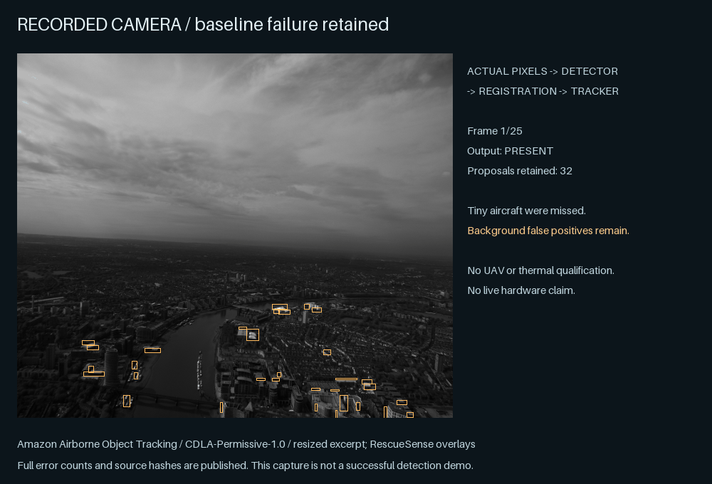
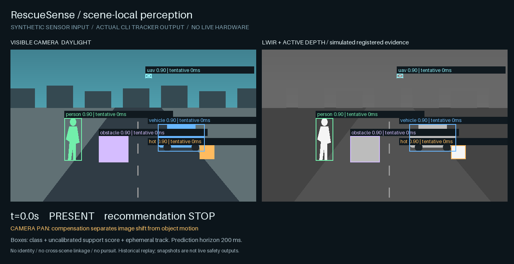

<p align="center"></p>

**Keep supported objects visible through sensor loss. Make uncertainty explicit.**



*Recorded camera replay, not a successful aircraft-detection test: tiny aircraft were missed and false positives remain. [Full evaluation](#recorded-failures-are-part-of-the-evidence).*

RescueSense is a local multi-sensor perception toolkit for rescue and collision-avoidance research. It combines registered detections, temporary geometric tracks, short-horizon motion estimates and bounded defensive recommendations. Daylight RGB can give way to valid LWIR, radar or depth evidence without discarding the object.

**Safety boundary:** scene-local human boxes and temporary tracks are allowed; biometric identity, durable person IDs, cross-camera/location re-identification, long-term histories, threat scoring, target designation, following/pursuit and weapons are prohibited. Through-obstruction human sensing remains **coarse zone presence only**. [Public v3 amendment](docs/safety/amendment-v3.md).

**Qualification:** locally verified research software, **not production-ready**. Synthetic fusion/tracking passes the frozen software scenarios. Real recorded aircraft evaluation exposes detector failures. Physical thermal/night/UAV sensing, controller safety and hosted platform evidence remain unqualified. Earlier tracker latency failures remain recorded, and CPU RGB inference does not meet the live freshness budget. [Exact results and blockers](docs/verification/status-v3.md).

## Live camera preview: iPhone, laptop and compatible video streams

An additional self-contained [browser camera app](web/) supports device-camera permission, front/rear switching, on-device COCO-SSD object detection and installable HTTPS web hosting. The model is bundled with the site, so camera images remain local and it can work offline again after successful caching. **The public HTTPS camera preview is live at [RescueSense Camera](https://nima0101.github.io/rescuesense/), but it has not yet been tested on a physical iPhone.** A CPU-worker compatibility mode preserves responsive controls even when local inference is slow.

```sh
cd web && npm ci && npm run dev
```

Open http://localhost:5173 on the laptop. To use iPhone or Android from anywhere, deploy the generated `web/dist` to an HTTPS site; browsers require permission and a secure context. For locally attached/UVC cameras, video files or compatible RTSP sources, `scripts/live_video.py` provides an optional native host adapter with Core ML on supported Macs. Read the [multi-platform camera instructions](docs/usage-live-platforms.md) for commands and safety evidence boundaries.

## Run a useful replay



Original synthetic scene, **actual CLI output**. The slowed replay shows daylight → zero visible light → short occlusion → reacquisition → all-sensor loss. Rectangles carry class, uncalibrated support score, state and freshness. Dashed geometry is an uncertain prediction. No live hardware is depicted. [Input/output and reproduction](docs/demo-v3.md).

Python 3.9+; no runtime dependencies for the core. From this checkout:

```sh
python3 scripts/verify.py
python3 -m rescuesense replay examples/temporal-blackout.jsonl
python3 scripts/temporal_evaluate.py --out build/v3-registered
```

The replay retains one temporary person track as RGB goes dark, uses LWIR/depth/radar support, and recommends STOP under the vehicle fixture contract. The evaluation runs frozen synthetic sequences, a 32-object resource benchmark, and **25 licensed recorded camera frames through a pixel detector, registration and tracker**. It prints false positives and misses, including failed experiments. Outputs never actuate hardware or declare SAFE.

Open [the offline visual replay](docs/assets/perception.html) after checkout. It displays recorded artifacts; it is not a live safety display. [Architecture](docs/architecture/overview-v3.md) · [Protocol](docs/architecture/protocol-v3.md) · [Verification](docs/verification/matrix-v3.md) · [Security](SECURITY.md) · [Contributing](CONTRIBUTING.md).

## Perception with bounded memory

| Situation | Implemented behavior |
|---|---|
| RGB blackout; valid registered non-visible evidence | Same active track, truthful remaining sources and support score |
| Short occlusion | UNKNOWN/coasting geometry for at most500ms; prediction never becomes fresh evidence |
| Expiry, scene change, invalid ego transform or long gap | Remove linkage; a later object receives a new temporary ID |
| Camera translation | Compensate image shift; velocity stays in normalized image units, not invented m/s |
| Ambiguous crossing, bad synchronization or invalid calibration | Expose uncertainty; suppress unsupported associations/claims |
| All supporting sensors fail | Explicit UNKNOWN and STOP/HOVER/LAND/RETREAT/WARN recommendation; watchdog handles acquisition stalls |
| Authorized through-obstruction sensing | Separate coarse v2 zone interface, no precise person tracks |

Kalman prediction and optimal L2/IoU assignment are compared against greedy IoU. On the frozen synthetic fast-UAV sequence, ID switches were0 versus20 for the baseline; the three missing detections remain three false negatives. This is a controlled software result, not UAV detection accuracy. [Full metrics and negative results](docs/verification/status-v3.md).

## Actual RGB model integration

The optional adapter loads only the SHA-256-pinned Apache-2.0 OpenCV Zoo YOLOX model. It outputs permitted person, vehicle, animal, equipment and obstacle classes. It suppresses RGB in darkness and does not turn airplane detections into UAV claims. Python3.11+ is required for these optional dependencies; locally exercised on3.13.

```sh
python3 -m venv .venv
.venv/bin/python -m pip install -r requirements-dev.txt -r requirements-vision.txt
.venv/bin/python scripts/fetch_rgb_model.py
.venv/bin/python scripts/vision_smoke.py
.venv/bin/python scripts/vision_e2e.py
```

On Windows use `.venv\Scripts\python` for the optional commands. The model fetch is explicit; the runtime never downloads weights.

### Optional Apple Silicon acceleration

The default OpenCV backend is unchanged. On macOS Apple Silicon, the same SHA-256-verified YOLOX model can explicitly run through ONNX Runtime Core ML; there is **no automatic fallback** if the Core ML provider is unavailable. CPU can still execute unsupported graph nodes. This is a runtime optimization, not a more accurate detector or a live-system qualification.

```sh
.venv/bin/python -m pip install -r requirements-coreml.txt
.venv/bin/python scripts/coreml_evaluate.py
RESCUESENSE_VISION_BACKEND=coreml .venv/bin/python scripts/vision_e2e.py
```

The comparison preserves original detection thresholds and checks class, box and score agreement against the OpenCV backend on licensed stills and recorded AOT frames. It records initial compilation and steady-state latency separately. First-frame startup and host scheduling can exceed the live 100 ms freshness limit. Stale inferences must not be interpreted as fresh sensor observations.

For real UI/timer verification, run `.venv/bin/python scripts/browser_check.py`. On macOS the browser checker can use a previously installed Chromium headless-shell revision when the exact Playwright revision is missing. Real launch/test failures still fail.

The RGB model's recorded integration checks and provenance remain reproducible in [the vision verification scripts](scripts/vision_smoke.py) and [model card](docs/models/v3-model-card.md). For an interactive camera demonstration, open [RescueSense Camera](https://nima0101.github.io/rescuesense/).

## Recorded failures are part of the evidence

The frozen AOT excerpt contains tiny **fixed-wing aircraft**, not verified drones. The classical detector missed all20 annotations and produced721 false positives after registration/tracking. YOLOX missed the same20 with no false positives. Neither qualifies this system for airborne detection. Source pixels, transformations, licenses and hashes are included; labels never enter inference. [Dataset](data/aot/README.md) · [Replay methodology](docs/demo-v3.md).

LWIR/RGB-T/radar/depth semantic adapters and zero-light fusion are implemented and synthetically tested. Representative physical thermal data, trained thermal/UAV weights, calibrated uncertainty, power/range/latency and device/controller validation remain explicit qualification gaps. No phone, vehicle, drone or sensor is declared production-supported. [Capability matrix](docs/architecture/capabilities-v3.md) · [Hardware evidence](docs/verification/hardware.md).

## Reproduce the candidate

```sh
python3 scripts/temporal_fuzz.py
python3 scripts/reproduce.py
python3 scripts/release.py
python3 dist/rescuesense.pyz replay examples/temporal-blackout.jsonl
```

Release checks require committed, clean source. Artifacts include a deterministic source archive and Python zipapp, SHA-256 sums, CycloneDX SBOM and unsigned local provenance. Optional vision dependencies/model are separately inventoried. Hosted CI and signed releases may be claimed only after actual remote runs. [Release procedure](docs/releasing-v3.md) · [Visual reproduction](docs/demo-v3.md).

Protocols1/2 and their earlier evidence remain available. Versioned owner amendments preserve the original freezes rather than rewriting history. [AGENTS](AGENTS.md) · [Governance](GOVERNANCE.md) · [Research](docs/engineering/research-v3.md) · [Architecture decisions](docs/decisions/0004-temporal-perception-v3.md).

Created by [Nima Khaki](https://github.com/Nima0101), with disclosed single-agent AI-assisted engineering. [Apache-2.0 source](LICENSE); bundled datasets have their own documented terms. [Notice](NOTICE). No certification, independent audit or field adoption is claimed.
