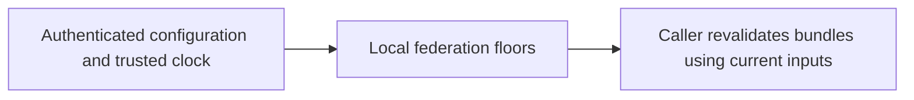
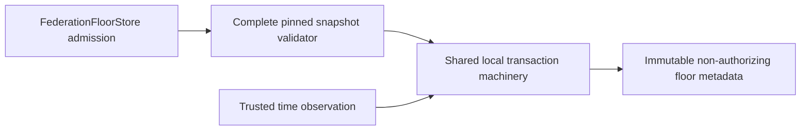

# Local federation-floor store v1

`aethron.passport_floor_store.FederationFloorStore` persists one local domain's
federation revision, exact snapshot digest and independently trusted UTC time floor.
Admission calls `validate_pinned_federation`, including a valid empty deny-all table.
No bundle needs to succeed for a restrictive configuration to become durable.

## Contract and constraints

The protected local filesystem, absolute configured path, SQLite locking/flush,
clock and authenticated pin assumptions of the [policy-floor store](policy-floor-store-v1.md)
apply. Python 3.9+ with SQLite >=3.31 is required. This component is outside a real-time
execution path. No language or storage latency ranking is inferred from desktop tests.

- `create(path, *, local_domain, federation, expected_federation_sha256, now_s,
  minimum_time_s, minimum_federation_revision)` validates before exclusively creating
  a file. Failed validation creates nothing. Interrupted initialization may leave a
  partial file requiring explicit recovery. Existing files are never overwritten.
- `FederationFloorStore(path, *, local_domain)` opens an existing file only. Missing,
  incompatible, malformed, oversized or wrong-domain stores fail without resetting.
- `read()` returns immutable `FederationFloor(local_domain, federation_revision,
  minimum_time_s, federation_sha256)` metadata. It does not establish current validity.
- `accept_federation(federation, *, expected_federation_sha256, now_s)` validates
  under persisted floors within `BEGIN IMMEDIATE`. Invalid pin, bytes, domain,
  interval or floors raise `FloorStoreError("federation_rejected")`. Changed bytes
  at the same revision raise `federation_equivocation`; an intentional change requires
  a higher revision. A valid deny-all snapshot commits even when every peer rejects.
- `observe_time(*, now_s)` independently commits nondecreasing trusted time, including
  after snapshot expiry. A rejected admission leaves all metadata unchanged. Callers
  explicitly observe trusted time when it must survive a later rejection.

All results have execution authority, motion authority and evidence verification false.
Exceptions use fixed reason strings; storage errors and immediate lock contention
produce `store_unavailable`, never success metadata or zero/default floors.

Both stores share internal transaction and row-validation code, with fixed SQL and
bound data parameters. Policy v1 retains its schema and application ID `0x41544631`.
Federation v1 uses application ID `0x41544632`, user version 1, and exactly one
`federation_floor` table containing `id`, `local_domain`, `revision`, `time_s` and
`federation_sha256`. Neither profile opens the other. The row has ID 1 and only bounded
identifier, safe-integer and lowercase SHA-256 values. Extra schema objects reject.

Each operation opens a connection and commits before returning. DELETE journaling,
synchronous EXTRA, suggested 64 KiB cache, sixteen-page limit and 65536-byte database
file ceiling are unchanged. These are not total process-memory or journal-disk bounds.
Reads also need an immediate transaction. There are no retries or hard completion-time
guarantees. Stored metadata is neither authenticated nor encrypted by this helper.

The two files are independent: there is no atomic combined policy/federation snapshot,
remote trust enrollment, transport, distributed consensus or automatic cancellation of
in-flight work. Consumers must validate current inputs at use; returned metadata can
immediately become stale. Whole-file restore restores older floors. A trusted anchor
outside the restored filesystem's rollback domain is needed to detect that event.
No physical power-loss, MLS/CNSA, availability or target-hardware qualification is
established. Insufficient information for tactical deployment.

## Technology decision and C4 views

The [ADR](../../decisions/p16-federation-floor-store-v1.json) compares native SQLite,
atomic-file protocols, LMDB and Erlang Mnesia plus Python, Rust and .NET bindings.
SQLite provides local atomic read/check/write and cooperating-process locking. The
Python binding directly invokes the exact bounded validator; another binding has no
demonstrated advantage for the identified one-row contract. No alternatives were
benchmarked and no future P18 runtime is selected by this decision.

Context:


Containers:


Components:


Code:


These views implement computer-side metadata persistence. They add no command,
control, communications, intelligence, surveillance or reconnaissance service.

## Focused verification

Real-file tests cover deny-all persistence, reopen, stale revision/time, equivocation,
invalid bootstrap, disjoint profiles, malformed schema/metadata, cooperating writers,
a second process, commit-failure rollback and the known whole-file-restore limitation.
The existing policy tests remain, with an independent literal-v1-schema compatibility
case. Commit injection performs a real SQL update and fails at COMMIT; it is not a
power-loss test. The installed-check runner adds a real-file federation scenario and
negative controls for lost writes, wrong metadata and accepted rollback. Its complete
source execution covers 60 fixed fixture cases plus two persistence scenarios; this
is not evidence that a new installed distribution or hosted matrix passed.

Reproduce the persistence slice with:
```sh
PYTHONPATH=tests:. python -m unittest test_interop_federation_floor_store test_passport_floor_store test_passport_installed_vectors -v
```

[Source-bound result record](../../engineering/reviews/p16-federation-floor-v1-results.json)
retains failures, commands, scope and limitations. No phase-completion marker is issued.

At this snapshot, 68 focused methods and one optional-dependency regression pass;
33 selected persistence/runner methods also pass in an isolated no-site interpreter
without cryptography. Ruff and formatting pass. The unexcluded Bandit scan reports
42 low-severity runner assertion warnings and four low-severity test subprocess
warnings; production persistence has no reported finding. The subprocess tests use
a fixed trusted interpreter/code with no shell. The complete runner rejects optimized
execution. These retained warnings are not represented as a clean security scan.
