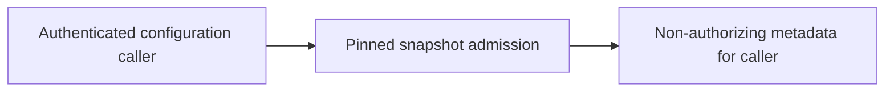
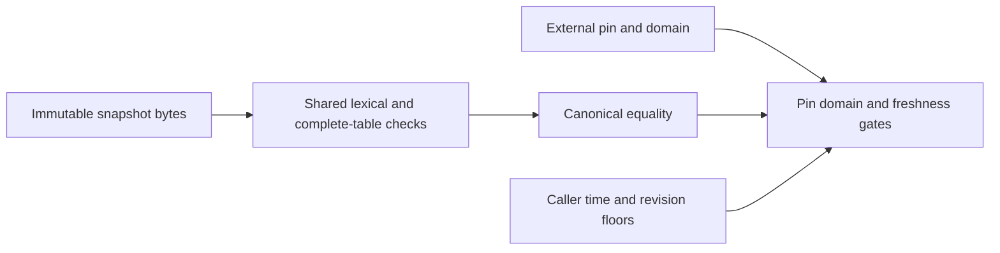
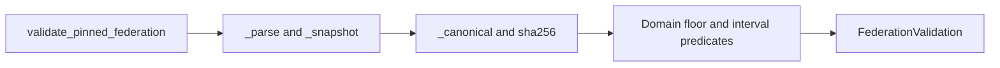

# Independent pinned federation admission v1

`validate_pinned_federation(federation, *, expected_federation_sha256, local_domain,
now_s, minimum_time_s, minimum_federation_revision)` validates a complete existing
[federation v1](federation-v1.md) snapshot without requiring a peer or bundle to succeed.
A valid empty peer table denies every peer and still returns its validated revision.
This supplies admission metadata for later caller persistence; it stores nothing.

The input must be exact immutable bytes, at most 65536 bytes and depth eight, with
canonical ASCII JSON and the existing safe-integer and closed-table rules. Every row
is validated, including rows irrelevant to any later bundle. The pin must be supplied
by authenticated configuration. Hashing a received table is not trust provisioning.
Local-domain aliases and nonnegative safe-integer UTC/time floors are external inputs;
the revision floor is a positive safe integer. All intervals are half-open.

Checks follow the existing federation gate order: caller argument validity, complete
snapshot shape/canonical bytes, exact digest pin, local domain, revision/time rollback,
then current interval. `FederationValidation` is frozen and returns `validated` with
reason `federation_matches`, exact `federation_sha256`, `federation_revision` and
`expires_at`. Rejection returns `rejected` with one of `invalid_federation`,
`federation_mismatch`, `local_domain_mismatch`, `federation_rollback` or
`federation_not_current`; all three metadata fields are null. Every result has
`execution_authority`, `motion_authority` and `evidence_verified` false.

Results are constructible application values, not authorization tokens. No peer policy
is fetched or authenticated, no signature backend is required, and no bundle verifier
is invoked. Consumers must use the same exact snapshot bytes and recheck trust/time
at use. There is no automatic expiry, current-revocation discovery, floor persistence,
same-revision conflict detection or whole-store rollback protection. Existing
`verify_federated_bundle` behavior and its inputs/results remain unchanged.

## Technology and implementation sequence

The [ADR](../../decisions/p16-federation-policy-v1.json) compares Python lexical hooks,
OTP JSON callbacks, .NET token spans and Rust visitors against the bounded offline
contract. Retain shared lexical/table validation and immutable-byte hashing; another
runtime supplies no demonstrated resource or trust advantage for this boundary.
This decision does not choose the future P18 runtime or claim measured speed.

Implement in the existing federation module with a separate result type and public
function. First add portable positive/negative admission cases and failing tests for
whole-table, canonical, pin, domain, time/revision and resource gates. Then implement
admission, add the cases to the isolated installed-vector runner, and run focused
compatibility, no-site, packaging-input, lint/security and ADR checks. No second peer
policy implementation or peer-owned module is added.

## C4 views

Context:


Containers:


Components:


Code:


These views implement computer-side configuration checks. They add no command,
control, communications, intelligence, surveillance or reconnaissance service, and
no physical actuation or weapon integration. No MLS/CNSA, availability or target
latency qualification is established. Insufficient information for tactical deployment.

## Verification evidence

At the implementation snapshot, 52 focused methods pass with zero skips, covering the
new API, existing federation/delivery behavior, installed-runner checks, finite package
input/archive checks, ADR validation and the dependency-free assurance regression.
Ten selected methods also pass in an isolated no-site interpreter with the crypto
package unavailable. The ten portable cases are pinned by digest in the installed
runner, whose complete source-side execution now covers 60 fixture cases plus one
real-file policy-floor scenario. This is configuration and source execution of an
installed-check tool, not an observed new installation or hosted acceptance result.

The API tests first failed because the function was absent. Runner tests separately
failed because its new scenario was absent. Both failure logs are retained. Twelve
metadata/authority substitutions in the runner tests must raise assertions, and the
complete-run test requires invocation of the new scenario. Existing rejection reasons
are compared directly across the independent and bundle APIs.

Ruff and formatting pass after correcting two dictionary-style warnings and explicitly
binding three loop variables in a test callback. The unexcluded Bandit scan retains
37 low-severity B101 assertion warnings in the developer runner; none is in production
admission. The full runner explicitly rejects optimized execution, which is covered by
existing focused tests. No warning was hidden by a blanket exclusion.

[Source-bound results](../../engineering/reviews/p16-federation-policy-v1-results.json)
identify the scoped checks and local raw logs. Reproduce the API boundary with:

```sh
PYTHONPATH=tests:. python -m unittest test_interop_federation_policy test_interop_federation test_interop_delivery -v
```

Durable federation-floor persistence remains the next software task. Whole-store
rollback protection requires an independently retained anchor and is not supplied here.
