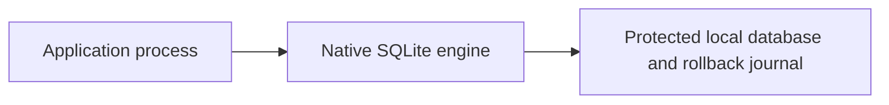
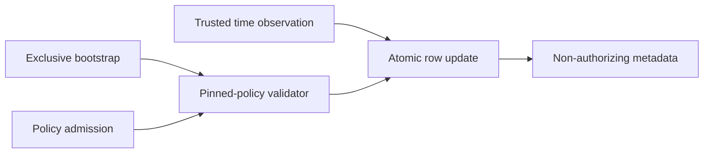

# Local policy-floor store v1

`aethron.passport_floor_store.PolicyFloorStore` persists one software-policy scope's
revision, exact policy SHA-256 and trusted UTC time floor. It uses the existing
`validate_pinned_policy` API; no passport success is needed to retain a revoking policy.
This optional helper adds file I/O without changing any existing stateless verifier.

## Preconditions and technology

Use Python 3.9+ with the `sqlite3` module and SQLite >=3.31. The caller supplies an
absolute string path (1..4096 characters, no NUL), a software scope alias matching
passport v1 identifier grammar, authenticated policy pins and independently trusted
UTC seconds. Paths are local configuration, never passport/network inputs. Protect
the file, its parent directories and SQLite journals with appropriate OS permissions.
The caller must supply a local filesystem with working SQLite locks/flushes. The
helper does not verify ACLs, detect network mounts or authenticate stored bytes.
It rejects a non-regular final path, including a final symlink, but is not a defense
against concurrent malicious directory replacement or hostile database files.

The [technology ADR](../../decisions/p16-policy-floor-store-v1.json) compares SQLite,
atomic file replacement, LMDB and Erlang storage, plus Python/Rust/.NET bindings.
The [implementation plan](../../engineering/plans/p16-policy-floor-store-v1.md) records
constraints and selection before code. SQLite supplies transaction/locking machinery;
Python directly calls the existing exact-byte policy validator. No measured language
performance advantage is claimed. SQLite's [atomic commit](https://www.sqlite.org/atomiccommit.html)
mechanism depends on its filesystem/hardware assumptions.

## Lifecycle and API

- `create(path, *, scope, policy, expected_policy_sha256, now_s, minimum_time_s,
  minimum_policy_revision)` validates a pinned bootstrap policy and exclusively creates
  a file. Existing files are never overwritten. Initial time is the supplied trusted
  `now_s`; revision/digest come from policy validation. A failed or interrupted creation
  can leave an unusable file. There is no automatic repair, reset or deletion.
- `PolicyFloorStore(path, *, scope)` opens an existing v1 store and checks its scope,
  format markers, exact schema and one metadata row. Missing, malformed, empty,
  incompatible or oversized files fail. Opening never silently creates a replacement.
- `read()` returns a frozen `PolicyFloor(scope, policy_revision, minimum_time_s,
  policy_sha256)`. This is persisted metadata, not a statement that the policy remains
  current. The helper stores no policy expiry or bytes.
- `accept_policy(policy, *, expected_policy_sha256, now_s)` validates under the
  current persisted floors inside a write transaction. Lower time/revision rejects.
  A different exact digest at the same revision rejects as `policy_equivocation`,
  including whitespace-only changes. An intentional byte change requires a higher
  revision. A higher valid policy may revoke every signer and still commit.
- `observe_time(*, now_s)` records a trusted nondecreasing time independently of policy
  validity. Equal time is allowed. Call it when trusted clock observations must survive
  a later failed policy admission. Rejected policy admission does not implicitly advance
  time. Wrong/untrusted future clock input can deny later admissions; clock trust is
  the caller's responsibility.

All metadata results have execution authority, motion authority and evidence
qualification set to false, including dataclass serialization. Failures raise
`FloorStoreError` with a fixed reason: `invalid_configuration`, `policy_rejected`,
`store_unavailable`, `invalid_store`, `unsupported_storage`, `invalid_time`,
`time_rollback` or `policy_equivocation`. Never turn these errors into default/zero
floors. Import fails if the optional platform SQLite module is unavailable; there
is no in-memory fallback. No path, policy bytes or database error detail is included
in the helper's failure message.

## Transaction, resource and rollback limits

Each operation opens a connection, uses `BEGIN IMMEDIATE`, validates the current row
and commits before returning. Connections are closed after success or failure;
uncommitted work rolls back on close. No state is cached between operations.
Cooperating processes use SQLite locks. Busy timeout is zero; the helper does not
retry contention. Disk calls, locks and operating-system scheduling still have no
hard-real-time bound. Even `read()` needs an immediate transaction and can fail on
contention or a read-only filesystem.

The profile requires DELETE journal mode and requests synchronous EXTRA, a 64 KiB
suggested page cache and at most sixteen database pages. Creation uses 4096-byte pages;
opening rejects a database file larger than 65536 bytes. The effective page-count
limit must equal sixteen; SQLite cannot lower it below the existing page count.
An under-byte-budget file with more pages therefore also rejects. These are local settings,
not a whole-process memory or database-plus-journal disk bound. SQL statements use
bound parameters; the exact schema rejects additional tables, triggers and views.
No extension loading or SQL supplied by callers is provided.

A returned snapshot can become stale immediately after commit. The store does not
atomically authorize subsequent use or cancel work already running. Consumers still
need fresh verifier calls with the returned floors and their current trusted inputs.
Federation revision floors have a [separate store](federation-floor-store-v1.md).
Policy enrollment, trusted clocks, provisioning, encryption,
distributed synchronization, backup recovery and whole-store anti-rollback detection
are separate requirements. The store grants no execution authority.

Restoring an older complete database restores its older floors. A retained test makes
this limitation explicit; file integrity checks cannot detect a valid old copy. Stronger
rollback protection needs independently retained state outside that rollback domain.
There is no history/audit API or secure disk-erasure guarantee. Digests are not anonymity.
No physical power-loss, target-hardware, MLS/CNSA, availability or tactical qualification
is claimed. Insufficient information for tactical deployment.

## C4 views

Context:


Containers:


Components:


Code:


These views implement computer-side metadata persistence only. They add no command,
control, communications, intelligence, surveillance or reconnaissance service.

## Focused evidence

Sixteen tests exercise real local files: reopen, exclusive initialization, same-revision
conflict, revoked policies, independent trusted time, malformed inputs/stores, lock
contention, a second process, effective page limits and commit-failure rollback. The commit fault uses a
SQLite connection subclass that performs the real update but raises at commit; it is
not a power-loss test. The restore test records a known limitation rather than claiming
tamper resistance. Current logs and source digests are in the
[result record](../../engineering/reviews/p16-floor-store-v1-results.json).

```sh
PYTHONPATH=tests:. python -m unittest test_passport_floor_store test_passport_policy -v
```
