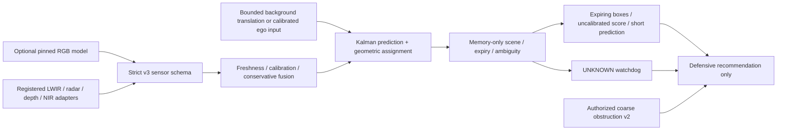

# Implemented v3 boundaries

The ordinary-scene tracker never receives through-obstruction geometry. The core imports neither OpenCV nor NumPy; the optional hash-verified RGB adapter is separate. Recorded pixel inference and original synthetic inputs feed the same public schema/session/replay path. Image registration supplies bounded translation, not full odometry. Output motion is normalized image-plane motion after compensation; range requires depth/radar evidence.

No appearance descriptors for association, identity table, image archive, trajectory history, external track ID, target API, autonomous actuator or network path exists in the runtime. Memory contains at most32 current tracks, each with a filtered state/covariance and latest measurement. Misses expire after500ms;10s track lifetime and30s scene reset bound continuity. A new scene clears linkage. Downstream consumers still have to enforce deadlines and cannot be prevented from maliciously recording outputs by an open-source library alone.

The fixed production/publication gates still apply to each claimed device and model. Current evidence is local software and tiny recorded/still integration tests, not operational rescue suitability. [Protocol](protocol-v3.md), [ADR](../decisions/0004-temporal-perception-v3.md), [model boundary](../models/v3-model-card.md).
