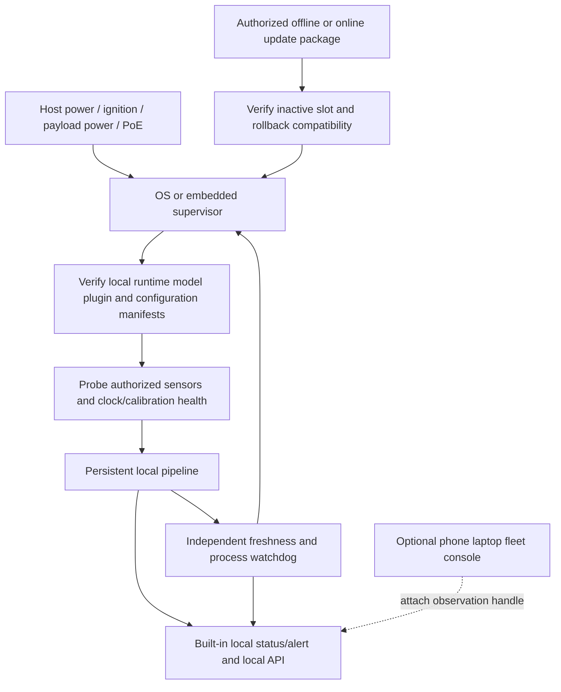

> **Phase 1 implementation update:** The blueprint below remains the specification. Actual implemented and executed coverage is tracked in [PHASES](PHASES.json) and [EXECUTION](EXECUTION.md); installation instructions are in [the edge guide](../../usage-edge.md) and [appliance guide](../../usage-appliance.md). Historical “SPEC ONLY” wording does not supersede those evidence records. Physical compatibility, field accuracy and certification remain unqualified.

# Permanent appliance runtime — SPEC ONLY

This design implements the [mandatory owner requirement](OWNER-NEXT-APPLIANCE-RUNTIME.md) in the plan. No appliance service/image is implemented or deployed in Phase 0. Normal operation is **provision once → power on → supervised local capture/inference/fusion/status**. A phone/laptop/terminal, external programming-host USB tether, WAN, online account, Supabase, Coolify or licensing heartbeat is not a runtime dependency. Fixed sensor wiring, compute, local camera LAN and protected power remain necessary.

## Deployment classes and ownership

| Class | Normal installed product | Lifecycle owner / admission |
|---|---|---|
| OEM embedded | Authorized native runtime/package within vehicle/vendor compute | OEM supervisor, documented camera APIs and signed deployment permissions; locked systems remain unavailable |
| Permanent vehicle retrofit | Secured compute module with compatible fixed cameras/nonvisible sensors, protected supply and local indicator | Appliance supervisor plus installer-approved ignition/power controller; exact environmental/EMC assessment |
| Onboard drone | Persistent image/package on companion/payload computer with integrated sensors | Payload supervisor; local inference independent of ground station/radio/cloud; flight controller remains separate |
| Home smart camera/NVR/NAS | Supported on-device package or fixed always-on camera hub | Device manager/system service; local power/PoE/LAN sufficient without WAN or logged-in viewer |
| Native phone | Device itself runs an OS-permitted active camera session | Mobile lifecycle/permissions; no unattended background-camera guarantee and no role as required companion for the four appliance classes |

Desktop/CLI/wheel/container commands remain engineering, integration and service entry points. Normal users receive a compatible preinstalled product, authorized native package, signed image or guided one-time appliance installer. Their guide describes indicator, commissioning, power and recovery; it does not require a shell each morning.

## Boot and supervision architecture

`ApplianceSupervisor` owns configured `RuntimePipeline` lifetimes at boot. Each pipeline owns source workers and bounded core sessions; the core still resets state at 30 s and rotates tracks at 10 s. Continuous operation means continuous reacquisition with bounded memory, never continuous person identity. A viewer handle neither starts nor sustains the core pipeline. Viewer disconnect, logout or DELETE releases only its observation handle. Admin-local explicit maintenance/shutdown is the only service operation that stops a configured pipeline; ordinary API clients cannot do so.

At startup, expose `booting/UNKNOWN` before data. Verify runtime/model/plugin signatures and hashes; validate local config schema, permissions and calibration. Missing/invalid model or sensor means `fault/UNKNOWN`; do not download automatically or wait for an activation server. Once valid fresh evidence exists, publish the real core result. OS liveness readiness and scene evidence readiness remain distinct. Persistent device configuration/administrative identity may survive reboot; no person/track state or imagery does.

## Concrete initial Linux package target

Phase 1 produces a local candidate for a **Linux systemd appliance** with a locked OS/base-image manifest, native amd64/arm64 build lanes and a VM boot test. systemd v255 documentation is a selected reference, not a claim that all hosts run that version [S63](SOURCES.md#s63), [S64](SOURCES.md#s64). OEM supervisors, Windows Service Control Manager and macOS launchd are additional platform targets; their camera permission/session restrictions must be qualified, not bypassed. A desktop app that needs an interactive login is not advertised as an unattended appliance.

Planned files: `packaging/appliance/systemd/aethron.service`, `packaging/appliance/install.py`, `packaging/appliance/image/`, `integrations/edge/aethron_edge/runtime/{supervisor,health,provisioning,updates}.py`. No files at these paths are created in Phase 0. The generated service uses a dedicated restricted account, root-owned executable/model/config manifests, read-only runtime, explicit writable state directory and only required camera/group/device access. It starts as part of normal system boot without waiting for WAN or `network-online.target`; a local IP camera appearing later is discovered with bounded retries.

Candidate policy to freeze in P1.7: `Restart=on-failure`, `RestartSec=2s`, start-rate limit 5 attempts/60 s, bounded graceful stop 10 s, and a supervisor watchdog notification interval selected and tested with the OS watchdog. Process watchdog timeouts do not replace 100 ms evidence expiry. Supervisor is isolated from inference worker stalls. After the retry budget, show a latched local fault and wait for explicit maintenance or bounded cooldown policy; never endless reboot loops. Cap log storage, do not persist frames, and test disk-full recovery. Tighten filesystem/network privileges per profile while allowing the selected hardware backend; blindly enabling `PrivateDevices` would hide required cameras and is not a tested security recipe.

An on-device LED/display/audio notifier or equivalent independent local status path is required per appliance class. It distinguishes startup, valid-supported observation, degraded/no evidence and service fault without declaring SAFE. A safety-critical alarm needs its own qualification; prototype status is informational. A process-dead appliance cannot render its own fault through software alone: exact hardware qualification must include an independently supervised indicator/watchdog or explicitly document the remaining fault-detection limitation.

## Provisioning, updates and recovery

Guided one-time provisioning installs a verified package/image, binds authorized sensor profiles/calibration, configures local auth and enables the boot service. Temporary Bluetooth/Wi-Fi/LAN/USB/app use is allowed; all credentials/model/calibration required for offline boot are stored locally with suitable permissions. Initial provisioning checks vendor SDK terms: a mandatory continuing online activation or license heartbeat disqualifies that plugin from the standalone-offline class. Select a permitted alternative; do not bypass licensing.

Device identity is for update/auth administration only, preferably hardware-backed where available. It is local/private by default and must not appear as a tracking identifier or public telemetry label. Calibrations bind to the actual sensor tuple without exposing serials publicly. Provisioning secrets are removed/rotated when setup closes.

Updates are explicit, authenticated packages verified against a pinned trust root and anti-rollback policy. Stage image/model/plugin/config in an inactive slot or separate versioned directory; verify compatibility and run self-test before atomic switch. Keep last known-good compatible version and transactional configuration migration. Simulate power loss during every update stage. No incomplete download replaces the active model, and no failed online check blocks steady-state perception. Secure recovery cannot silently accept unsigned packages or restore a known-revoked version.

Local service mode provides aggregate diagnostics, version/digest, sensor faults, calibration status, clock error and temperature/resource summaries without exporting raw imagery by default. Physical/admin-authenticated factory reset erases keys/config and returns to unprovisioned/UNKNOWN; it does not restore a functional perception claim until recommissioning. Operators get a one-page guide for each class; technicians get detailed debug/update rollback instructions.

## Unplug/reboot/offline acceptance — A01–A09

All are required design gates; software-in-loop first, exact hardware later. Simulation is labeled and cannot prove electrical/thermal behavior.

| Gate | Reproducible procedure | Required outcome |
|---|---|---|
| A01 one-time provision | Install signed local candidate, close provisioning tool, remove its credentials/endpoint, reboot VM/device with no user login | Enabled service starts from local artifacts and valid local source; no shell/user launch |
| A02 no companion/WAN | Disable WAN/cloud/DNS/installer, phone Bluetooth/Wi-Fi and remote viewers; preserve fixed sensor bus/local camera network; cold reboot | Local acquisition/inference/fusion/API/notifier continue; no license heartbeat |
| A03 power lifecycle | Reboot, ignition/payload/sleep transitions; software inject incomplete writes; later measured brownout/unclean-power bench tests | Config integrity, new scene IDs, startup UNKNOWN, bounded recovery; no stale observation restored |
| A04 sensor/night faults | Lose RGB only, then nonvisible sensor, delay/reorder/black frames, reconnect | Valid nonvisible support survives RGB loss; unsupported zero-visible/all loss UNKNOWN; resume only fresh calibrated evidence |
| A05 worker/accelerator faults | Crash/hang decoder/model worker, unavailable provider, repeat beyond retry budget | Expiry maintained by independent supervisor, bounded restart, latched fault; no silent fallback |
| A06 resource/thermal soak | VM contention/disk-full and an initial 1-hour software soak; later predeclared rig-duration/ambient campaign | Report p50/p95/p99/max acquisition-to-publication latency, uptime/drops/RSS/storage/power/temperature; no freshness waiver |
| A07 update/recovery | Corrupt manifest/model, interrupt staged update, incompatible config migration, revoked rollback, factory reset | Reject tampering, keep verified compatible active image or fault safely; offline recovery documented |
| A08 local independence | Disconnect every API client and stop UI process; observe built-in notifier/API locally | Pipeline continues independently; no hidden browser/socket lease sustaining inference |
| A09 per-class recipe | Execute OEM (when accessible), sealed retrofit, drone companion and home hub recipes on respective evidence lanes | Explicit software versus SKU/field status; normal-user guide needs no manual terminal or connected phone |

Phase 1 closes A01/A02/A03 software simulation/A05/A07/A08 on a real service-manager boot VM and recorded/virtual sources, and provides A04/A06 software reports. It writes A09 concrete recipes. Physical power, real zero-visible accuracy and temperature/range claims wait for Level C/D. An unavailable VM runner is a pending required gate, not an excuse to replace boot with calling `main()` in a unit test.

Current raw geometry increment: [sensor appliance](SENSOR-APPLIANCE.md) implements signed bounded recorded processing in the same supervisor. Its API remains UNKNOWN; the earlier VM soak is not evidence of this new driver’s boot behavior.
