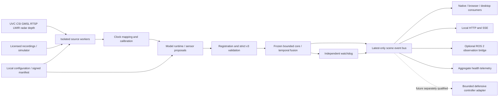

> **Phase 1 implementation update:** The blueprint below remains the specification. Actual implemented and executed coverage is tracked in [PHASES](PHASES.json) and [EXECUTION](EXECUTION.md); installation instructions are in [the edge guide](../../usage-edge.md) and [appliance guide](../../usage-appliance.md). Historical “SPEC ONLY” wording does not supersede those evidence records. Physical compatibility, field accuracy and certification remain unqualified.

# Architecture — SPEC ONLY additions around the frozen core

## Selected approach and alternatives

Retain the current Python core, put network/device integration in a separately packaged `aethron_edge` boundary, and exchange strict versioned bytes with it. This preserves existing deterministic evidence and the static no-network policy in `aethron/`. A rewrite in Rust/C++ could improve bounded memory and native embedding, but would invalidate much existing evidence before proving a bottleneck. A ROS-only distribution would fit robotics but impose middleware on phone/desktop/library users. Select the split package approach; measure before adding native kernels.

There is no actuator path in Phase 1. The future controller boundary must preserve explicit authorization, platform-specific assurance, independent watchdog, manual override and bounded defensive behavior. It must never implement pursuit, target designation or weapon integration. A STOP/HOVER/LAND/RETREAT recommendation is data, not an instruction sent to a vehicle.

## Components and contracts

| Component | Owns | Must not own |
|---|---|---|
| `aethron` existing core | strict parsing, finite state, v3 tracking/fusion/recommendations | network, vendor SDK loading, live recording |
| `aethron_edge.sources` proposed | negotiated capture, decoder lifecycle, backpressure | identities, conclusions about free space |
| `aethron_edge.timebase` | exposure-clock conversion, error bound, reset detection | relabeling receive time as exposure time |
| `aethron_edge.calibration` | intrinsics/extrinsics, validity, transform evidence | manufacturing confidence or unsupported range |
| runtime workers | pinned weights, preprocessing, per-model class mapping | training labels at inference, silent backend fallback |
| `aethron_edge.service` | auth, session ownership, HTTP/SSE envelopes | modifying v3 thresholds or trusting caller `now_ms` |
| event bus | bounded latest snapshot, gap/expiry notifications | history database, durable track identifiers |
| UI/SDK | show freshness, uncertainty and sources; expire locally | declaring SAFE or hiding UNKNOWN |
| audit/telemetry | release/config digest, fault code/count/duration | raw frames, locations, human boxes/IDs in persistent logs |

Proposed source ABI: `Source.open(config: SourceConfig) -> SourceInfo`, `Source.read(deadline_ns: int) -> FrameEnvelope | SourceFault`, `Source.close() -> None`. A frame includes bounded image handle, modality, sequence, exposure/receive times, clock ID, timestamp uncertainty and calibration ID. Vendor data stays outside v3 until mapped. Driver configs are typed allowlisted data, never arbitrary Python imports or shell pipelines. See [API](API-CONTRACT.md).

## Data and clock flow

Sensor exposure → capture/decoder → time mapping → preprocessor → detector → calibrated registration → strict v3 bytes → `Session.step(..., now_ms=trusted_clock)` → latest snapshot → independently expiring client. No queue accumulates old frames: one pending frame per source and one pending inference, plus the active buffer. Drop the older pending frame and count the drop. Budget both encoded bytes and decoded dimensions before allocation.

Local monotonic time is the authority. Remote clocks require offset/drift/error measurement; UTC is audit metadata, never a freshness clock. ROS `/clock` is simulation-only unless an explicit mapping qualifies it. A restart, wrap, clock jump or source reattach produces a scene break. Fusion checks worst-case age/skew including mapping uncertainty; it does not re-date packets. A network sender cannot set trusted `now_ms`.

Image optical coordinates are x right, y down, z forward in the adapter frame metadata; v3 boxes are normalized in one registered image plane. ROS body/map frames and autopilot NED/FRD require explicit transforms and units; no automatic ENU/NED guessing. Current v3 supports translation compensation only: rotations, parallax and uncertain extrinsics withdraw motion and linkage. Metric 3D fusion and physical velocity require a future protocol, not additional undocumented fields.

## Runtime and language decisions

Python remains the tested semantic core and service orchestration. C++ is justified for a libcamera/GStreamer/vendor SDK worker or native inference binding when required; a C ABI can later serve embedded clients. Rust is a candidate for a hardened decoder supervisor only if measured reliability/packaging benefits beat maintaining another toolchain. Swift and Kotlin own native camera/UI/lifecycle adapters; TypeScript owns browser/API consumers. Go adds no necessary responsibility now. ROS 2 is optional middleware for robot image/CameraInfo and telemetry integration, not a dependency of `import aethron`.

CPU provides the reproducible fallback lane only when explicitly selected. ONNX Runtime providers, TensorRT, Core ML and platform NPUs need separate artifact/provider/driver evidence [S25](SOURCES.md#s25). TensorRT engines are device/toolchain artifacts, not universal portable weights. Model/provider startup, partition fallback and quantization changes must be measured. No backend can extend the 100 ms freshness limit.

## Deployment modes

In-process offline library; single-user local edge daemon; private enterprise edge gateway with authenticated viewers; robot companion; ground-station observation; native application using conformance-compatible embedded logic. Cloud may manage signed packages and aggregate opt-in device health; it is not the required safety loop. No raw imagery upload by default. Project-owned code is GPL-3.0-only with separately negotiated commercial licensing. Enterprise adapter distribution must satisfy the chosen license and third-party SDK terms; process separation alone does not resolve copyleft or SDK obligations.

## Resource/failure policy

Frozen v3: 65,536-byte input; depth 8; ≤5 sensor kinds; ≤64 detections; ≤32 tracks; frame/sensor age ≤100 ms; support skew ≤50 ms; prediction 200 ms; missed window ≤500 ms; track rotation 10 s; session reset 30 s; >1 s gap resets linkage. Unsupported class/provider, stale timestamp, missing calibration or model failure becomes explicit invalid evidence. No support means UNKNOWN plus the configured bounded recommendation.

Proposed edge budgets are additional admission limits: 2 sources for the initial driver milestone, ≤1920×1080 decoded input, ≤16 MiB encoded frame, ≤64 MiB total raw-frame slots per worker, 1 inference worker per session, ≤4 active sessions/device, ≤8 SSE subscribers. These are engineering defaults to test and revise before their own freeze, not claims of achieved resource use. Core T10's 32 MiB traced-memory gate does not include models/decoders; report process RSS separately.

## Primary appliance lifecycle and client independence

The [owner requirement](OWNER-NEXT-APPLIANCE-RUNTIME.md) makes permanently installed supervised execution the normal consumer/fleet path. [APPLIANCE-RUNTIME](APPLIANCE-RUNTIME.md) defines boot, provisioning, local notifications, updates, watchdogs and A01–A09 acceptance. The architecture above sits beneath an OS/vendor supervisor; it boots configured pipelines from verified local artifacts without any laptop, phone, internet, backend or manual command. API/CLI tools are optional engineering/maintenance clients.

Pipeline ownership is `ApplianceSupervisor → RuntimePipeline → sources/core`, never an API viewer lease. Persistent device configuration/auth identity is allowed for administration, but person/track state is erased across scene expiry/reboot. Capture/inference continues after all observers detach. Startup, license/model failure, disk-full or accelerator faults have independent local UNKNOWN/fault reporting. No online service is a prerequisite to verify/install already provisioned model bytes.

Linux/systemd is the first concrete boot target; OEM supervisor, native platform manager and home hub recipes extend it. Native iOS/Android camera usage remains subject to foreground/permission lifecycle, so those apps cannot be promised as universal unattended camera daemons [S61](SOURCES.md#s61), [S62](SOURCES.md#s62). A phone is optional for the other appliance classes. Enabling autonomous **runtime startup** does not enable autonomous driving, flight control, pursuit or target designation.
