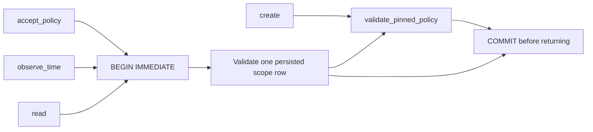

# P16 local policy-floor store v1

A single local policy scope needs persisted time/revision floors independent of whether
any passport succeeds. This new slice is generic offline software trust metadata;
it has no command, observation, device, transport or actuation interface.

Deployment assumptions: Python 3.9+ with SQLite >=3.31, a caller-controlled absolute
path in an access-controlled local directory, working SQLite file locks and durable
flush semantics. One row per database; exact policy bytes remain caller-owned.
No network filesystem, hostile database ingestion, automatic recreation, history,
background service or hard-real-time claim. All paths/configuration are local trusted
inputs. A privileged filesystem rollback is outside the protection boundary.

## Selection before implementation

Select SQLite rollback transactions, DELETE journaling and synchronous EXTRA. A
BEGIN IMMEDIATE transaction reads the current row, validates the incoming policy,
updates all metadata and commits before returning. Contention fails immediately at
the SQLite busy handler (timeout zero), without promising a wall-clock deadline.
Opening never creates; initialization is explicit and exclusive. Missing, invalid,
wrong-scope or incompatible databases fail closed, without automatic repair/reset.

Alternatives researched: atomic JSON replacement plus OS locks/fsync; LMDB native
transactions; Erlang DETS/Mnesia; SQLite bindings in Rust, .NET and Python. SQLite
provides a transaction boundary around the read/check/write operation without designing
our own journal or a distributed runtime. DETS is a persistent term store rather than
this transaction API; Mnesia supports transactions but brings a database/runtime model
unneeded for a single local row. The LMDB documentation URL was unavailable, so no
unsupported comparison of its durability guarantees is used to select a winner.

Select Python's SQLite binding and the actual public pinned-policy validator. SQL
mutation/locking/journaling remains in SQLite's native engine; Python exact bytes
preserve the validated policy across hashing and metadata extraction. Rust/rusqlite
and Microsoft.Data.Sqlite can implement the same storage semantics but would need a
second validator or process boundary for this component. No native deployment or
measured latency requirement establishes a material gain from that boundary here.
This is a semantic choice, not a performance ranking or tooling/familiarity preference.
Sources and limits are recorded in the strict JSON ADR.

## Contract

`PolicyFloorStore.create(path, scope=..., policy=..., expected_policy_sha256=...,
now_s=..., minimum_time_s=..., minimum_policy_revision=...)` validates an externally
pinned bootstrap policy, creates a new store exclusively, and persists its revision,
exact digest and trusted now. Existing files are never overwritten. Interrupted
initialization can leave an invalid file; operators must resolve that explicitly.

`PolicyFloorStore(path, scope=...)` opens only an existing compatible store.
`read()` returns immutable scope, policy revision, minimum time and policy digest.
`accept_policy(policy, expected_policy_sha256=..., now_s=...)` validates against
current persisted floors under the transaction. Lower time/revision rejects. Same
revision with a different exact digest rejects, even if newly externally pinned;
an intentional policy-byte change needs a higher revision. Higher valid revocation
policies persist even if they revoke every passport. Rejected updates do not commit.
`observe_time(now_s=...)` persists a caller-trusted nondecreasing time independently
of policy validity/expiry. Callers must use it for trusted clock observations that
need retaining when policy admission fails. The store does not obtain a clock.

Results always deny execution/motion authority and evidence qualification. Exceptions
have fixed reasons with no path/policy echo. Separate operations are not a transaction
with later passport use; fresh verification and authorization remain caller duties.
The database carries no policy bytes, personal identities, key material or history.

## Implementation and verification sequence

1. Failing real-file tests for missing API, reopen, exclusive creation and bounds.
2. Native SQLite transaction adapter plus existing pinned-policy validation.
3. Real competing connections and subprocess reopen; rollback on injected commit
   failure, malformed/wrong-scope stores, equivocation and negative restore evidence.
4. Focused dependency tests, Ruff/Bandit, ADR validation and source/package inventory
   updates. Keep remote installation/physical power-loss qualification unclaimed.

C4 context: trusted configuration caller → local floor persistence → stateless verifier.
Container: application process → native SQLite → protected local database/journal.
Component: explicit bootstrap, time observation and policy admission share row validation
and transaction handling. Code view:

These views describe computer-side trust metadata only. No command/control,
communications, intelligence, surveillance or reconnaissance service is implemented.
No MLS/CNSA, availability, tactical, physical or hardware anti-rollback qualification.
