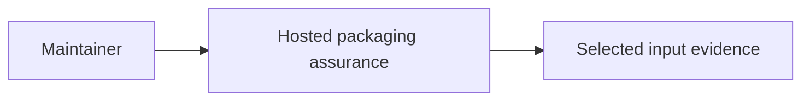
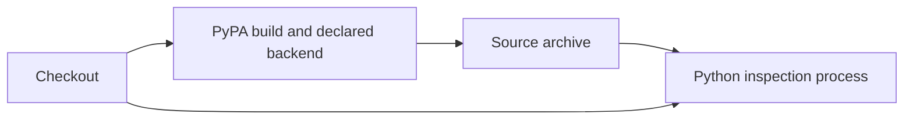
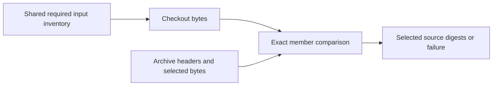
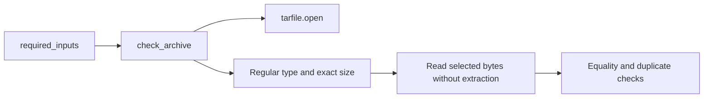

# P16 source-archive input evidence

Reviewed 2026-10-10 against `a92a8293d46ede4bfea4e234f701733943713b4b`.
The current policy and review order were read in full. Earliest passport parsing was
reread; no runtime change follows from this packaging correction.

The preceding manifest correction proves selection over 22 candidate inputs. The
existing installed-source check proves equality for seven installed module files.
Neither check inspects the source archive produced by the build backend. Their
published limitations are correct; the missing hosted archive check is now executable.

`scripts/passport_sdist_check.py` shares the finite `required_inputs` inventory with
the manifest regression test. It compares exact regular archive members with the
selected checkout bytes, rejects missing, changed, duplicate, sparse or non-regular
selected members, and returns their SHA-256 digests. It reads members without extracting
or executing them. The CLI derives the archive prefix from this project's static,
normalized name and version, and requires Python 3.11 or later for `tomllib`.

The sensor-conformance job uses Python 3.13 and PyPA build 1.6.1 to create a source
archive in the runner temporary directory, then invokes the checker. A ten-minute
job timeout limits hosted execution. The workflow now discovers both packaging
test modules, and its event filters cover their paths. No production or peer-owned
source files change.

## Technology decision

The [strict JSON ADR](../../decisions/p16-archive-inputs-v3.json) compares standard-library
Python inspection, Go `archive/tar`, Java Commons Compress and alternative uv/Hatch
build orchestration. The deciding requirements are selected-member semantics and
no-extraction inspection, rather than a measured throughput target. Python provides
the required member interfaces directly and allows a single inventory shared with
the selector test. Go and Java support archive inspection, but still require the same
application-specific checks. A build frontend change alone cannot supply those checks.
KEEP is scoped to this assurance component; no language performance ranking is claimed.

Primary references: [tarfile](https://docs.python.org/3.13/library/tarfile.html),
[PyPA build](https://build.pypa.io/en/stable/),
[Go tar](https://pkg.go.dev/archive/tar),
[Commons Compress](https://commons.apache.org/proper/commons-compress/),
[uv build](https://docs.astral.sh/uv/concepts/projects/build/) and
[Hatch](https://hatch.pypa.io/latest/config/build/).

## Verification and limits

The initial six archive tests errored because the checker did not yet exist. This
is a missing-implementation RED result, not a production defect demonstrated by six
assertion failures. After implementation, those six methods and the shared manifest
method pass. Counterexamples cover wrong or absent members, changed bytes, larger
members, duplicates, links and directories. The positive case confirms no extraction.

A separate isolated CLI probe generated a small synthetic archive containing the
22 selected checkout inputs. It accepted that archive and rejected an altered member
with no successful JSON output. This was not a backend source-distribution build.
Ruff initially reported one formatting issue, which was corrected; its original log
is retained. Focused results and source/log hashes are in the
[result record](p16-archive-inputs-v3-results.json).

No actual hosted run, complete source distribution, independent install/demo,
signed distribution, or whole-product acceptance is claimed here. This checker is
for a trusted archive built within the hosted job. It does not validate unselected
entries or aliases, enforce global decompression/member-count limits, authenticate
an artifact, or provide an atomic checkout snapshot. Selected-member digests are
not a whole-archive signature or dependency closure manifest.

## C4 assurance views

Context:

Containers:

Components:

Code:

These are build-assurance views, not a C4ISR operational architecture. No command
authority, communications transport, intelligence/surveillance/reconnaissance
service or device control is introduced. Insufficient information for tactical
deployment. Next: inspect exact-head hosted source-archive evidence when available,
while continuing independent release assurance without waiting on CI.
