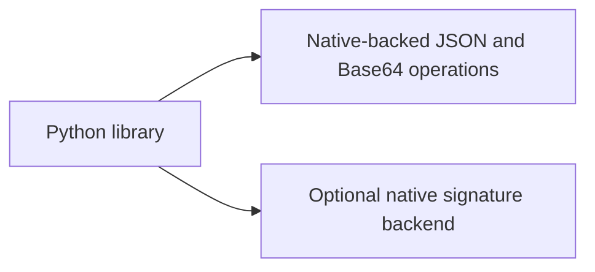

# P16 earliest admission review: canonical Base64

Fresh review at `b1301a1f57c16325ae893942e70afb51da047798`, 2026-10-10.
The walk restarts with bounded lexical passport admission and the envelope/signature
boundary. KEEP the runtime; FIX missing negative coverage. This review does not
complete the remaining current P16–P19 review or confer deployment qualification.

## Constraints, candidates and finding

The offline API accepts immutable UTF-8 JSON with a 65536-byte/depth-eight bound,
closed ASCII fields, safe integer tokens and canonical payload bytes. The envelope
carries one 64-byte Ed25519 signature. Its payload and signature use canonical padded
standard Base64, checked by decoding and re-encoding for exact equality before crypto.
Trusted policy/time/floors and expected artifact identity remain caller inputs.

The fresh source walk confirms pre-conversion integer limits, duplicate-key callbacks,
explicit UTF-8 decoding and native signature verification with fixed failure metadata.
No process-memory, target hardware, throughput or hard deadline has been specified.
The [decision record](../../decisions/p16-base64-current-v3.json) records constraints,
alternatives and limits; no runtime is retained merely because it is installed.

| Candidate | Evidence and implication |
|---|---|
| Python JSON/Base64 plus native crypto | JSON lexical callbacks express the closed profile. The Base64 decoder's alphabet validation alone does not establish canonical pad bits in the executed environment. Exact re-encoding supplies the additional gate. [JSON](https://docs.python.org/3/library/json.html), [Base64](https://docs.python.org/3/library/base64.html). |
| Erlang/Elixir OTP JSON/Base64 | JSON callbacks and binary encodings are credible alternatives; complete duplicate, numeric and canonical-envelope rules still require an explicit adapter. No OTP runtime was executed. [JSON](https://www.erlang.org/doc/apps/stdlib/json.html), [Base64](https://www.erlang.org/doc/apps/stdlib/base64.html). |
| Rust base64 engine | Explicit trailing-bit and padding configuration can implement stricter decoding. This is a serious native candidate; no measured target requirement establishes a migration benefit for this bounded API. [Configuration](https://docs.rs/base64/latest/base64/engine/general_purpose/struct.GeneralPurposeConfig.html). |
| C#/F# .NET Convert | Decodes Base64 into bytes and documents whitespace handling; an application profile still needs to impose exact accepted wire spelling. No .NET implementation or parity benchmark was run. [API](https://learn.microsoft.com/en-us/dotnet/api/system.convert.frombase64string). |

KEEP follows the small explicit acceptance surface, immutable buffers and standard
native-backed codec operations. The other implementations remain credible. No timing
ranking or claim of optimality for an unspecified embedded target is made. An actual
memory/deadline requirement would reopen native/streaming selection.

[RFC 4648 section 3.5](https://www.rfc-editor.org/rfc/rfc4648.html#section-3.5)
explains that nonzero unused pad bits can give multiple spellings for the same decoded
bytes, and that a referring profile can require rejection. This passport profile
already does so. Removing its round-trip equality check in an isolated in-memory
module left all 17 preexisting signature-verification methods passing. This is a
coverage defect, not a demonstrated vulnerability in the unchanged production code.

Two added methods now construct 15 signature aliases and 18 payload aliases spanning
both padded tail lengths. Each asserts identical decoded bytes, verifies canonical
positive controls with real signatures, and requires `invalid_input` with empty
authentication metadata for the aliases. The public RFC seed remains test data.

## Evidence and limitations

The unchanged runtime passes both new methods. Removing only the round-trip guard
produces 33 assertion failures, zero errors and zero skips. The focused parser,
verification, lexical, optional-backend and existing ADR checks pass: 36 methods,
zero skips. New ADR validation is also run separately after publication of its record.
Ruff and formatting pass. Bandit retains two low-severity B311 findings in existing
seeded mutation-test generators; those generators do not produce cryptographic keys.
No production finding is reported by this scoped scan.

An initial third test incorrectly assumed that superfluous padding was accepted by
the executed decoder. It raised `binascii.Error` before the application guard, so it
was removed from the guard-sensitivity experiment; the failure log is retained.
No frozen threshold or production acceptance behavior changed.

The existing hosted passport job discovers this test file and requires crypto import.
Local execution is not a new installed-distribution, hosted matrix, physical or
cryptographic accreditation result. No advanced command, sensor fusion, surveillance,
transport, MLS/CNSA, availability or real-time service is established by these checks.
Insufficient information for tactical deployment.

## C4 views

Context:

Containers:

Components:

Code:

[Results and source bindings](p16-base64-current-v3-results.json) retain the finite
scope. Reproduce with `PYTHONPATH=tests:. python -m unittest test_passports test_passport_lexical test_passport_optional_backend -v`.
The next earliest component in this restart is independent pinned-policy validation,
then local floor persistence and evidence binding. Forward integration remains pending.
