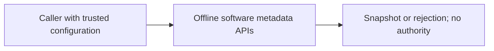
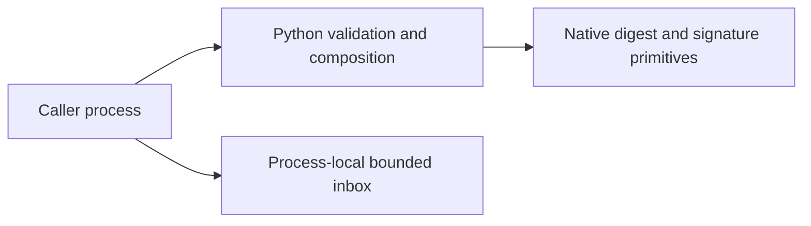
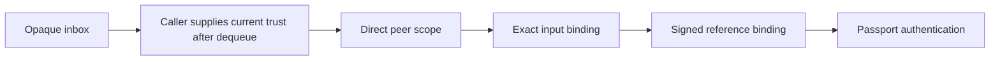
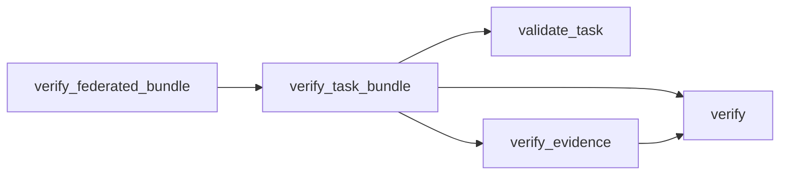

# P16 binding, composition and public evidence review

Baseline `ec55eb8bd3cdb25641b6ec761bbd200d90a5604b`, reviewed 2026-10-10.
The floor-store bridge commit matches its expected parent and all thirteen recorded
file hashes. The owner policy was reread; the source walk restarted with the parser,
signature/policy gates, then proceeded through evidence, tasks, bundles, federation
and inbox. No production runtime or wire contract changes in this slice.

## Component decisions

The [strict ADR](../../decisions/p16-binding-current-v3.json) records deployment
constraints and source-bound alternatives per component. These are bounded offline
software APIs, with caller-provided trust, time and immutable byte snapshots. There
is no target hardware, latency/RSS SLA or service-availability evidence.

| Component | Fresh decision and decisive comparison |
|---|---|
| Evidence bytes | KEEP exact Python bytes/tuple plus native per-blob SHA-256. [Rust sha2](https://docs.rs/sha2/latest/sha2/), [.NET SHA256](https://learn.microsoft.com/en-us/dotnet/api/system.security.cryptography.sha256.hashdata?view=net-10.0) and [BEAM crypto](https://www.erlang.org/doc/apps/crypto/crypto.html) are credible; none removes the stable-input, complete-set and signed-metadata requirements. Current tests exercise size/type gates before hashing, late failure, signature rejection and all three kinds/outcomes. |
| Task description | KEEP lexical callbacks and canonical bytes. [OTP JSON callbacks](https://www.erlang.org/doc/apps/stdlib/json.html), [Utf8JsonReader](https://learn.microsoft.com/en-us/dotnet/standard/serialization/system-text-json/use-utf8jsonreader) and Rust typed decoding are alternatives; the present hooks express lexical rejection without another tokenizer. Exact pins, half-open expiry and cross-field restrictions remain separate application checks. |
| Bundle composition | KEEP immutable snapshots and direct versioned verifier calls. Rust borrowing or managed stable buffers can support the same ownership contract, but no measured resource benefit warrants a second acceptance implementation. FIX test coverage of complete signed evidence references; actual runtime already preserves them. |
| Direct federation | KEEP the bounded explicit table. [Cedar](https://docs.cedarpolicy.com/overview/terminology.html) and [OPA/Rego](https://www.openpolicyagent.org/docs/policy-language) support broader policy models; a policy language or hierarchy is not required by this closed direct-peer profile. FIX the same metadata coverage gap at this return boundary. |
| Inbox and delivery composition | KEEP native deque plus one explicit lock. [Rust bounded channels](https://docs.rs/crossbeam-channel/latest/crossbeam_channel/fn.bounded.html), [.NET channels](https://learn.microsoft.com/en-us/dotnet/core/extensions/channels) and [Erlang processes](https://www.erlang.org/doc/system/eff_guide_processes.html) still need aggregate-byte, per-peer and expiry accounting. Existing real concurrent admission and delivery tests check quotas, distinct payload retention, stale trust, clock faults and close semantics. No new runtime mismatch found. |

The early parser/signature/pinned-policy source remains unchanged and passes its focused
tests. The prior floor-store selection is also exercised again. Choices are about the
specified acceptance and ownership semantics; no candidate benchmark, latency ranking,
CNSA/MLS assurance, native-runtime disadvantage or deployment qualification is inferred.
Future streaming/native/contended workloads require their own measured decision.

## Signed evidence coverage correction

The two component suites used synthetic-kind fixtures and primarily asserted outcomes.
Independent in-memory changes to bundle and federation return expressions relabeled
all references as synthetic. Each old eleven-method suite still passed. Two new tests
sign mixed synthetic/recorded/external-unverified references, reverse the signed order,
permute supplied blobs and assert every returned digest, kind and outcome in signed
order. Each weakened variant now produces one expected assertion failure; unchanged
production code passes. All authority and qualification flags remain false.

An initial control runner copied module globals, which hid a test's hash-failure patch
and caused an unrelated assertion failure. That diagnostic is retained. The corrected
runner compiles only the selected function into its actual module globals, restores it
in `finally`, verifies unchanged source bytes and checks exact failure/error/skip counts.
This demonstrates test sensitivity, not a formerly deployed relabeling defect.

## Hosted publication failure and correction

At published PR #35 head `8c6ccdb9c4e9fa4aa49f9644398e47e5305973da`, both inspected
[core](https://github.com/Nima0101/aethron/actions/runs/38078187015/job/114289457265)
and [edge](https://github.com/Nima0101/aethron/actions/runs/38078186991/job/114289457543)
jobs failed the public-content gate on the policy-admission result record. The failure
was reproduced locally using the unchanged public-content/link loop from
`scripts/verify.py`. A focused search also found executable host paths in the ADR
publication result record.

Nine executable paths across those two records now use public basenames. Each record
explicitly identifies the redaction, original SHA-256 and baseline commit. Historical
arguments, outcomes, source digests and runtime-log digests are unchanged. These edited
command arrays are not represented as verbatim historical argv or fresh execution.
Historical source reconciliation still refers to the original Git revisions. This
forward correction does not remove earlier Git copies of those records.

The unchanged product-content/link loop now passes. Only its tracked-file assignment
and scan loop were executed by an AST-selected runtime probe; the complete verifier,
full tests, evaluation and consumer subprocesses were not run. No checker exceptions,
threshold changes, history rewriting, forced push or qualification bypass were used.
The prior hosted failures remain recorded; a new hosted PASS is not claimed.

## Current C4 views

Context:

Containers:

Components:

Code:

These views describe computer-side metadata checks and a caller-composed local queue,
not a command platform, communications service or ISR system. Neither enqueue nor a
bound result grants authority. No runtime cancellation of already-returned snapshots.

## Verification and remaining scope

The source run passes 116 focused methods without skips. Two deliberate relabeling
variants each fail their new assertion, without errors or skips. Source/log hashes and
commands are in the [result record](p16-binding-current-v3-results.json).

Next earliest unreviewed component: published schemas and conformance tooling, followed
by remaining packaging/probe/consumer review. Installed floor-store conformance and
other P16 software gaps remain unfinished; P17/P18/P19 are not complete. No audit-complete
marker. Insufficient information for tactical deployment.
