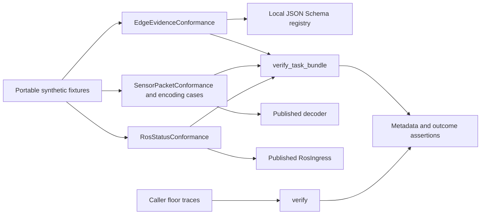

# P16 current consumer and lifecycle review

Reviewed 2026-10-10 at `e45f2f7a7fb582933a49ae4c9f11e29448c9cf3c`.
The earliest parser was reread before these consumers. Current source, fixtures,
optional dependencies and existing negative traces were reviewed afresh; earlier
decisions are evidence inputs only. Decision: **KEEP four assurance components;
FIX two missing rejection-metadata assertions**. Production behavior is unchanged.

## Finding and verification

The edge and packet consumers asserted that rejected results omit task/passport
digests, expiry and evidence, but omitted `policy_revision`. A finite control called
the actual verifier and replaced only that field on rejected results with `3`.
Both old methods passed. Adding an explicit `assertIsNone` to each method produces
seven expected assertion failures: five edge cases and two packet cases. There are
no errors or skips, and both patched bindings are restored. Positive results are
unchanged by the control. This demonstrates test sensitivity, not a runtime defect.
The ROS consumer already asserts this field's absence on rejection.

Twenty-four focused methods pass with zero skips: one lexical method, three edge,
seven packet/encoding, three ROS-status, eight policy and two lifecycle methods.
Ruff, formatting and Bandit on the changed test files pass. Four strict ADR schema
methods validate the decision records and their rejection cases. No full repository,
hardware, installed distribution or hosted CI run is credited here.

All seventeen producer-source bindings across four corpora match both local bytes
and fetched `origin/main` at `fce89d3904ddbfb004b55718fab955c91a9c49a0`.
They cover eleven distinct files. Historical corpus `source_commit` values remain
unchanged. This is a current byte comparison, not loaded-code attestation, provenance
authentication or dependency closure. No peer-owned source or fixture is changed.

## Constraints and technology choices

This work observes small synthetic cases offline through published APIs. There is
no target hardware, latency deadline or device memory budget for these test drivers.
Each component has its own current ADR:

| Component | Decisive evidence and KEEP rationale |
|---|---|
| [Edge fixture](../../decisions/p16-edge-consumer-current-v3.json) | Independent JSON Schema validation with a no-retrieval registry plus real authentication. Ajv is a credible structural alternative but does not perform authentication. The new assertion detects all five altered rejected results. |
| [Packet and encoding](../../decisions/p16-packet-consumer-current-v3.json) | Direct published decoder and verifier calls preserve the distinction between authentic bytes and valid content. The new assertion detects both altered rejected results. |
| [ROS status](../../decisions/p16-ros-consumer-current-v3.json) | Exact synthetic status traces observe the actual producer without duplicating its state machine; no ROS or DDS deployment is exercised. |
| [Lifecycle](../../decisions/p16-lifecycle-current-v3.json) | Actual verifier traces retain caller rewind counterexamples and independent floor protections. No storage, restart or enrollment implementation is inferred. |

Current official sources describe [jsonschema registries](https://python-jsonschema.readthedocs.io/en/stable/referencing/),
[Ajv dialect support](https://ajv.js.org/json-schema.html),
[Robot Framework libraries](https://robotframework.org/robotframework/latest/RobotFrameworkUserGuide.html),
[JUnit](https://docs.junit.org/6.1.3/overview.html) and
[Rust proptest](https://docs.rs/proptest/latest/proptest/).
The comparison includes credible technologies outside each component's incumbent
language. Our inference is that keyword or foreign-process drivers add no material
benefit for these fixed direct-API observations; generated tests could extend coverage
as a separate requirement. No alternative runtime was benchmarked or executed here.

For lifecycle evidence, [TLA+](https://lamport.azurewebsites.net/tla/tla.html),
[Alloy](https://alloytools.org/about.html) and [PropEr](https://proper-testing.github.io/)
offer modeling or generated sequence approaches. They can complement actual-library
traces, especially for future persistent state; a separately encoded model cannot
replace observation of the current calls. Familiarity, installed tools and rewrite
cost are not KEEP reasons. These decisions do not select future deployed runtimes.

## C4 assurance views

Context: developer reviewer → offline conformance → scoped software evidence.
Container: local test process → published producer library and P16 library.
Component: pinned fixtures → independent producer checks and byte verification →
metadata assertions. Code view:



These are assurance views on a computer. They implement no command, control,
communications, intelligence, surveillance or reconnaissance service. No operational
sensor fusion, weapon integration, transport or human decision workflow is inferred.

## Reproduction and remaining work

With the optional conformance dependencies installed:

```sh
PYTHONPATH=tests:tests/interop_consumers:.:integrations/edge python -m unittest test_passport_lexical test_passport_schemas.EdgeEvidenceConformance test_sensor_packets test_ros_status test_passport_policy test_passports.PassportVerificationTests.test_revocation_rejection_does_not_persist_the_new_policy_floor test_passports.PassportVerificationTests.test_expiry_rejection_does_not_persist_a_trusted_time_floor -v
PYTHONPATH=tests python -m unittest test_passport_schemas.ArchitectureDecisionConformance -v
```

The [result record](p16-consumer-current-v3-results.json) retains the finite control
source, source bindings and hashes of local logs. To repeat the control, save its
`negative_control_source` string to a scratch Python file and run it with the first
command's `PYTHONPATH` and argument `7`. Its seven assertion failures are expected;
the wrapper rejects a different count, errors, skips or unrestored bindings. Argument
`0` was used on the baseline before the two assertions were added.

Next earliest unreviewed work is public architecture/release claim reconciliation
against the existing P16 implementation inventory. Persistent rollback floors and
remaining transport/integration software are unfinished. No audit-complete marker or
P16–P19 completion is asserted. Insufficient information for tactical deployment.
