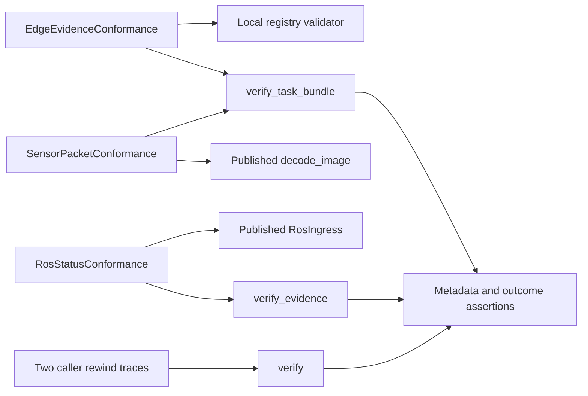

# P16 consumer, lifecycle and claim refresh

Reviewed 2026-10-10 at `5f733e4af8649d9ef61ae4a26edda320fa183006`, following
the current parser-to-tooling review recorded in the [inventory](p16-p18-inventory-v3.md).
The authoritative policy was reread; previous decisions were inputs, not a substitute
for reading the current consumer code, fixtures, lifecycle traces and public contracts.
No new runtime, contract or assertion mismatch was demonstrated. No production or test
code changes are needed for this slice. The preceding optional-backend correction was
verified against its bridge parent, nine file hashes and noreply identity, then published.

## Component decisions

The constraint is offline assurance of small synthetic fixtures through actual published
APIs. These drivers have no target device, memory budget or real-time deadline. The
[strict ADR](../../decisions/p16-consumer-refresh-v3.json) records separate reasons for
each KEEP decision. None selects a future deployed sensor or command runtime.

| Component | Current evidence and decision |
|---|---|
| Edge UNKNOWN consumer | KEEP direct Python calls and an independent local JSON Schema registry. Three methods check the published structure, real byte binding, negative metadata and separate clock domains. A JVM/JUnit driver could supervise these calls; replacing them with a model or structural checker would lose actual verifier observation. |
| Packet/encoding consumer | KEEP published decoder calls and byte binding as separate observations. Seven methods retain signed malformed content, zero-depth UNKNOWN, byte order, row padding and trailing-byte cases. Rust proptest can generate additional cases, but does not replace the decoder under test; no native decoder is duplicated here. |
| ROS status consumer | KEEP direct calls to published RosIngress and exact signed status bytes. Three methods observe idle, receipt, loss and invalid status without treating receipt as capture time or qualification. Robot Framework keywords or JUnit supervision add orchestration without extending this fixed API boundary. |
| Stateless lifecycle traces | KEEP two actual-verifier rewind counterexamples. Independently supplied floors reject replay; accepting a previous result cannot persist them. TLA+, Alloy and Erlang PropEr are credible complementary modeling/generated-sequence technologies; a separately encoded model is not evidence that these implementation calls behaved correctly. |

This is a constraints-based inference from fresh source review and official documentation:
[unittest](https://docs.python.org/3/library/unittest.html),
[local schema referencing](https://python-jsonschema.readthedocs.io/en/stable/referencing/),
[JUnit](https://docs.junit.org/6.1.3/overview.html),
[Robot Framework](https://robotframework.org/robotframework/latest/RobotFrameworkUserGuide.html),
[proptest](https://docs.rs/proptest/latest/proptest/),
[TLA+](https://lamport.azurewebsites.net/tla/tla.html),
[Alloy](https://alloytools.org/about.html) and [PropEr](https://proper-testing.github.io/).
Alternative runtimes/model checkers were not executed or benchmarked. Familiarity,
installation convenience, rewrite cost and incumbent language are not KEEP reasons.

## Executable evidence

Twenty-four focused methods pass with zero skips: the thirteen consumer methods,
two lifecycle methods, eight pinned-policy methods and one lexical restart method.
Two controlled rejected-result substitutions cause seven expected assertion failures;
two controlled floor overrides cause one failure each. All four controls call the real
verifier, produce no errors/skips and restore patched bindings. These are sensitivity
experiments, not production failures. Both README examples execute successfully with
source imports. No installation was performed by that example check.

All seventeen corpus producer-source bindings, covering eleven distinct files, match
local bytes and refreshed `origin/main` at
`fce89d3904ddbfb004b55718fab955c91a9c49a0`. Historical corpus revisions remain intact.
No peer-owned file was changed. This comparison is not complete dependency closure,
loaded-code attestation or signed provenance.

The public passport, evidence, task, bundle, federation, inbox, policy-floor, schema
and verification-evidence contracts agree with their limited implemented scope.
In particular, the local policy store does not fix federation-floor persistence or
whole-store restoration. Source consumers are not installed P2/P3 integration tests.
Configured hosted jobs and retained artifacts are not observed release qualification.
The one PR snapshot after publishing this head showed 53 queued checks and one skipped
check; no relevant exact-head success or merge is credited. CI was not polled.

## C4 assurance views

Context: reviewer → offline conformance → bounded software observations.
Container: local test process → published producer APIs and P16 library.
Component: pinned synthetic fixtures → independent decoding/structure and binding →
result assertions; caller floors → stateless verifier → rewind assertions.
Code:



These are computer-side assurance views. They implement no command, control,
communications, intelligence, surveillance or reconnaissance service. No tactical
sensor fusion, authority workflow, transport, weapon integration or physical control
is inferred from test execution.

## Reproduction and next work

```sh
PYTHONPATH=tests:tests/interop_consumers:.:integrations/edge python -m unittest test_passport_lexical test_passport_schemas.EdgeEvidenceConformance test_sensor_packets test_ros_status test_passport_policy test_passports.PassportVerificationTests.test_revocation_rejection_does_not_persist_the_new_policy_floor test_passports.PassportVerificationTests.test_expiry_rejection_does_not_persist_a_trusted_time_floor -v
PYTHONPATH=tests python -m unittest test_passport_schemas.ArchitectureDecisionConformance -v
```

Use the optional conformance dependencies. The [result record](p16-consumer-refresh-v3-results.json)
binds sources and local raw logs and includes the lifecycle-control source. The consumer
control source remains in the linked prior result record, with its unchanged hash
recorded here. Local raw logs are not published release artifacts.

This closes the current consumer/lifecycle and public-claim review slice. Next executable
work is requirements and implementation of independent pinned federation-snapshot
validation, needed before retaining a deny-all federation revision independently of
bundle success. Remaining P16–P19 software is unfinished; no whole-lane audit-complete
marker or qualification is issued. Insufficient information for tactical deployment.
