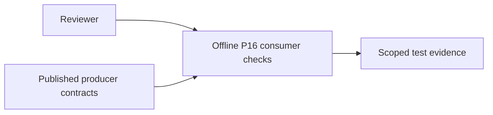
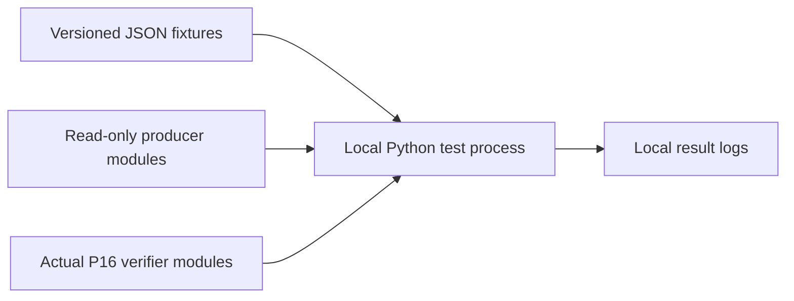
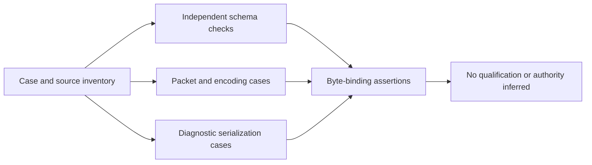
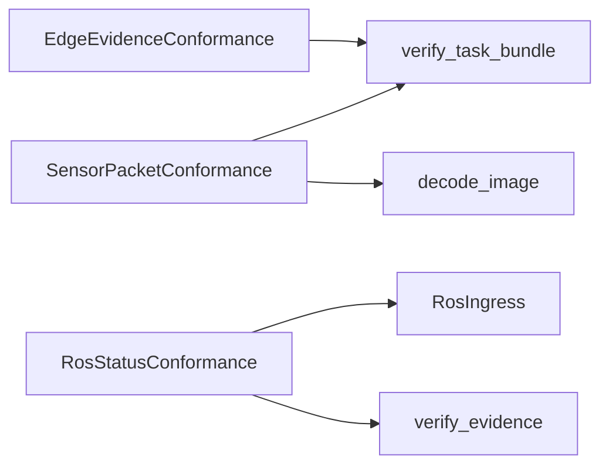

# P16 cross-phase consumer reassessment v3

Reviewed 2026-10-10 against `2859c59477c1bea7256efabf5629e15bb3b5330d`.
The earliest parser was reread before this continuation through the consumer tests.
This review covers owned test adapters, fixture provenance and CI discovery. It does
not reassess or replace peer-owned producer implementations. No new defect was
demonstrated; this patch records three scoped KEEP decisions and fresh evidence.

## Constraints and decisions

These are fixed, offline developer/CI checks of published contracts and real local
APIs. Inputs are synthetic, immutable fixture bytes. Required properties are exact
byte identity, explicit positive authentication controls, negative qualification
examples, no network schema retrieval, and separation of source clocks from UTC.
No target hardware class, memory SLA or hard-real-time deadline applies to this test
harness. Changing the harness language would not qualify the producer's runtime.

| Component | Decision and decisive evidence |
|---|---|
| Edge UNKNOWN schema and six binding cases | KEEP unittest plus independent JSON Schema validation. The published schema is interpreted without importing the producer model. The real verifier checks fixture bytes. [ADR](../../decisions/p16-edge-consumer-reassessment-v3.json). |
| Packet evidence and encoding variants | KEEP direct API tests plus portable JSON. The decoder and verifier are independently called; signed malformed bytes remain authenticated but invalid content. [ADR](../../decisions/p16-packet-consumer-reassessment-v3.json). |
| Four ROS diagnostic states | KEEP direct producer API calls and exact serialization comparison. Authentication leaves status UNKNOWN and unqualified. No ROS/DDS transport is exercised. [ADR](../../decisions/p16-ros-consumer-reassessment-v3.json). |

The candidate search included [Python unittest](https://docs.python.org/3.13/library/unittest.html),
[jsonschema reference control](https://python-jsonschema.readthedocs.io/en/stable/referencing/),
[Node/Ajv](https://ajv.js.org/json-schema.html),
[Java/Kotlin JUnit](https://docs.junit.org/6.1.3/overview.html),
[Robot Framework](https://robotframework.org/robotframework/latest/RobotFrameworkUserGuide.html)
and [Rust proptest](https://docs.rs/proptest/latest/proptest/).
Ajv offers an independent draft-2020-12 validator; JUnit offers another test runner;
Robot supports keyword/library abstraction; proptest supplies generated property
cases. Our inference: direct calls minimize representation differences when the
question is how the actual published Python API behaves on fixed bytes. Schema-only
engines cannot answer that question, and a foreign test driver needs an adapter.
Those alternatives become relevant to different requirements, including cross-runtime
schema comparisons, generated cases or operator-facing acceptance. No speed ranking,
benchmark winner or migration based on familiarity/installed tooling is asserted.
A CUE documentation URL could not be retrieved; no CUE-specific capability conclusion
is used in these decisions.

## C4 views of the assurance boundary

Context:



Containers:



Components:



Code:



These views describe a test system, not an implemented C4ISR platform. They add no
command execution, communication transport or ISR capability. C2 authority, live
communications and operational intelligence are outside these tests; computation is
limited to synthetic conformance checks. No military accreditation follows.

## Fresh verification

Fourteen methods pass with zero skips: the lexical restart check, three edge methods,
seven packet/encoding methods and three diagnostic methods. Three selected methods
were then run under two wrappers each: the wrapper first calls the real verifier,
copies its result fields, and changes only `evidence_verified` to true or changes
status/reason to `rejected`/`injected_rejection`. The six runs produce respectively
6/6, 5/5 and 4/4 expected assertion failures (30 total), with no errors or skips.
Each patched binding is restored. These sensitivity checks are not production bugs,
a comprehensive mutation score or evidence that every assertion is necessary.
Tracked runtime, tests, fixtures and producer files remain unchanged.

Seventeen fixture-to-source bindings (11 distinct files) match both the local tree
and cached main `fce89d3904ddbfb004b55718fab955c91a9c49a0`. A normal fetch failed
because `FETCH_HEAD` is read-only; no sandbox workaround was used. A separate read-only
`git ls-remote` reported that same main SHA. Historical fixtures retain original
publication revision `a7704008f0f59cbd7b4d56d3cefb5ff28bd9eb46`; they are not relabeled.
Module-location checks cover the directly imported packet/diagnostic module, not every
transitive import. File hashes do not attest loaded bytecode or all dependencies.

The dedicated sensor job discovers both consumer files with the edge import path and
pinned optional dependencies. The schema job explicitly imports its validator and
crypto backend before discovery. The broader matrix can legitimately skip optional
schema tests; its success alone is not schema-conformance evidence. No hosted check
status was queried or inferred during this review.

Reproduce the focused run from the repository with the optional conformance and sensor
requirements available:

```sh
PYTHONPATH=tests:tests/interop_consumers:.:integrations/edge python -m unittest test_passport_lexical test_passport_schemas.EdgeEvidenceConformance test_sensor_packets test_ros_status -v
```

[Result record](p16-cross-phase-reassessment-v3-results.json) binds inspected sources,
local logs and the sensitivity experiment. Alternative runtimes were researched, not
executed. This is not an installed-distribution test, network/DDS test or physical
measurement. Next is the remaining trust-floor lifecycle/documentation evidence and
final historical inventory reconciliation. No whole-lane audit completion marker is
created. P16 persistence/transport and P17–P19 remain unfinished.
Insufficient information for tactical deployment.
