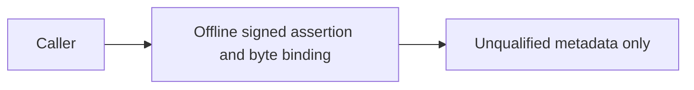
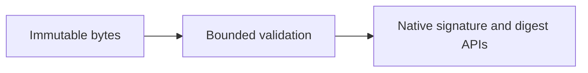
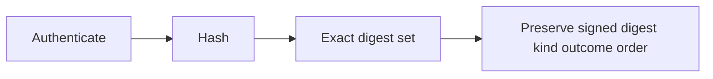
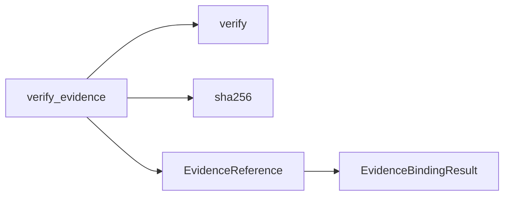

# P16 evidence-kind preservation review

Baseline `53cccd69e0b9fa672958dc456d314e388358af29`, reviewed 2026-10-10.
The authoritative policy and review order were reread, then the earliest parser and
current evidence implementation, contract and tests were inspected. Historical audit
records remain evidence inputs; this slice does not complete the lane re-audit.

The binder still accepts only 1..16 exact immutable byte strings of at most 65536
bytes each. Authentication precedes hashing, duplicates and incomplete digest sets
reject, and result metadata follows signed reference order. It does not inspect blob
content or establish physical provenance. The contract correctly distinguishes signed
assertions from truth, and digests from anonymization or encryption.

A coverage gap remained: the ten evidence methods did not detect replacing every
returned evidence kind with `synthetic`. The new real-signature test uses all three
kinds (`synthetic`, `recorded`, `external_unverified`) with passed/failed/unknown
outcomes, reverses signed and supplied ordering, and checks complete reference
metadata. All eleven methods pass on unchanged production code. Under a one-line
in-memory label mutation the prior ten methods still pass, while the new method has
one expected assertion failure and no errors/skips. The real source remains unchanged.
This is a demonstrated test-coverage correction, not a production bug claim.

[The strict ADR](../../decisions/p16-evidence-kinds-v3.json) records a fresh scoped
KEEP decision after comparing [hashlib](https://docs.python.org/3.13/library/hashlib.html),
[Rust sha2](https://docs.rs/sha2/latest/sha2/),
[.NET HashData](https://learn.microsoft.com/en-us/dotnet/api/system.security.cryptography.sha256.hashdata?view=net-10.0)
and [OTP crypto](https://www.erlang.org/doc/apps/crypto/crypto.html#hash/2).
These provide hash APIs, while immutable ownership and signed metadata preservation
remain application requirements. The in-memory contract specifies no target hardware,
throughput or deadline that demonstrates a materially better replacement. Hashlib's
GIL release for larger inputs reinforces the need for immutable buffers. No alternate
full binder or comparative benchmark was executed, and no migration winner is deferred.
The decision is scoped to this stateless software-assurance call, not P18 execution.

Four ADR conformance methods, Ruff, formatting and Bandit pass. The existing workflow
already discovers this test file. [The result record](p16-evidence-kinds-v3-results.json)
binds listed source and retained local probe logs; it is not dependency closure,
loaded-code attestation or a physical qualification result.

## C4 assurance views

Context:

Containers:

Components:

Code:

No command, communication, intelligence, surveillance or reconnaissance service is
introduced. No MLS/CNSA, availability, real-time, physical or complete-audit claim.
Insufficient information for tactical deployment. Next earliest component: structural
schemas and their conformance tooling.
