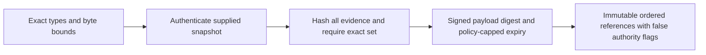

# Evidence metadata, task and bundle review

Current restart at `202d952a3ec08d0d98f6866b78831fea4a8d1e09`, after the
[policy and persistence review](p16-floor-cleanup-current-v3.md). Evidence binding,
task descriptions and bundle composition were reread against their contracts and
current tests. Production code remains unchanged. Direct federation is next.

## Findings and technology decisions

| Component | Constraints and current decision |
|---|---|
| Evidence binding | KEEP exact immutable snapshots with native-backed hashing and current signature checks. FIX standalone output-metadata coverage and clarify that the returned digest identifies the signed payload. [ADR](../../decisions/p16-evidence-metadata-current-v3.json). |
| Task descriptions | KEEP bounded lexical/canonical validation, external digest pins and half-open time checks. Ten current methods pass; no new mismatch demonstrated. Canonicalization does not authenticate or establish freshness. [ADR](../../decisions/p16-task-metadata-review-v3.json). |
| Bundle composition | KEEP complete snapshot pin/set checks followed by public verifier calls. Twelve methods pass, including all supplied revocation lists, policy/passport expiry and metadata-free rejection. No new mismatch demonstrated. [ADR](../../decisions/p16-bundle-metadata-review-v3.json). |

The candidate search includes Rust immutable borrowing/custom JSON visitors, OTP
immutable binaries/JSON callbacks/native crypto, and C#/F# token readers and SHA-256.
These are credible alternatives outside the component's Python implementation.
Decisive requirements are bounded immutable snapshots, explicit lexical admission,
complete byte binding and preservation of non-authorizing metadata. Current direct
composition provides those properties without a second interpretation of trust policy.
Another runtime can provide them too; no material deployment advantage for migration
was established. No alternate implementation or speed comparison was executed. There
is no supplied target hardware, throughput SLA or hard deadline for these offline APIs.
These choices do not select the eventual P18 runtime.

The evidence-only suite's eleven methods passed after either of two independent
in-memory substitutions: output `authenticated.payload_sha256` replaced by `None`, or
output `authenticated.expires_at` replaced by the passport statement's expiry. Two
new real-signature methods now check payload versus envelope identity and a policy
that expires before the passport, including rejection exactly at policy expiry.
Each substitution now causes one assertion failure; all thirteen unchanged-runtime
methods pass. This is a standalone coverage gap, not a discovered production defect:
existing bundle tests already checked both properties.

An initial probe copied module globals, unintentionally isolating existing hash fault
injections. Even its unmodified baseline failed two assertions. That attempt is retained
as invalid probe evidence and is not credited. The corrected probe uses the real module
globals, changes only the selected function code in memory, and requires a passing
unmodified baseline. It does not edit production files or exercise arbitrary code.

## C4 views

Context:


Containers:


Components:


Code:


These views cover computer-side offline metadata checks. They implement no command,
control, communications, intelligence, surveillance or reconnaissance service.

## Verification boundary

[Source-bound results](p16-evidence-metadata-current-v3-results.json) retain the valid
and invalid probe outcomes. Thirty-five focused methods pass without skips: thirteen
evidence, ten task and twelve bundle methods. ADR validation and lint are recorded
separately. Reproduce the focused suite with:

```sh
PYTHONPATH=tests:. python -m unittest test_passport_evidence test_interop_tasks test_interop_bundles -v
PYTHONPATH=tests:. python -m unittest test_passport_schemas.ArchitectureDecisionConformance -v
```

A saved result is not fresh authorization; callers still supply trusted clocks,
policy snapshots and floors at use. No enrollment, persistent replay protection,
transport or execution authority was added. No installed-product, full repository,
hardware, MLS/CNSA, availability or real-time qualification is claimed. Insufficient
information for tactical deployment.
