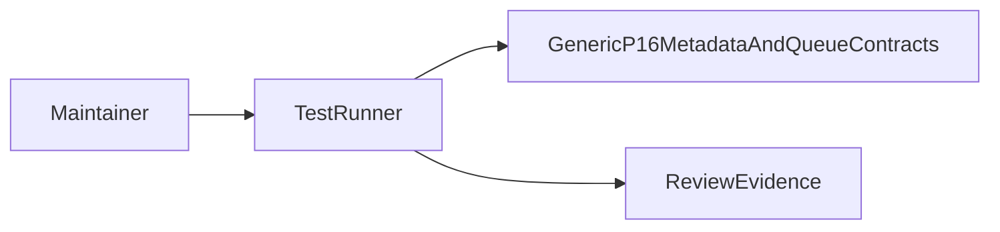
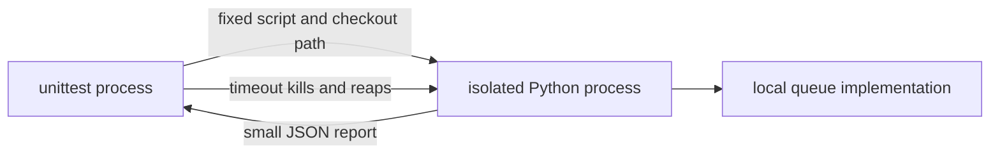
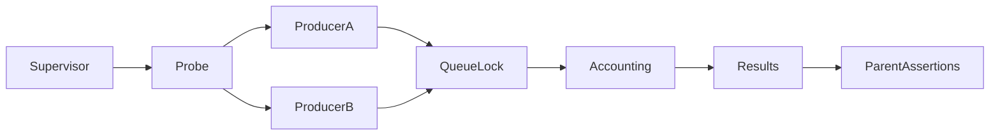
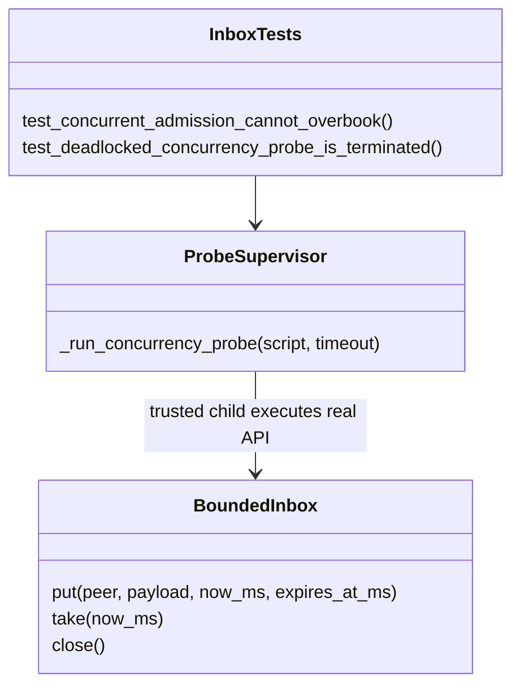

# P16 federation and inbox reassessment v3

Baseline `8cc440edeab8f217851781a513075632ffb2217e`; reviewed 2026-10-10.
The earliest parser boundary was reread before walking forward through the remaining
P16 metadata and queue boundaries. Earlier decisions are evidence inputs, not this
review's conclusion. Production code and wire contracts remain unchanged.

## Finding and correction

The inbox concurrency test gave each future a timeout, but its executor context still
waited for workers during shutdown. An injected held lock therefore trapped the test
runner after the future timed out. This is an assurance-harness defect, not evidence
of a production deadlock. Python documents that executor context exit waits as if
[`shutdown(wait=True)`](https://docs.python.org/3.13/library/concurrent.futures.html)
were called.

The same two-producer probe now runs in an isolated Python child. Its parent checks
all sixteen results, eight admissions, item/byte counters, eight returned payloads and
empty tail. A process timeout becomes a unittest failure. A separate regression holds
the real queue lock and requires a child timeout. There is no shell, network input or
user-provided program. Bandit suppressions are restricted to the fixed-interpreter,
test-controlled subprocess import and call.

The controlled pre-fix experiment shortened the future timeout to one second and
held the queue lock. An outer three-second supervisor killed the trapped runner.
After the correction, the same substitution also shortens the new process timeout:
the runner exits with one assertion failure rather than reaching the outer timeout.
The experiment mutates an in-memory test source only. The positive unmodified tests
pass separately; the expected fault is not counted as a production failure.

[`subprocess.run`](https://docs.python.org/3.13/library/subprocess.html) kills and waits
for its direct child on timeout. Process creation may delay timeout delivery. This
is not an exact elapsed-time bound, general process-tree supervisor or sandbox. The
trusted probe emits a fixed small report; output quotas are not implemented. A sampled
concurrent execution does not prove every interleaving, fairness or runtime deadlines.

## Technology decisions and contract review

[Closed-table ADR](../../decisions/p16-federation-reassessment-v3.json): KEEP the
explicit validator after comparison with Cedar, Rego and Rust. Current requirements
are a small closed relation and lexical/byte identity, with no policy-authoring or
hierarchy requirement. Dedicated policy languages provide useful richer semantics
but still require the encoding boundary and external caller authentication. All rows
are validated before selected-peer composition. Fresh tests retain expiry, revision,
revocation and non-transitive scope checks. No new runtime mismatch was demonstrated.

[Queue and assurance ADR](../../decisions/p16-inbox-reassessment-v3.json): KEEP explicit
compound accounting after comparison with Rust channels, .NET channels and BEAM
processes; FIX the test isolation. A count-bounded channel alone cannot enforce summed
bytes, per-peer quota and expiry behind a live head in one decision. The existing small
synchronous contract does not require an actor or async service. Source comparisons
establish relevant semantics, not a benchmark ranking or full alternative parity.

The runtime lock has no deadline or fairness guarantee. Expiry advances only on API
calls using caller time. Close releases retained queue references but cannot erase
previously returned bytes or cancel a consumer. `repr` suppression does not redact
`asdict`. Composition tests retain the negative result that stale caller configuration
can still validate: this lane does not persist or discover newer trust floors.

## C4 views of the assurance boundary

Context:

Containers:

Components:

Code:

These views describe generic assurance, not a deployed C2 topology. They do not
establish operational C4ISR, MLS, CNSA, five-nines availability or physical timing.
Insufficient information for tactical deployment.

## Evidence and next review

[Result record](p16-federation-inbox-reassessment-v3-results.json) binds listed source
and local experiment hashes. The focused set has 28 passing methods and no skips.
Initial import-order lint failure and Bandit comment-parser warnings were retained;
final targeted lint/format/security checks pass. No full repository or hosted CI
qualification is claimed. No complete-audit marker is issued.

Next earliest remaining review: installed packaging identity and conformance evidence,
then remaining assurance tooling. P17–P19 implementation and qualification remain
unfinished; unsafe weapon/targeting/radio subcomponents stay excluded.
