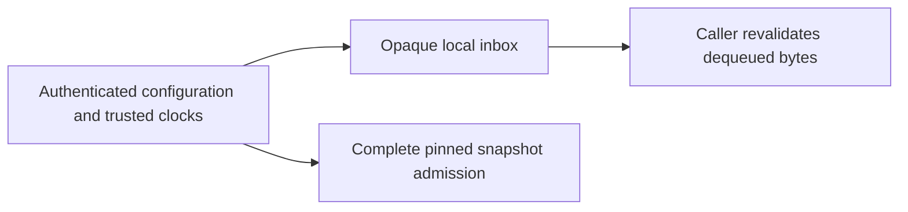
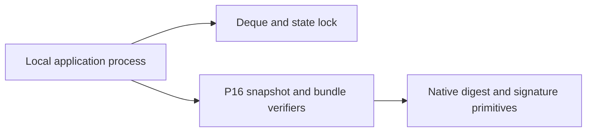
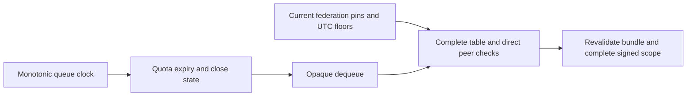
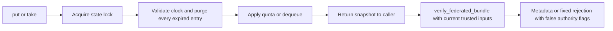

# Current federation and inbox review

Reviewed at `deba934f4f3dc745d2a4cdff31dbe4a068d3d3d2` after the
[evidence/task/bundle review](p16-evidence-metadata-current-v3.md). Current production
code, four test modules and all three contracts were reread. No new runtime or
contract mismatch was demonstrated. Runtime, tests and frozen bounds are unchanged.

## Component decisions

| Component | Decision and executable evidence |
|---|---|
| Direct federation | KEEP. Twelve methods check direct scope, full table validation, pins, floors, expiry, negative evidence and rejection metadata. Removing the peer policy-pin check causes one assertion failure. [ADR](../../decisions/p16-direct-federation-recheck-v3.json). |
| Independent snapshot admission | KEEP. Eight methods include valid deny-all admission, every peer row, canonical byte bounds and rejection parity. Removing the snapshot pin check causes one assertion failure. [ADR](../../decisions/p16-federation-admission-recheck-v3.json). |
| Inbox | KEEP. Twelve methods include distinct-byte concurrent admission, supervised deadlock timeout, quotas, all-entry expiry and shutdown limitations. Making expiry inclusive causes one assertion failure. [ADR](../../decisions/p16-inbox-accounting-recheck-v3.json). |

Four additional real-API delivery traces confirm that queue lifetime cannot extend
federation validity, current revocation/floors reject queued artifacts, and close
cannot revoke previously returned copies. Stale caller-supplied configuration can
still authenticate: that negative evidence remains explicit. These are integration
traces for local primitives, not a shipped transport or cancellation service.

Constraints precede the selections: offline canonical immutable snapshots, bounded
closed peer tables, exact external pins, and small synchronous local retention with
atomic byte/count/peer/expiry accounting. Cedar and OPA/Rego are credible policy-language
alternatives; this profile has neither general rules nor transitive hierarchy. Rust
and managed token readers can implement the same table but still require its exact
byte/trust predicates. OTP JSON callbacks provide another credible admission approach.
For buffering, crossbeam and .NET channels provide count bounds; the other quota and
expiry predicates still need coordinated accounting. OTP queues support filtering,
while a process-based adapter also needs explicit message-admission control.

KEEP the narrow current implementations because these decisive semantics are explicit
and tested without adding a rule evaluator or asynchronous staging boundary. No
alternative implementation or benchmark was executed. No target hardware, throughput
SLA, process-memory budget or hard deadline establishes a material migration benefit
for these P16 APIs. Reopen the selections for actual P17/P18 deployment constraints.
This is a scoped engineering decision, not proof that one language is universally best.

## C4 views

Context:


Containers:


Components:


Code:


The scope remains computer-side metadata and buffering. Command, control,
communications, intelligence, surveillance and reconnaissance services are not
implemented by these primitives or diagrams.

## Retained verification

Thirty-six focused methods pass without skips. Three selected methods also pass
unmodified and fail with three controlled in-memory substitutions, one assertion
failure each and no errors/skips. No source file is mutated by those experiments.
They demonstrate selected guard sensitivity, not exhaustive correctness or a formal
concurrency proof. The [result record](p16-federation-inbox-recheck-v3-results.json)
binds source bytes, commands and retained raw diagnostics.

```sh
PYTHONPATH=tests:. python -m unittest test_interop_federation test_interop_federation_policy test_interop_inbox test_interop_delivery -v
```

No protocol bytes, runtime selection or public API changed. Lock acquisition can
block; clocks are caller inputs and are not refreshed at completion; an idle queue
does not purge itself. There is no installed-product, full repository, hardware,
MLS/CNSA, availability or real-time qualification. Insufficient information for
tactical deployment. Schemas/conformance and assurance tooling remain in the current
restart, and no audit-completion marker is issued.
