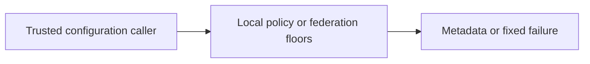
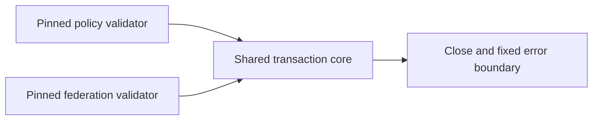
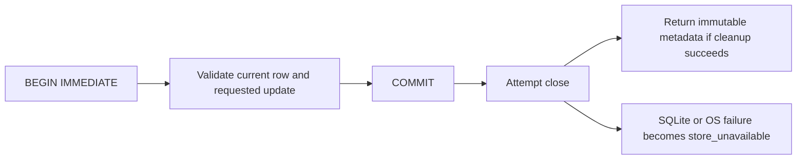

# Current pinned-policy and floor cleanup review

Reviewed at `8e264e9f5137216dc6c881ad264e82556dc2794e` plus this correction.
This continues the current restart after the [Base64 review](p16-base64-current-v3.md).
Independent pinned-policy validation and both local floor profiles were reread;
earlier decisions were inputs, not completion evidence. Evidence binding is next.

The policy validator still compares the exact external byte digest and validates the
complete bounded metadata before returning non-authorizing results. Eight policy
methods pass. KEEP is recorded in the [policy ADR](../../decisions/p16-policy-current-v3.json).
Python lexical hooks/native hashing, Rust custom visitors, OTP callbacks and .NET
UTF-8 tokens are credible alternatives. No candidate was executed or benchmarked
against the current validator, and no runtime speed ranking is inferred. The bounded
immutable byte contract has no identified hard deadline or deployment throughput SLA.

The shared floor-store transaction handler translated SQLite/OS failures in its body,
but `close()` in `finally` sat outside that handler. Four new test methods exposed
raw exceptions: five policy assertions and one federation assertion failed before
correction. The cleanup path now returns the fixed `store_unavailable` error with
backend context suppressed, never success metadata. It preserves both v1 disk schemas.

Tests use real temporary databases and a connection subclass that performs real
close then raises. This isolates the error boundary; it is not an observed native
SQLite fault or power-loss experiment. A committed trusted time update, bootstrap
row or deny-all federation revision remains persisted despite the injected cleanup
error. A rejected update preserves the prior row. A read also fails closed when
cleanup reports failure. An exception therefore cannot establish non-commit, and
callers must not reset or bootstrap a replacement store on that assumption.

KEEP native SQLite with the current binding for each local profile, with this
executable correction. The [storage ADR](../../decisions/p16-floor-cleanup-current-v3.json)
compares Python, Rust and .NET bindings, Mnesia and atomic-file protocols. SQLite
provides cooperating-writer read/check/write transactions; another binding does not
by itself add authenticated storage or whole-store rollback detection. Rust's explicit
close result is a useful alternative error API, not evidence of better end-to-end
behavior here. Mnesia addresses managed/distributed transaction deployments; atomic
replacement still needs a writer-locking/recovery protocol. LMDB remains a credible
candidate whose earlier source retrieval failed; no unsupported comparison is credited.
These are scoped engineering judgments based on the cited official APIs, not benchmarks.

## C4 views

Context:


Containers:


Components:


Code:


These views cover computer-side trust metadata only. They implement no command,
control, communications, intelligence, surveillance or reconnaissance service.

## Verification and limits

The [result record](p16-floor-cleanup-current-v3-results.json) binds selected source
bytes and retained diagnostics. Seventy-two focused source methods pass without skips:
eight policy, twenty policy-floor, thirteen federation-floor, eleven evidence and twenty
installed-runner unit methods. The evidence and runner methods are regression coverage,
not completion of their next fresh review. Additional isolated no-site persistence and
ADR checks are recorded separately. Ruff and formatting pass. The unexcluded Bandit
scan retains low-severity subprocess warnings in tests; this is not a clean security scan.

```sh
PYTHONPATH=tests:. python -m unittest test_passport_policy test_passport_floor_store test_interop_federation_floor_store test_passport_evidence test_passport_installed_vectors -v
PYTHONPATH=tests:. python -m unittest test_passport_schemas.ArchitectureDecisionConformance -v
```

No close-failure resource-release guarantee, whole-file rollback detection, combined
policy/federation atomicity or encryption is added. No installed-distribution acceptance,
full repository matrix, physical test or hard-real-time measurement was run. No MLS,
CNSA, availability or whole-phase completion claim. Insufficient information for
tactical deployment.
