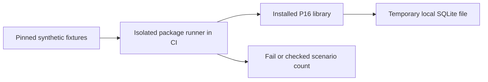
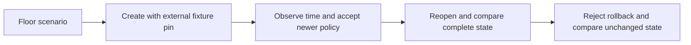
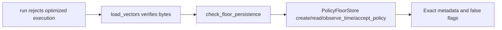

# Current schema and installed-floor review

Baseline `42259ba689e205a8c44375f19d2b4b5affe36c6e`, reviewed 2026-10-10.
The earliest parser/signature/policy source was reread, followed by the six
published schemas, their conformance tests, tooling requirements, installation
checker, archive-input checker and hosted workflow. Prior reviews remain evidence
inputs. No new schema/runtime acceptance mismatch was demonstrated.

The [schema decision](../../decisions/p16-schema-current-v3.json) retains standard
JSON Schema and the explicit offline Registry with direct runtime comparisons.
Current primary documentation was checked for [jsonschema](https://python-jsonschema.readthedocs.io/en/stable/referencing/),
[Ajv](https://ajv.js.org/json-schema.html), [JsonSchema.Net](https://docs.json-everything.net/schema/basics/)
and [CUE](https://cuelang.org/docs/concept/how-cue-enables-data-validation/).
These are finite authoring/CI checks; no throughput or target-device requirement
justifies replacing them. No alternate validator was benchmarked or executed.

The installed checker covered floor-store source identity but omitted behavioral
persistence. The [installed assurance decision](../../decisions/p16-installed-floor-v3.json)
retains direct Python API execution, comparing external process orchestration and
C#/F# [Microsoft.Data.Sqlite](https://learn.microsoft.com/en-us/dotnet/standard/data/sqlite/)
inspection. Direct invocation tests the actual package methods; another database
implementation tests a different boundary. This is a requirements decision, not a
language speed ranking or a preference based on installed tools.

`scripts/passport_installed_vectors.py` now runs fifty pinned corpus cases plus
one synthetic floor scenario in a temporary directory. The scenario checks every
metadata field and all three false authority/qualification flags, advances time,
accepts a newer pinned revoking policy, reopens after updates, and rejects older
time and policy revisions. Reopened state must remain unchanged after rejection.
The existing hosted isolated-package and archive-install steps already execute
this script, so no workflow change is needed. Store runtime and wire schemas are
unchanged. The scenario does not authenticate an externally supplied clock or pin.

Three new methods first failed with nine assertion failures and zero errors on
the old runner. The corrected runner plus five total regression methods detect
omitted API execution, lost time/policy writes, altered metadata/flags and suppressed
rollback errors. All 67 focused methods then passed without skips. They exercise
source imports locally; no new installed-distribution or hosted PASS is claimed.

Ruff and formatting pass. The unfiltered scoped Bandit run reports 32 low-severity
B101 assertion-use findings, no medium/high findings. The assurance runner refuses
optimized execution before fixture reads; its existing tests check both optimization
levels. Findings are retained, not suppressed or represented as a clean scan.
The [results](p16-installed-floor-v3-results.json) bind selected inputs and raw-log
hashes. Logs remain local; those hashes are not published logs or loaded-code attestation.

C4 context:

C4 containers:

C4 components:

C4 code:


This is computer/software assurance. Human review remains the command and control
boundary. It adds no communications transport, intelligence, surveillance or
reconnaissance capability. No MLS/CNSA, NAF/DoDAF accreditation, availability,
hard-real-time or physical claim follows. Insufficient information for tactical deployment.
Whole-store restoration remains known negative evidence in the runtime tests.

Reproduce with the pinned developer environment:
```sh
PYTHONPATH=tests:. python -m unittest test_passport_installed_vectors test_passport_floor_store test_passport_install_check test_passport_schemas -v
python -m ruff check scripts/passport_installed_vectors.py tests/test_passport_installed_vectors.py
python -m ruff format --check scripts/passport_installed_vectors.py tests/test_passport_installed_vectors.py
python -m bandit -q -f json scripts/passport_installed_vectors.py tests/test_passport_installed_vectors.py
```

Next earliest review: comparison/mutation probes, then published peer-consumer
boundaries. P17/P18/P19 and remaining P16 software are unfinished; no completion
marker is issued.
