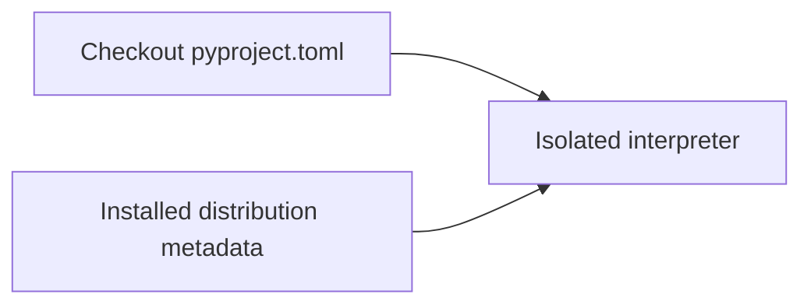
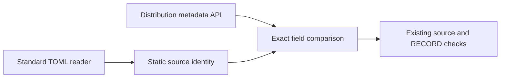
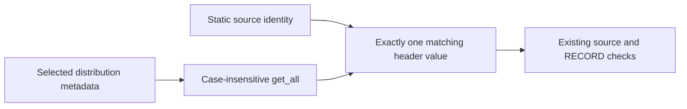
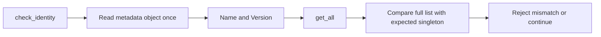

# P16 static distribution identity review

Baseline `cee3e17906834e1bd6520da8b6b4fc1111654bf6`, reviewed 2026-10-10.
The policy and review order were reread in full, followed by the earliest parser
and current packaging checks. Prior RECORD evidence is correctly scoped, but it
does not compare installed distribution name/version with source release metadata.

`check_identity` now reads this checkout's `pyproject.toml` through a TOML parser
and compares its static name/version with the interpreter-selected distribution's
metadata. Missing, empty, non-string or dynamic source fields fail; mismatched or
missing installed fields fail. Duplicate TOML keys fail in the parser. The isolated
CLI performs this before the existing seven source-file and RECORD checks, and
retains its existing output shape. No production module or package metadata changes.

KEEP Python inspection with standard TOML parsing. The
[JSON ADR](../../decisions/p16-installed-identity-v3.json) compares
[tomllib](https://docs.python.org/3.13/library/tomllib.html),
[Tomli](https://pypi.org/project/tomli/2.5.0/),
[uv](https://docs.astral.sh/uv/reference/cli/) and
[Java TomlJ](https://github.com/tomlj/tomlj).
Direct inspection avoids an additional runtime/environment selection boundary.
No throughput requirement or measured result favors a compiled parser here.
The Go parser discovery page and a Tomli source-tag URL were unavailable; neither
is used as evidence. The versioned PyPI metadata confirms Tomli 2.5.0 supports
Python >=3.8. These source observations do not establish local Python 3.9 execution.

The hosted matrix installs `tomli==2.5.0` only below Python 3.11. It is a developer
check dependency; no core or passport optional runtime requirement changes. The
fixture guide states this prerequisite. On newer Python, the checker uses stdlib
`tomllib`. The current simple static declarations work with their shared TOML
syntax; arbitrary TOML-version parity is not claimed.

Four new test methods initially produced eleven missing-function errors, not
eleven demonstrated production assertion failures. All fifteen installed checker
methods now pass. A separate in-memory no-op control causes ten expected assertion
failures across the three negative identity methods, with no errors or skips.
The real function is restored afterward. The isolated CLI passes against the
existing Linux Python 3.13 installation; no wheel was rebuilt or reinstalled.
Actionlint found an initial YAML quoting error in the dependency command. Converting
the command to a block scalar fixed it; the failure log is retained.

The [result record](p16-installed-identity-v3-results.json) records focused outcomes
and hashes. Hosted Python 3.9/Tomli, macOS and Windows results remain unobserved.
The check requires exact strings for this project's static profile. It is not a
general normalized-name/version comparator, dynamic build-metadata resolver, full
metadata validator, package `__version__` comparison or publisher authentication.
Local metadata and source remain trusted inputs with no atomic snapshot guarantee.

## C4 assurance views

Context:

Containers:

Components:

Code:

These are assurance-tooling views, not an operational C4ISR architecture. No command
authority, live communications, intelligence, surveillance or reconnaissance service
is introduced. No MLS/CNSA, availability, hard-real-time or physical qualification.
Insufficient information for tactical deployment. Full phase review and delivery
remain unfinished.

## Fresh cardinality review at 383a4c5

Baseline `383a4c536ce8f12799f6f1790f5e89e25c071005`, reviewed 2026-10-10.
Following the policy and earliest parser reread, the installed checker, RECORD tests,
selected-archive checker and hosted packaging configuration were inspected again.
The static identity check had a concrete ambiguity: `metadata[field]` could return
the expected value while a second identity header contained the same or a different
value. The old statement that identity matches source did not cover this case.

[Python documents](https://docs.python.org/3.13/library/email.message.html) that
single-header lookup does not specify which duplicate is returned. The correction
reads the metadata object once and requires `get_all(field, []) == [expected]` for
each identity field. Missing, duplicated or conflicting fields fail with the existing
`installed_identity_mismatch` error. A single case-insensitively named header remains
valid. This does not validate every core metadata field or make reads atomic.

The [current strict ADR](../../decisions/p16-identity-cardinality-v3.json) compares
standard Python inspection, PyPA packaging metadata validation, Rust uv inspection
and Java TomlJ with interpreter inspection. KEEP direct inspection because it exposes
the actual selected distribution and every header without another environment-selection
boundary. The broader packaging validator is useful for complete metadata validation;
that is outside this two-field comparison. No measured alternate-language speed or
resource advantage is asserted, and no runtime language migration is justified here.

Two new methods use real temporary METADATA files and `Distribution.at`. The duplicate
method checks both identity fields with equal duplicates and conflicting values in both
orders; the second method checks valid single headers with mixed-case spelling. Before
the fix, four subcases failed with `ValueError not raised`, zero errors. All six duplicate
subcases now reject. The original missing-field lookup also emitted a deprecation warning;
using `get_all` with an explicit default removes that lookup from this code path.

Thirty-four focused methods pass with no skips, covering lexical, installed-source,
RECORD, identity, installed corpus, manifest selection and synthetic archive checks.
The deliberately sparse manifest fixture emits missing-file warnings; these are retained
in the log, not a clean build claim. The existing isolated installation outside the
checkout passes all seven source-file comparisons and fifty behavioral cases. Ruff,
format and unfiltered Bandit on the changed checker pass. The result record contains
source and log hashes: [current results](p16-identity-cardinality-v3-results.json).
No fresh wheel/sdist build, reinstallation, hosted matrix or Python 3.9 execution occurred.

The context and container C4 views above remain applicable. Updated component boundary:

Updated code view:

These are developer-assurance views. No operational command, communications or ISR
functionality is introduced. Insufficient information for tactical deployment.
The next earliest remaining review component is comparison/mutation assurance tooling;
the lane audit and P17–P19 software remain incomplete.
