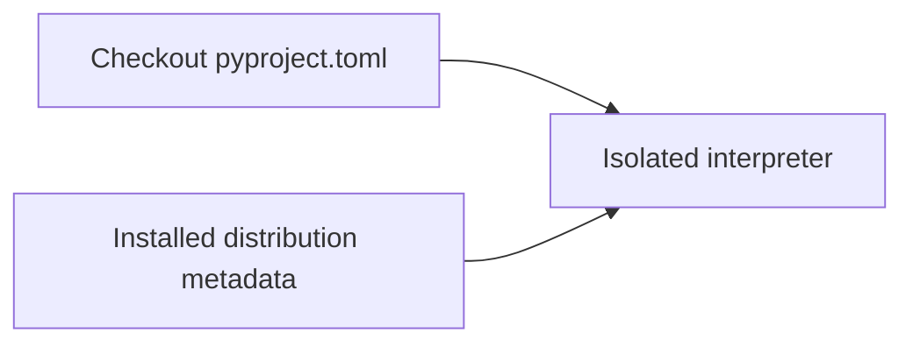
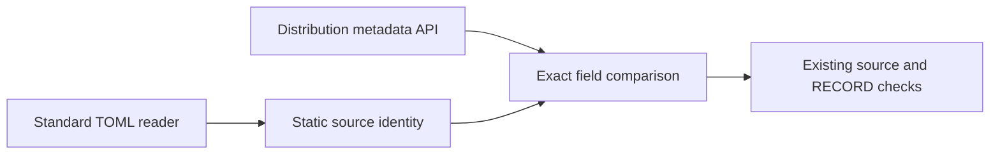

# P16 static distribution identity review

Baseline `cee3e17906834e1bd6520da8b6b4fc1111654bf6`, reviewed 2026-10-10.
The policy and review order were reread in full, followed by the earliest parser
and current packaging checks. Prior RECORD evidence is correctly scoped, but it
does not compare installed distribution name/version with source release metadata.

`check_identity` now reads this checkout's `pyproject.toml` through a TOML parser
and compares its static name/version with the interpreter-selected distribution's
metadata. Missing, empty, non-string or dynamic source fields fail; mismatched or
missing installed fields fail. Duplicate TOML keys fail in the parser. The isolated
CLI performs this before the existing seven source-file and RECORD checks, and
retains its existing output shape. No production module or package metadata changes.

KEEP Python inspection with standard TOML parsing. The
[JSON ADR](../../decisions/p16-installed-identity-v3.json) compares
[tomllib](https://docs.python.org/3.13/library/tomllib.html),
[Tomli](https://pypi.org/project/tomli/2.5.0/),
[uv](https://docs.astral.sh/uv/reference/cli/) and
[Java TomlJ](https://github.com/tomlj/tomlj).
Direct inspection avoids an additional runtime/environment selection boundary.
No throughput requirement or measured result favors a compiled parser here.
The Go parser discovery page and a Tomli source-tag URL were unavailable; neither
is used as evidence. The versioned PyPI metadata confirms Tomli 2.5.0 supports
Python >=3.8. These source observations do not establish local Python 3.9 execution.

The hosted matrix installs `tomli==2.5.0` only below Python 3.11. It is a developer
check dependency; no core or passport optional runtime requirement changes. The
fixture guide states this prerequisite. On newer Python, the checker uses stdlib
`tomllib`. The current simple static declarations work with their shared TOML
syntax; arbitrary TOML-version parity is not claimed.

Four new test methods initially produced eleven missing-function errors, not
eleven demonstrated production assertion failures. All fifteen installed checker
methods now pass. A separate in-memory no-op control causes ten expected assertion
failures across the three negative identity methods, with no errors or skips.
The real function is restored afterward. The isolated CLI passes against the
existing Linux Python 3.13 installation; no wheel was rebuilt or reinstalled.
Actionlint found an initial YAML quoting error in the dependency command. Converting
the command to a block scalar fixed it; the failure log is retained.

The [result record](p16-installed-identity-v3-results.json) records focused outcomes
and hashes. Hosted Python 3.9/Tomli, macOS and Windows results remain unobserved.
The check requires exact strings for this project's static profile. It is not a
general normalized-name/version comparator, dynamic build-metadata resolver, full
metadata validator, package `__version__` comparison or publisher authentication.
Local metadata and source remain trusted inputs with no atomic snapshot guarantee.

## C4 assurance views

Context:

Containers:

Components:

Code:

These are assurance-tooling views, not an operational C4ISR architecture. No command
authority, live communications, intelligence, surveillance or reconnaissance service
is introduced. No MLS/CNSA, availability, hard-real-time or physical qualification.
Insufficient information for tactical deployment. Full phase review and delivery
remain unfinished.
