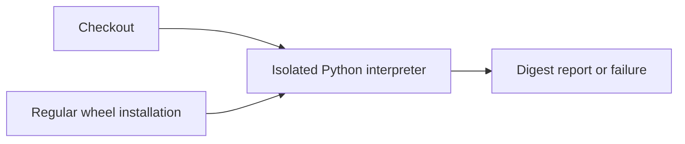
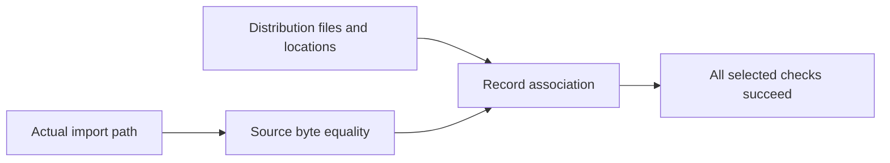
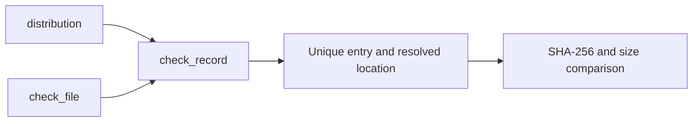

# P16 installed distribution RECORD review

Baseline: `61ffd53a5efd607d35936c6ad5fa440ad49c0b66`, reviewed 2026-10-10.
The policy and review order were read in full, the earliest parser was reread,
and packaging evidence was reviewed against its actual implementation.

The existing checker correctly claims selected installed/source byte equality,
not authentication of a wheel. It does not establish distribution membership:
an identical external copy passes even if no installed distribution owns that path.
The new check adds that narrower missing association to the hosted installation step.

`check_record` uses the selected distribution's `files` and `locate_file` interfaces.
It requires exactly one matching entry for each of the seven selected module paths,
the same resolved location as the imported file, SHA-256 equality with checkout
bytes, and matching recorded size. Missing file metadata, missing/duplicate entries,
different locations, missing/wrong hashes and missing/wrong sizes fail the check.
The CLI still requires isolated execution and prints its existing source-digest
report only after all byte and RECORD checks succeed. Existing workflow discovery
and path filters already cover both changed Python files.

## Technology choice

KEEP standard-library metadata inspection within the interpreter being tested.
The [ADR](../../decisions/p16-installed-record-v3.json) compares
[importlib.metadata](https://docs.python.org/3.9/library/importlib.metadata.html),
[pip inspect](https://pip.pypa.io/en/stable/cli/pip_inspect/),
[uv inspection](https://docs.astral.sh/uv/reference/cli/),
[Node child processes](https://nodejs.org/api/child_process.html) and
[Java ProcessBuilder](https://docs.oracle.com/en/java/javase/25/docs/api/java.base/java/lang/ProcessBuilder.html).
The decisive property is observing metadata resolution and imported file locations
in the same Python environment. A package report alone does not associate those
locations with reviewed bytes. Other-language orchestration remains credible, but
would still need evidence from this interpreter; no separate orchestration or
throughput requirement favors it. No language speed comparison was performed.

The [installed-project specification](https://packaging.python.org/en/latest/specifications/recording-installed-packages/)
allows some metadata omissions. This checker deliberately requires hashes and sizes
for these selected source files in its regular wheel CI profile. It is not a general
validator for every legal installation format.

## Evidence and limitations

Six new methods use real temporary files and real `Distribution.at` metadata reads.
Before implementation they produced ten missing-function errors across their cases;
this is missing implementation evidence, not ten production assertion failures.
All eleven installed-source/RECORD methods now pass. Replacing only `check_record`
with a no-op in memory produces nine expected assertion failures across five negative
methods, with no errors or skips. The original checker function is restored afterward.
This tests sensitivity to removal of the new check, not a production exploit.

The isolated CLI passes for all seven module files in the existing Linux Python 3.13
installation. No new wheel was built or installed. The cross-platform hosted matrix
has not been observed for this change. Initial Ruff formatting failure was corrected
and retained; final focused outcomes and hashes are in the
[result record](p16-installed-record-v3-results.json).

This is local consistency evidence. It does not authenticate the publisher, checkout,
RECORD or wheel; attest loaded bytecode; inspect all dependencies; detect all conflicting
distributions; or compare the distribution version with project metadata. Imports
execute package code before this checker runs, and sequential file reads are not an
atomic snapshot. Existing source-check limitations remain applicable.

## C4 assurance views

Context:

Containers:

Components:

Code:

These diagrams cover assurance tooling only. No operational C2, communications,
intelligence, surveillance or reconnaissance capability is introduced. No MLS,
CNSA, availability or physical performance claim is established. Insufficient
information for tactical deployment.
