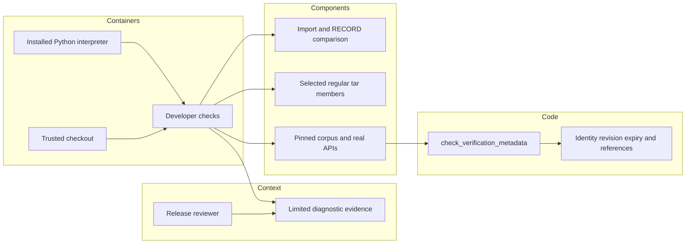

# Current P16 installed-package assurance review

Reviewed at `ea75e19c4e16486b7a91e83ca8db44de0eb9d6e2`, 2026-10-10.
The current restart now covers module/RECORD identity, source-archive inspection,
finite manifest selection, installed-vector behavior and their workflow configuration.
No local package build, install, clean clone or hosted matrix was run.

## Decisions from deployment constraints

These are offline developer/CI tools. They inspect the actual Python imports,
distribution metadata and selected tar members, then run a fixed synthetic corpus.
The configured installed matrix covers Python 3.9/3.13; archive checks use 3.13.
There is no target hardware latency or memory SLA for these tools. Files, checkout
and local distribution metadata are trusted inputs, not authenticated release media.

| Component | Current decision and comparison |
|---|---|
| Module and RECORD identity | KEEP direct Python introspection; seventeen real-file methods check the actual metadata API. [importlib.metadata](https://docs.python.org/3/library/importlib.metadata.html) exposes the interpreter's installed files and metadata. A Node/Java orchestrator still needs a Python probe. The [RECORD format](https://packaging.python.org/en/latest/specifications/recording-installed-packages/) is local metadata, not a publisher signature. |
| Archive and manifest | KEEP `tarfile` and the actual setuptools selection engine. Six small archive tests and one finite manifest check pass. [Apache Commons Compress](https://commons.apache.org/proper/commons-compress/) and [.NET TarReader](https://learn.microsoft.com/en-us/dotnet/api/system.formats.tar.tarreader?view=net-10.0) are credible Java/Kotlin and C#/F# readers; neither independently validates setuptools selection. No material migration advantage demonstrated for this limited trusted-input inspection. |
| Installed behavior runner | KEEP direct Python API calls, FIX missing metadata assertions. [pytest](https://docs.pytest.org/en/stable/how-to/assert.html) and [Robot Framework](https://robotframework.org/robotframework/latest/RobotFrameworkUserGuide.html) offer alternative assertion/orchestration models, but require explicit result expectations too. Direct object checks avoid a serialization bridge obscuring the installed return values. |
| Build-system alternatives | [Hatch](https://hatch.pypa.io/latest/config/build/) provides configurable file selection and [Maturin](https://www.maturin.rs/) supports Rust/Python packaging. A backend replacement does not resolve incomplete result assertions or prove the running import identity. Shared package configuration is unchanged. |

These are current requirements-based choices, not preferences based on installed tools
or familiarity. Alternatives were researched, not executed or benchmarked. Strict ADRs:
[identity](../../decisions/p16-installed-identity-recheck-v3.json),
[archive](../../decisions/p16-source-archive-recheck-v3.json),
[behavior](../../decisions/p16-installed-result-recheck-v3.json).

## Corrected evidence gap

The installed-vector runner compared policy metadata, but omitted identities and
effective expiries for several other verification APIs. It also checked evidence
outcomes without checking reference digests/kinds, and omitted task evidence flags
and inbox peer/expiry identity. Library implementations were not found defective.

Three new methods first produced 48 assertion failures with no harness errors:
38 success/rejection metadata or task-flag substitutions, six signed-reference
substitutions and four inbox identity substitutions. The earlier preliminary run had
18 failures and 26 errors because a test helper recursively converted nested references
to dictionaries. That run is retained and excluded from defect evidence; the helper
was corrected before the decisive RED run. A genuine baseline corpus control passed.

`check_verification_metadata` now derives expectations from the already pinned fixture
bytes. It compares exact payload/task/federation identities, revision values and
effective expiry; rejection metadata must be absent. Binding checks compare signed
digest/kind/outcome tuples in order, while passport-only tasks return no evidence.
The task evidence flag must remain false. The two successful fixed inbox dequeue
records have explicit peer/expiry expectations; other records carry neither value.
This helper is a fixture oracle, not a new verifier or input-admission API.

The runner still requires the existing eight corpus pins, rejects optimized execution,
and reports 62 cases/scenarios. Fixture bytes, pins, library code and wire formats are
unchanged. A source-runner result does not establish an installed-distribution result.

## C4 boundary

This tooling supplies computer/software assurance evidence only. It supplies no
command execution, communications transport, observation acquisition or intelligence
decision. It cannot establish the other C4ISR operational pillars, MLS, CNSA, Link 16,
DDS, five-nines uptime or physical real-time qualification.

## Verification and remaining limits

Run `PYTHONPATH=tests:tests/packaging:. python -m unittest test_passport_install_check test_passport_installed_vectors test_passport_sdist test_passport_manifest -v`.
Current source result: 47 methods, zero failures/errors/skips. The 23 runner methods
include real-file floor scenarios and the 48 corrected negative controls. Ruff passes.
Bandit with `--ignore-nosec` across three tools and four test files reports 46 low B101
assertion warnings, zero medium/high findings. Assertions are deliberate developer
checks, and `run` rejects `-O`/`-OO`; these warnings are retained, not suppressed.
The finite manifest test emits expected unmatched-pattern warnings because unrelated
repository files are deliberately outside its candidate set.

[Results](p16-installed-result-current-v3-results.json) bind selected source bytes and
retained logs. They are not dependency closure, loaded-code attestation, an atomic
snapshot or signed provenance. Archive inspection is not a hostile-archive validator;
module checks cannot detect a coordinated forged checkout/RECORD or attest imported
bytecode. Configured isolated hosted jobs still need observed exact-revision results.
Probes and remaining cross-phase consumer/lifecycle reviews are next in this restart.
No audit-complete marker is issued. Insufficient information for tactical deployment.
