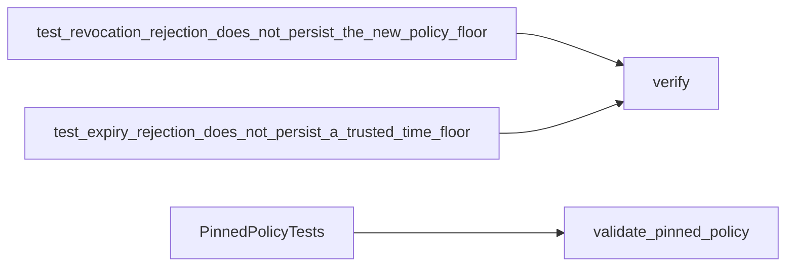

# P16 lifecycle evidence reassessment v3

Reviewed 2026-10-10 at `ed7824aca21363d44810eea2af1e14d7a1844912` after rereading
the policy and earliest parser, then the trust-floor tests, current verifier/policy
APIs and public contracts. No production or test defect was demonstrated. This is a
fresh KEEP decision for two executable counterexamples, not a persistence implementation.

The revocation trace authenticates revision 3, rejects a passport under revoking
revision 4, demonstrates authentication when the caller restores the old policy/floor,
and rejects that replay with independently retained floor 4. The expiry trace rejects
at time 2000, demonstrates authentication after caller time/floor rewind, and rejects
with retained time floor 2000. Rejections expose no trusted metadata. The tests use
synthetic signatures, not a disk restore or reboot. The policy API separately validates
an externally pinned revoking policy; it still stores no state and authenticates no
transport. These limits agree with the current public contract.

## Technology decision

The [ADR](../../decisions/p16-lifecycle-reassessment-v3.json) compares direct Python
unittest traces with [TLA+](https://lamport.azurewebsites.net/tla/tla.html),
[Alloy](https://alloytools.org/about.html),
[Erlang PropEr](https://proper-testing.github.io/) and
[Java/Kotlin JUnit](https://docs.junit.org/6.1.3/overview.html).
TLA+ models system transitions; Alloy explores constraints and counterexamples;
PropEr generates stateful model-based tests. Those are credible candidates outside
the current component language. Our inference: a model is complementary to these
fixed calls into the actual implementation. It does not replace observation of its
metadata and rejection behavior. A foreign test driver also needs an adapter.
KEEP direct calls for this narrow requirement; formal modeling and generated sequences
remain separate options if the reviewed component gains persistent or concurrent state.
No model checker, alternative benchmark, target deadline or native-memory comparison
was run or claimed. Familiarity, installed tooling and rewrite cost are not the decision.

## Verification and historical reconciliation

Eleven methods pass with zero skips: two lifecycle traces, eight independent-policy
methods and one lexical restart method. Two scoped wrappers then call the real verifier
while replacing only `minimum_policy_revision` with 3 or `minimum_time_s` with 0.
Each selected lifecycle test produces one assertion failure, with no error or skip.
Both original function bindings are restored. This demonstrates sensitivity to ignoring
the caller's stronger floor; it does not establish exhaustive coverage or a production bug.

All 386 `source_sha256` entries in 36 existing P16 result records match the files at
the Git commits that first published those records. This is a new historical byte
comparison, not re-execution of 36 experiments. It does not verify logs' truth, authors,
dependency closure, loaded code, accreditation or present-day compatibility. Historical
records are unchanged. The [result record](p16-lifecycle-reassessment-v3-results.json)
identifies those commits and binds the complete local comparison artifact by hash.

C4 context: reviewer → offline assurance traces → scoped evidence. Container: local
Python test process → actual library. Component: caller argument fixtures → stateless
verifier → result assertions. Code view:



No C2, live communications or operational ISR service is implemented by these views.
They describe software assurance on a local computer; no command, control, surveillance
or reconnaissance capability is inferred. Storage, trusted provisioning and transport
remain unfinished software, not fictitious external gates.

Reproduce from the repository with the optional passport crypto dependency installed:

```sh
PYTHONPATH=tests:. python -m unittest test_passport_lexical test_passports.PassportVerificationTests.test_revocation_rejection_does_not_persist_the_new_policy_floor test_passports.PassportVerificationTests.test_expiry_rejection_does_not_persist_a_trusted_time_floor test_passport_policy -v
```

Next: reconcile remaining public architecture/release claims against the reviewed
implementation inventory. No audit-complete marker or P16–P19 completion is asserted.
Insufficient information for tactical deployment.
