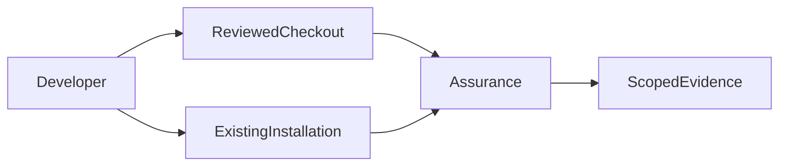
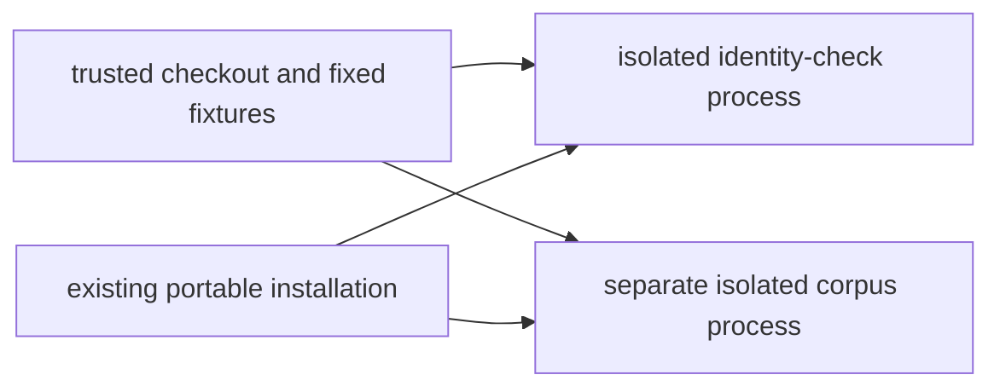
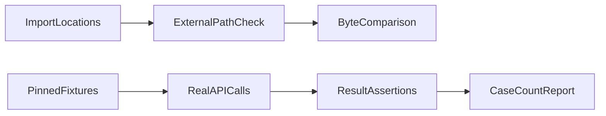
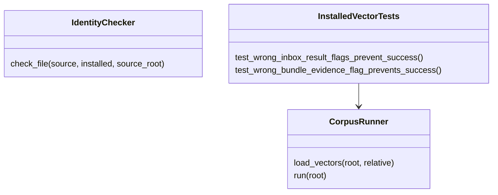

# P16 packaging reassessment v3

Baseline `53b1ba412794ba7efc3fbd1bc37b567f601fe551`, reviewed 2026-10-10.
The earliest lexical boundary was reread before reviewing the installed-file checker,
behavioral runner, their tests, workflow, build selection and historical evidence.
The preceding bridge commit matched its parent, six file hashes and noreply identity.
This review changes assurance tooling only; production and fixture bytes are unchanged.

## Demonstrated gap and correction

The installed corpus checked `motion_authority` on inbox results but omitted
`execution_authority` and `evidence_verified`. It also omitted `evidence_verified`
on bundle results. An incorrect value in any of these fields could accompany a
successful conformance report. No such incorrect production result was demonstrated.

Two new methods wrap real calls and substitute one returned field at a time while
preserving the remaining fields, including nested evidence objects. Four inbox
subcases cover put/take crossed with the two omitted flags; the fifth covers the
bundle flag. All five initially failed with `AssertionError not raised`, without
execution errors. Three explicit `is False` assertions correct the runner. The normal
fifty-case run and the five fault substitutions now pass their respective expectations.
The tests replace runner dependencies only within scoped contexts; runtime code remains
unchanged. Removing these added checks recreates the recorded failure mechanism.

## Fresh technology decision

[The strict JSON ADR](../../decisions/p16-packaging-reassessment-v3.json) records
constraints before selection and current official sources for the alternatives.
KEEP standard portable wheel packaging and direct isolated Python inspection. The
required observable is the actual Python import path and return object, which direct
inspection obtains without a newly introduced cross-language report boundary.

Setuptools and Hatchling offer package selection; neither supplies the missing result
checks. Meson/meson-python and Maturin are credible compiled-extension build ecosystems,
but this slice has no native ABI requirement. Robot Framework supplies keyword-driven
acceptance tests; CTest can orchestrate processes. Those are useful for other test
interfaces, but still require Python inspection for this boundary. Dhall can generate
typed configuration; the existing workflow needs no generation step to select these
changed scripts/tests. No migration win follows from the demonstrated assertion gap.

These are source-based property comparisons, not executed alternate-runtime parity or
speed measurements. Incumbency and rewrite cost are not selection criteria. The shared
build configuration and peer-owned native helper remain unchanged.

## C4 assurance views

Context:



Containers:



Components:



Code:



These views describe development evidence, not an operational deployment architecture.

## Verification and limits

Fifteen focused methods pass without skips. From outside the checkout, the existing
installation matches all seven listed source files and executes fifty corpus cases.
Real isolated `-O` and `-OO` children each reject before success output. Ruff and format
checks pass. Bandit passes with B101 excluded for explicitly guarded runner assertions;
that is not an unfiltered clean scan. The [result record](p16-packaging-reassessment-v3-results.json)
retains the unfiltered assertion-use count and listed source/log hashes.

No new wheel, clean environment, full repository run or hosted matrix was executed.
The identity check and behavior check are separate processes, not atomic attestation.
Seven file comparisons do not cover package initialization, transitive dependencies,
loaded bytecode or the entire distribution. The checker compares portable Python
source files; it does not qualify a compiled `_json_bounds` binary. These trusted
local files are read wholly, so arbitrary hostile file sizes are not bounded here.

Reproduction in a prepared portable installation:

```sh
PYTHONPATH=tests:. python -m unittest test_passport_lexical test_passport_install_check test_passport_installed_vectors -v
python -I scripts/passport_install_check.py
python -I scripts/passport_installed_vectors.py
```

No physical, MLS/CNSA, availability or complete-phase claim follows. Insufficient
information for tactical deployment. The next earliest remaining component is the
comparison/mutation assurance tooling; the audit remains incomplete.
