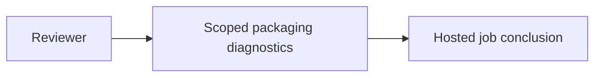
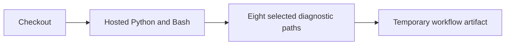
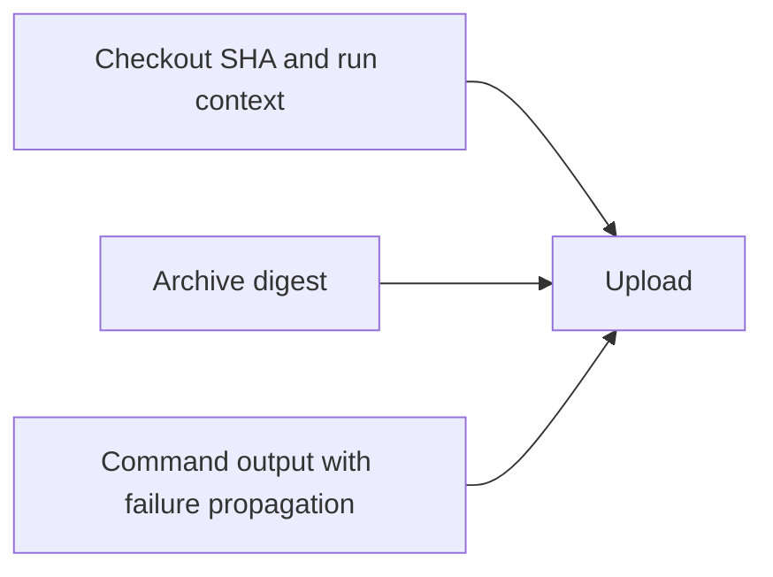
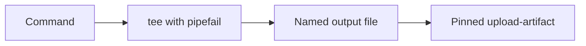

# P16 packaging diagnostic retention

Baseline `82e044e8ef66558f8a8519964e6ad42968276fe8`, reviewed 2026-10-10.
The current policy/review order were read in full. The parser, signature and pinned
policy source were reread before continuing packaging review. No new runtime defect
was identified; that observation is not a completed whole-phase technology audit.

The hosted P16 source-archive job had no selected diagnostic artifact. The workflow
now records actual checkout SHA separately from five named GitHub context fields,
the source-archive SHA-256, archive-check output, install output, dependency check,
installed-source check and installed vectors. An explicit eight-file allowlist is
uploaded even after a preceding step fails. Artifact existence never means PASS;
files may be missing, empty or partial. No workspace-wide upload or environment dump.

[ADR](../../decisions/p16-packaging-retention-v3.json): KEEP the pinned
[official artifact action](https://github.com/actions/upload-artifact/tree/b7c566a772e6b6bfb58ed0dc250532a479d7789f)
for the hosted runner service. The [general CLI API client](https://cli.github.com/manual/gh_api)
is a credible alternate orchestration tool, but requires service-specific integration;
job logs alone do not provide the selected downloadable bundle. No custom uploader
or new runtime is justified by this bounded diagnostic requirement.

Retention is requested for fourteen days; it is not permanent release storage.
The name includes event SHA, run ID and attempt. The recorded checkout SHA may be a
PR merge commit rather than the PR head. Consumers must check the run conclusion,
repository, revision and attempt; these files do not authenticate themselves.
[GitHub artifact documentation](https://docs.github.com/en/actions/tutorials/store-and-share-data)
describes the retention mechanism. Neither a digest nor uploaded context is a signed
provenance statement. This bundle does not retain the source archive or resulting wheel.

Explicit `shell: bash` selects GitHub's
[documented pipefail execution](https://docs.github.com/en/actions/reference/workflows-and-actions/workflow-syntax).
A real local shell probe confirms successful output capture and exit-zero continuation,
then exit-23 capture without continuation. Its negative control removes pipefail and
observes the failure being masked. This is a shell-semantics probe, not a hosted build
or upload. No failing production regression test is claimed for a configuration gap.

Thirty focused methods pass without skips: parser/policy/signature tests and four ADR
conformance methods. Actionlint passes. [Source-bound results](p16-packaging-retention-v3-results.json)
retain the local observations. No hosted upload, new archive build, installation or
customer acceptance was performed locally. The earlier commit was verified against
its parent, staged file hashes and noreply identity before publication.

## C4 assurance views

Context:

Containers:

Components:

Code:

This correction is software assurance only; no command, communication, intelligence,
surveillance or reconnaissance feature is introduced. No MLS/CNSA, real-time,
availability or physical qualification follows. Insufficient information for tactical
deployment. Full audit, release and phase completion remain unestablished.
