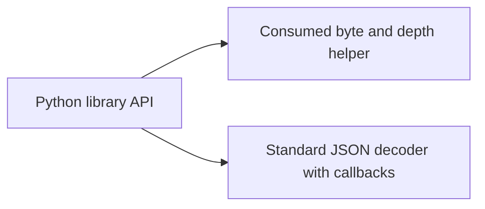
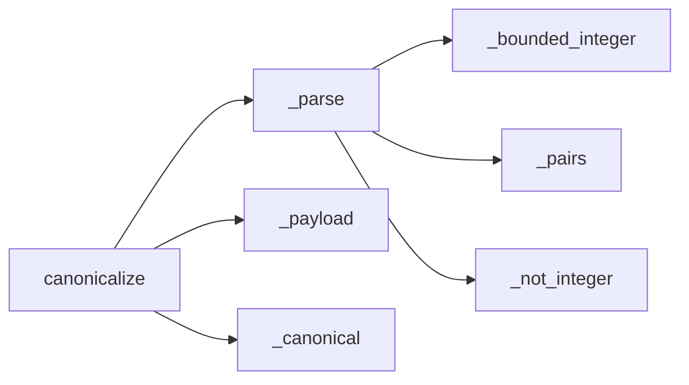

# P16 parser technology reassessment

Reviewed 2026-10-10 at `338454b702945cd159748a543bba7485b042b706`.
Decision: **KEEP the bounded offline parser; add portable lexical evidence**.
[Machine-readable decision](../../decisions/p16-parser-reassessment-v3.json).
Earlier reviews are historical inputs; this is a fresh review of the earliest component.

## Requirements and evidence

Inputs are immutable UTF-8 bytes, <=65536 bytes and depth 8. The application requires
unique decoded keys, pre-conversion integer-token bounds, rejection of floats and
exponents, closed ASCII fields, and deterministic canonical bytes. It neither performs
I/O nor grants authority. The input-size bound is not a process-memory or deadline
bound. No actual hardware class, RSS budget or throughput requirement is specified.

| Candidate | Decisive properties for this contract |
|---|---|
| Python JSON hooks | Integer/float callbacks receive token strings; object-pair hooks permit duplicate rejection. Explicit UTF-8 decoding excludes the byte decoder's alternate encodings. These mechanisms directly express the current contract without a custom tokenizer. [Documentation](https://docs.python.org/3.13/library/json.html). |
| Erlang/Elixir OTP JSON | Integer/float callbacks take binaries and object callbacks allow custom accumulation. A credible alternative with comparable lexical hooks, not ruled out by absent local tooling. Application duplicate, bounds and canonicalization rules still need implementation. [Documentation](https://www.erlang.org/doc/apps/stdlib/json.html). |
| C#/F# Utf8JsonReader | Token spans support checking raw representations before conversion. Streaming can avoid a full object tree, but buffer ownership, duplicate detection and canonical output still require application logic. No measured memory requirement establishes a migration advantage here. [Documentation](https://learn.microsoft.com/en-us/dotnet/standard/serialization/system-text-json/use-utf8jsonreader). |
| Java/Kotlin Jackson | A streaming API separates token processing from object binding. It is a serious managed-runtime candidate; this review does not claim untested configuration or full contract parity. [Project](https://github.com/FasterXML/jackson-core). |
| Rust Serde | A custom map visitor can control entry handling. A complete candidate must also preserve integer lexical rejection, byte bounds and canonical output. Native memory ownership is useful, but not an established win against an unspecified RSS/deadline target. [Custom map example](https://serde.rs/deserialize-map.html). |
| C++ simdjson | Native SIMD JSON parsing is relevant to throughput-oriented workloads. Its published general performance results are not measurements of this profile. Full JSON validation does not impose this application's stricter integer and schema rules. [Project](https://github.com/simdjson/simdjson). |
| JavaScript JSON.parse | The bounded local observation accepts duplicate keys and integral float/exponent spellings. A lexical adapter is required; native crypto does not supply that adapter. This is a syntax observation, not rejection of every possible JavaScript implementation. |

KEEP follows the fit between explicit lexical hooks, immutable byte inputs and the
small closed validation surface. The alternatives remain credible; none establishes a
material improvement for these actual offline constraints. No selection rests on
incumbency, installed tools, familiarity or rewrite cost. No comparative speed ranking
or objectively optimal technology for an unspecified embedded target is claimed.
Streaming/native deployment requirements would trigger a separate measured decision.

## Bounded executable comparison

The new pinned corpus has four accepted cases (canonical bytes, whitespace, escaped
ASCII key and negative-zero normalization) and ten rejected cases (two escaped duplicate
keys, four UTF-16/32 byte encodings, UTF-8 BOM, float/exponent versions and trailing JSON).
Expected canonical bytes are explicit fixtures, not computed by the production parser.
Existing tests separately cover byte/depth bounds and integer pre-conversion rejection.

The first new method failed because this portable corpus was absent; this is a coverage
failure, not a newly discovered production defect. All 14 cases pass on unchanged
production code. A scoped replacement of `_pairs` by ordinary dictionary construction
causes exactly two assertion failures, at the root and nested escaped duplicates.
The temporary replacement is restored; no source mutation or new production parser.

Python 3.13.5's default `json.loads(bytes)` accepts nine of the ten contract-negative
cases; Node v22.23.2's `JSON.parse(Buffer.toString('utf8'))` accepts four. Both reject the
trailing-document case. These are unconfigured syntax decoders, **not competing full
validators**: the result demonstrates necessary adapter semantics, not comparative
language quality. Other candidates above were researched, not executed. An older
simdjson API URL and a Jackson Javadoc URL failed to load; no API claim relies on them.

Reproduce the continuing contract and ADR checks:

```sh
PYTHONPATH=tests:. python -m unittest test_passport_lexical test_passports.PassportSchemaTests test_passport_schemas -v
```

28 methods pass without skips. Ruff, format, and unexcluded Bandit on the new test pass.
The workflow already discovers `test_passport*.py`, passport fixtures and P16 ADRs.
[Results and source bindings](p16-parser-reassessment-v3-results.json) retain the syntax
observations and negative-control outcomes. No new installed wheel, hosted run or
physical qualification is claimed. Historical failed evidence remains unchanged.

## C4 views of the unchanged boundary

Context:


Containers:



Components:


Code:



These views add no command, communications, sensor-fusion or ISR behavior. This component
cannot establish MLS, CNSA, five-nines service or a hard real-time path. Insufficient
information for tactical deployment. The next component is signature/trust metadata;
this decision does not complete the remaining P16–P19 reassessment.
