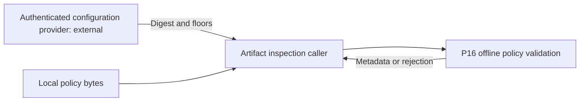
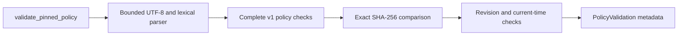
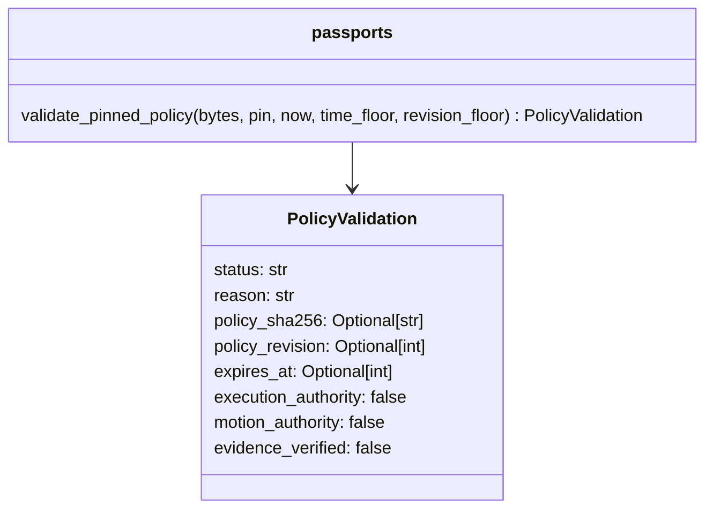

# P16 independent policy validation review v3

Baseline: `526e8549bb46ed2ffbd896d60b42c715d634438f`, reviewed 2026-10-10.
Decision: KEEP the bounded lexical parser and native hash boundary; FIX the missing
public policy-validation boundary identified by the retained trust-floor traces.
This is a correction at the earliest trust component, not completion of the full
retrospective review or the later phases.

## Constraints and technology decision

The actual deployment contract is a synchronous, offline Python 3.9+ library call
over immutable software-artifact metadata. Inputs are at most 65536 bytes and depth
eight, with safe-integer lexical checks, closed fields, at most 16 keys and three
revocation lists of at most 256 entries. No target device, throughput SLA, memory/RSS
budget or deadline has been supplied. No transport, file access, implicit clock or
operational command path belongs in this component.

Current primary-source comparison, checked for this correction:

| Candidate | Decisive fit and limitation |
|---|---|
| Python JSON hooks plus native SHA-256 | Integer-token and object-pair hooks preserve the protocol's lexical and duplicate-key distinctions. Reuse of the same bounded validator preserves the existing policy language for both public entry points. Default JSON decoding would not suffice. [Python documentation](https://docs.python.org/3.13/library/json.html). |
| Java/Kotlin with Jackson streaming | A credible token-level parser rather than an object-binding-only alternative; can implement closed fields and number checks. A separate implementation must establish the same complete policy acceptance contract. No claimed JVM performance comparison. [Jackson](https://github.com/FasterXML/jackson-core). |
| Rust with Serde | Typed deserialization and field attributes support a native implementation. Attributes alone do not establish this profile's lexical rejection or complete key/revocation checks; a parity implementation remains necessary. [Serde](https://serde.rs/attributes.html). |
| CUE | Declarative constraints are credible for configuration tooling. Value-level validation is not evidence of preserving raw JSON spelling or exact pinned bytes. It does not replace the caller's authenticated pin/time source. [CUE](https://cuelang.org/docs/concept/how-cue-enables-data-validation/). |

KEEP Python for this bounded metadata boundary: documented lexical hooks, exact immutable
bytes and shared policy validation directly meet the constraints without a custom JSON
tokenizer or a second acceptance implementation. This is not a speed ranking. No reviewed
alternative demonstrates a material win for the specified contract; installed tooling,
familiarity and rewrite cost are not the basis. The decision does not select a future
persistent store, service runtime or physical processing path. The executable acceptance
tests establish local behavior, not comparative performance or physical qualification.

The [machine-readable decision](../../decisions/p16-policy-admission-v1.json) uses the
[closed ADR schema](../../../contracts/interop/architecture-decision-v1.schema.json).

## Fresh source walk and correction

The parser, signature verifier, evidence binding, task descriptions, bundles, direct
federation and inbox were reread in implementation order. They still use exact bounded
snapshots and caller-provisioned trust/time. Evidence binding preserves issuer assertions;
the inbox is process-local, does not revoke returned copies, and has no bounded lock-wait
guarantee. None implements persistence or authentication of the policy channel. Historical
component decisions remain evidence inputs; this walk does not claim fresh exhaustive
tooling, schema or phase qualification.

The missing public boundary forced a caller to use private policy parsing or infer
policy admission from a successful passport. The latter fails for a policy revoking
all relevant signers. `validate_pinned_policy` now validates all policy metadata and the
caller-authenticated raw-byte pin before exposing revision/expiry, without needing a
successful passport. It shares the existing policy parser; no policy wire version,
signature algorithm, threshold or existing verifier behavior changes.

Persistence remains unfinished software. Validation alone cannot stop rollback when a
caller supplies old pins and floors. A future store needs realm isolation, same-revision
content checks, failure-atomic commit-before-use, trusted time advancement and explicit
backup/restore assumptions. None is claimed implemented by this call.

## C4 views of this implemented boundary

Context:

Container:

Component:

Code:

This is a computers/software-assurance boundary only. Command, control, communications,
intelligence, surveillance and reconnaissance services are not implemented by it.
These C4 views are not NAF/DoDAF conformance, an MLS guard, ZTA accreditation, CNSA
qualification, five-nines availability or target-hardware timing evidence.
Insufficient information for tactical deployment.

## Verification

Eight new methods first failed at the missing public API (45 assertion failures,
zero errors). They now pass, including a real signed-passport control followed by a
valid policy that revokes its only signer. Eighty-seven focused methods pass across
policy, passport, evidence, task, bundle, federation and inbox boundaries, with zero
skips. Formatting initially requested changes to the new test file; those were applied.
The initial ADR negative check also failed: the environment lacked an optional URI
format checker, so `format: uri` alone accepted an invalid reference. An explicit
HTTPS-reference pattern now rejects that case independently of optional checkers.
One positive and eight negative ADR records pass the structural check; this validates
reference shape, not reachability, source authenticity or technical correctness.
Final commands and source/log hashes are in the [result record](p16-policy-admission-v3-results.json).
No full-repository, installed-distribution, persistent-store or hosted run is claimed.

Next earliest unreviewed work: reconcile schema/tooling and publication evidence against
this additive API, then continue the generic persistent trust-floor boundary. No audit
completion marker is issued.
