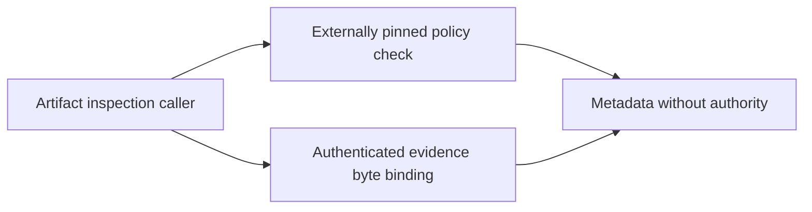
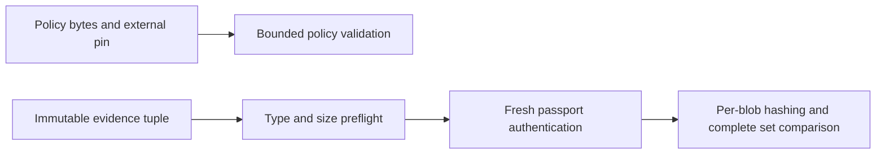
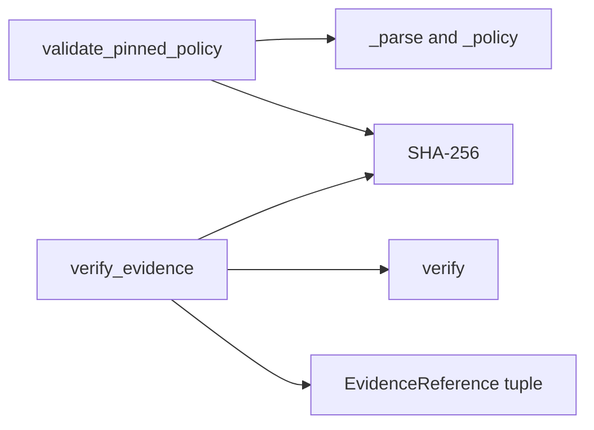

# P16 policy and evidence reassessment v3

Baseline: `d6edbc52de8781d41d5dcf8fa5e9f4bf3ff80474`, reviewed 2026-10-10.
The earliest parser and signature source were re-read before these two components.
Both decisions are **KEEP**, scoped to generic offline software-artifact metadata.
No production, wire, threshold or test change is required by the findings below.
Prior reviews remain historical evidence; these decisions use fresh source inspection,
focused execution and primary-source research. The full lane review is incomplete.

## Independent pinned-policy validation

The [policy ADR](../../decisions/p16-policy-reassessment-v3.json) records the constraints
and alternatives. The input is immutable UTF-8, at most 64 KiB and depth eight, with
closed key/revocation metadata. The external pin binds exact bytes, including whitespace.
Caller time/floors are mandatory; the function performs no enrollment or persistence.

The implementation validates all key metadata, hashes the same raw bytes, compares the
pin, checks revision and half-open expiry, and returns metadata only on success. The
existing documentation correctly explains why a policy revoking every signer can still
validate. A caller can still provide an old pin and old floors: this stateless API does
not detect that rollback or same-revision equivocation. No new mismatch was found.

Fresh technology comparison:

| Candidate | Fit and decisive limitation |
|---|---|
| CPython hooks and hashlib | [JSON callbacks](https://docs.python.org/3.13/library/json.html) preserve number lexemes and object pairs; [hashlib](https://docs.python.org/3.13/library/hashlib.html) hashes the original bytes. The bounded lexical and pin contract is directly executable. |
| CUE | [Constraint unification and closed definitions](https://cuelang.org/docs/concept/how-cue-enables-data-validation/) support rich configuration validation. For this API, an exact-byte pin/context wrapper would still be required; value validation is not pin-source authentication. This is a fit assessment, not a claim that CUE cannot represent the constraints. |
| Java/Kotlin Jackson | [Streaming tokens](https://github.com/FasterXML/jackson-core) are a credible admission boundary. A complete port needs the same lexical, key-binding, interval and rejection semantics. No JVM benchmark was run. |
| Rust Serde and sha2 | [Serde attributes](https://serde.rs/attributes.html) support typed data models; [sha2](https://docs.rs/sha2/latest/sha2/) supports byte hashing. Attributes alone are not proof of this exact lexical contract; custom admission needs parity evidence. |
| Erlang/Elixir OTP | [JSON callbacks](https://www.erlang.org/doc/apps/stdlib/json.html) and immutable binaries are credible alternatives. A process/service topology provides no demonstrated advantage for this synchronous stateless call. |

KEEP is grounded in lexical hooks, immutable bytes, native hashing and passing boundary
tests. No reviewed alternative establishes a material win under the supplied constraints.
Installed tools, familiarity, incumbent language and rewrite cost are not reasons to
retain it. No host/embedded platform, throughput, deadline or RSS budget is specified;
this is not a performance ranking or a decision for a future persistent service.

## Evidence byte binding

The [evidence ADR](../../decisions/p16-evidence-reassessment-v3.json) covers 1..16
already-resident exact byte strings, each at most 64 KiB. Preflight precedes passport
authentication and evidence hashing. The real public verifier is called for each bind;
only then is the same immutable envelope decoded again. Complete digest-set equality
rejects missing, extra and substituted blobs, while duplicate digests reject separately.
Signed failed/unknown outcomes survive binding; blob content is not interpreted.

The one-MiB input-content bound is correctly distinguished from RSS/native allocations.
The contract also distinguishes digest metadata from anonymization, encryption and
secure erasure. No new implementation or claims mismatch was found.

| Candidate | Ownership and hash boundary |
|---|---|
| CPython exact bytes/tuple plus hashlib | Immutable inputs remain stable while native hashing can release the GIL. Each bounded blob is hashed independently; no joined input buffer is necessary. |
| Rust sha2 | The [one-shot/incremental APIs and target backends](https://docs.rs/sha2/latest/sha2/) are credible native alternatives with owned or safely borrowed immutable data. No FFI-copy penalty is presumed. |
| C#/F# | [SHA256.HashData](https://learn.microsoft.com/en-us/dotnet/api/system.security.cryptography.sha256.hashdata?view=net-10.0) supports span inputs and caller-provided digest storage. Application ownership must keep backing data stable through verification and hashing. |
| Erlang/Elixir | [Binary handling](https://www.erlang.org/doc/system/binaryhandling.html) and [crypto hashing](https://www.erlang.org/doc/apps/crypto/crypto.html) are credible for a BEAM consumer. Distribution/supervision does not itself improve this bounded local function. |
| Node JavaScript/TypeScript | [Native hashing](https://nodejs.org/api/crypto.html) is viable with an explicit mutable-buffer ownership discipline. A hash primitive alone is not complete evidence binding. |

KEEP follows immutable admission, native per-blob hashing and the small tested rejection
surface. No specified deployment constraint or measurement establishes a materially better
implementation. No complete competing binder or runtime benchmark was executed in this
slice, and no winning migration is deferred. New target constraints reopen the decision.

## Fresh executable evidence

Twenty focused methods pass with no skips: eight policy, ten evidence, one lexical and
one optional-backend process method. Two in-memory production mutations test existing
coverage: disabling the policy pin comparison causes one assertion failure; weakening
evidence set equality to a strict-subset check causes two assertion failures (extra and
substituted content). Both controls have zero errors/skips; source bytes remain unchanged.
These are sensitivity controls, not discovered production failures. No redundant new test
is added for already-covered behavior.

Reproduce the focused acceptance run:

```sh
PYTHONPATH=tests:. python -m unittest test_passport_optional_backend test_passport_lexical test_passport_policy test_passport_evidence -v
```

The [result record](p16-policy-evidence-reassessment-v3-results.json) retains mutation
targets, test names, source hashes and local raw-log hashes. The two new ADRs also pass
the existing structural decision validator; this verifies document shape, not decision
truth. No full-repository, installed-release, hosted or physical run is claimed.

## C4 views of the reviewed components

Context:



Containers:


Components:



Code:



No C2/ISR/physical service, encryption, MLS guard, CNSA qualification, hard-real-time or
five-nines claim follows from these views. Insufficient information for tactical deployment.
Next earliest review: structural schemas and conformance tooling, followed by task and
bundle descriptions. No technology-audit completion marker is created.
