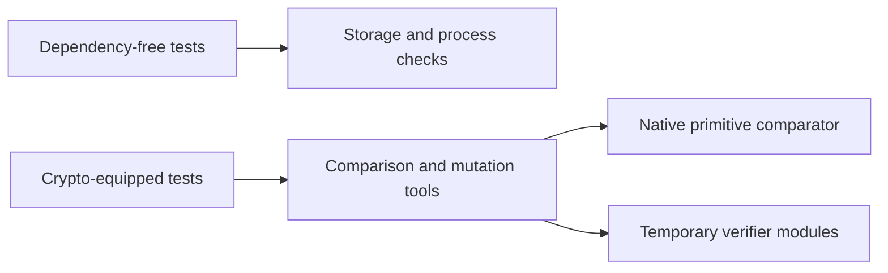
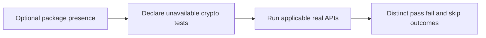
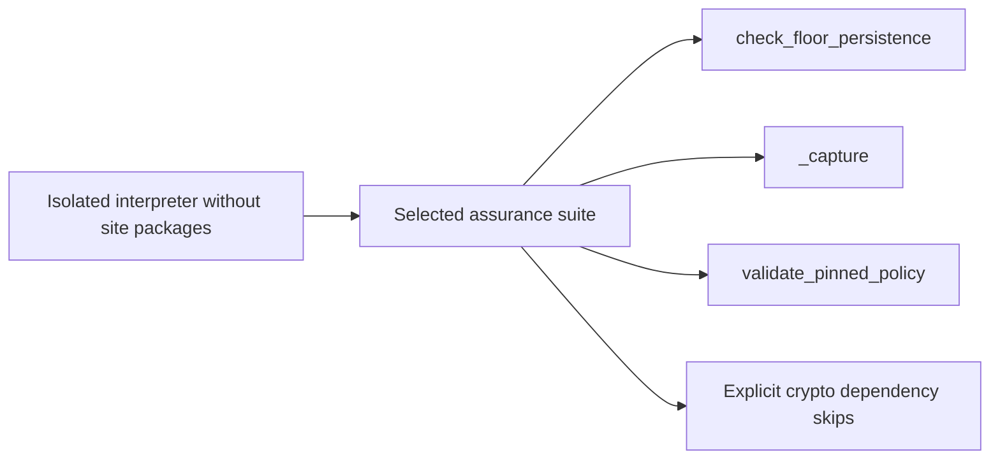

# Probe and optional-backend review

Baseline `64ac47c6d0986af09238d61a8514085849f1a36a`, reviewed 2026-10-10.
This continues the current P16 review through comparison and mutation tooling,
including source, tests, process handling, result claims and workflow dependencies.
The [strict ADR](../../decisions/p16-probe-optional-v3.json) records separate KEEP
rationales for the comparison observer and mutation runner.

These are bounded developer diagnostics, with no deployment latency target.
Current primary documentation was checked for [Python subprocess support](https://docs.python.org/3/library/asyncio-subprocess.html),
[unittest](https://docs.python.org/3/library/unittest.html), [Node processes](https://nodejs.org/api/child_process.html)
and [C#/F# process supervision](https://learn.microsoft.com/en-us/dotnet/api/system.diagnostics.process).
Direct calls to the real verifier and compilation of its isolated source copies
are decisive. External orchestration is credible but does not improve those
observations by itself. No candidate speed ranking or deferred winning migration
is established. Installed tools and familiarity are not the decision basis.

The completed [hosted development job](https://github.com/Nima0101/aethron/actions/runs/38080341376/job/114295776169)
failed with 12 failures, 30 errors and 73 skips at the earlier delivery. Its core
configuration does not install optional crypto. Probe response tests instead
required it unconditionally; mutation tests expected later failures that could
not be reached without a valid baseline. Several installed-runner negative tests
could pass because an earlier unrelated crypto assertion failed.

A fresh isolated no-site interpreter reproduced 15 failures and 30 errors in
45 affected methods, including the newly added floor checks. The new regression
first failed on that actual behavior. A subsequent test-only correction narrowed
a broad name check that mistakenly classified a crypto-backed federation revision
floor test as backend-independent storage coverage; that failed run is retained.

Only crypto-dependent test methods now have explicit dependency skips. Delivery
composition requires crypto throughout and declares this at class level. Five
floor tests invoke the real-file scenario directly, so they retain useful coverage
without running unrelated signature cases first. The dedicated passport workflow
still installs and imports the backend; neither workflow nor runtime was weakened.
The probe executables themselves still fail without success output if crypto is
absent. No fabricated acceptance substitutes for missing dependencies.

Verification: all 48 affected methods pass with crypto available, zero skips.
The narrowed no-site child executes 43 methods: 23 pass, 20 explicitly skip for
missing optional crypto, zero failures/errors. Process startup/optimization tests
also execute in the parent suite. The live comparison retains six primitive
outcomes and five lexical rejections. Four real mutation baselines pass and four
deliberate changes yield eight expected assertion failures. Source bindings in
both reports match the listed working-copy files. The final run also validates
four ADR methods (52 total). An additional full-runner storage-failure check
prevents omitted floor execution from reporting success: a controlled omission
causes one expected assertion failure; all 14 installed-runner methods pass again.

Ruff found two import-order errors, corrected without behavioral edits. Formatting
and final lint pass. The scoped unfiltered Bandit output retains three LOW findings
(B404 and two B603) in existing fixed-argv subprocess tests; existing narrow nosec
annotations in the optional-backend tests remain, including the new fixed-argv
calls. No medium/high finding or blanket exclusion was introduced. This is not a
clean unfiltered security result. [Results](p16-probe-optional-v3-results.json)
identify source and raw-log hashes; logs are local, not published attestation.

C4 context:

C4 containers:

C4 components:

C4 code:


These are computer assurance checks. Command and control remains human review;
no communications, intelligence, surveillance or reconnaissance capability is
implemented here. No NAF/DoDAF accreditation, MLS/CNSA compliance, availability or
physical real-time qualification follows. Insufficient information for tactical deployment.

Reproduce the focused source checks with the pinned passport environment:
```sh
PYTHONPATH=tests:. python -m unittest test_passport_probe test_passport_installed_vectors test_passport_policy test_interop_delivery test_passport_optional_backend -v
python scripts/passport_technology_probe.py
python scripts/passport_trust_review.py
```
No full local repository matrix or hardware run was performed. Next earliest
component: peer-consumer conformance and lifecycle evidence. P16–P19 remain unfinished.
