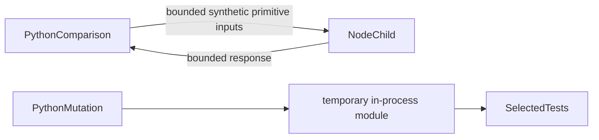
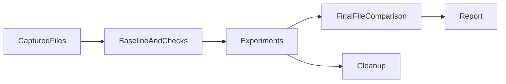
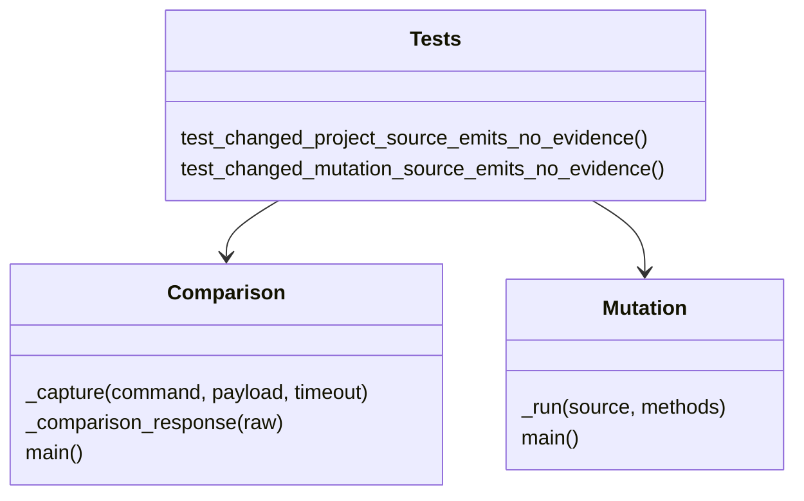

# P16 comparison and mutation tooling reassessment v3

Baseline `ba7f2c754342893c2c80fe18c6de2bf07b81a8e7`, reviewed 2026-10-10.
The earliest lexical boundary was reread before the complete comparison driver, Node
probe, mutation runner, regression tests and existing capture/timing/mutation reviews.
The packaging bridge matched its parent, six file hashes and noreply identity.

No new implementation mismatch was demonstrated. This patch records two fresh KEEP
decisions and their executable evidence; production, tool and test source is unchanged.
Earlier results remain historical inputs, not substitutes for this review.

## Decisions from current constraints

[Comparison ADR](../../decisions/p16-comparison-reassessment-v3.json): KEEP direct
Python inspection with an independent Node primitive check. Official Python, Node,
Tokio and Java process APIs were compared for bounded capture and cleanup. Python's
private callback helper counts bytes before retaining stdout; the finite stream limit
is not a limit on kernel buffers, transient chunks, total RSS or child execution.
Other-language orchestration would still need Python execution to inspect these API
objects and traced allocations. No required native transport or service is present.

KEEP integer elapsed intervals and explicit measurement scope. pyperf and JVM JMH are
credible statistical benchmark ecosystems, but these single-batch diagnostics make
no such claim. The six primitive results are checked against explicit expected values;
Node is not a complete implementation of the Python admission contract. Missing Node
and optimized Python are errors, not successful skipped comparisons.

[Mutation ADR](../../decisions/p16-mutation-reassessment-v3.json): KEEP four explicit
in-memory source substitutions with a complete successful baseline and scoped binding
restoration. mutmut offers broader discovery with process isolation, while PIT targets
JVM bytecode. Neither automatically improves evidence for these exact Python source
changes. Per-experiment processes would provide stronger state isolation if required;
this sequential trusted diagnostic promises restoration of only its two replaced
bindings. It is not a sandbox or a timeout supervisor for arbitrary tests.

These selections follow the inspected object/source boundary, not incumbent language,
installed tools or rewrite cost. No alternate implementation or speed ranking was run.

## Fresh executable evidence

Twenty focused methods pass without skips. They include real child-process capture
limits, nonzero exit and timeout cleanup; malformed response rejection; tracing
ownership; integer timing arithmetic; optimization rejection; baseline integrity;
source-change rejection; and restoration on runner exceptions.

A live Python/Node comparison completes six cases and five lexical rejection checks.
A live mutation run passes four baseline methods and observes eight assertion failures
across four selected mutations. The report calls those expected failures; they are not
failures of the unchanged baseline. Local timing values remain diagnostic samples.

Two bounded sensitivity experiments compile copies of the current tool source in
memory with final source-change rejection disabled. The existing source-change test
for each tool then records five assertion failures and no errors/skips. The unchanged
versions pass. This confirms that those tests detect that particular regression;
it is not a newly discovered production defect or exhaustive mutation coverage.
No tracked source is modified by the experiments.

[The result record](p16-probe-reassessment-v3-results.json) contains exact source/log
hashes, commands and sensitivity substitutions. The live reports' own five-file hashes
were compared to current bytes. That comparison does not attest loaded bytecode or
complete dependencies. Security exclusions for guarded assertions and trusted-source
exec remain explicit in the record.

## C4 assurance views

Context:

Containers:

Components:

Code:

Before/after file checks miss transient restoration and changes after the final read.
The fixed local files have no hostile-file read bound. OS process creation is outside
the exchange timeout; cleanup is cooperative and does not manage descendants. One
128-call verifier batch is not a latency distribution, jitter bound or representative
end-to-end workload. Traced allocations are not complete native allocations or RSS.
No whole-lane completion, hard-real-time, hardware, MLS/CNSA or availability claim
follows. Insufficient information for tactical deployment.

Next earliest remaining review: cross-phase conformance adapters and their evidence
boundaries, consuming published peer contracts without changing peer implementations.
