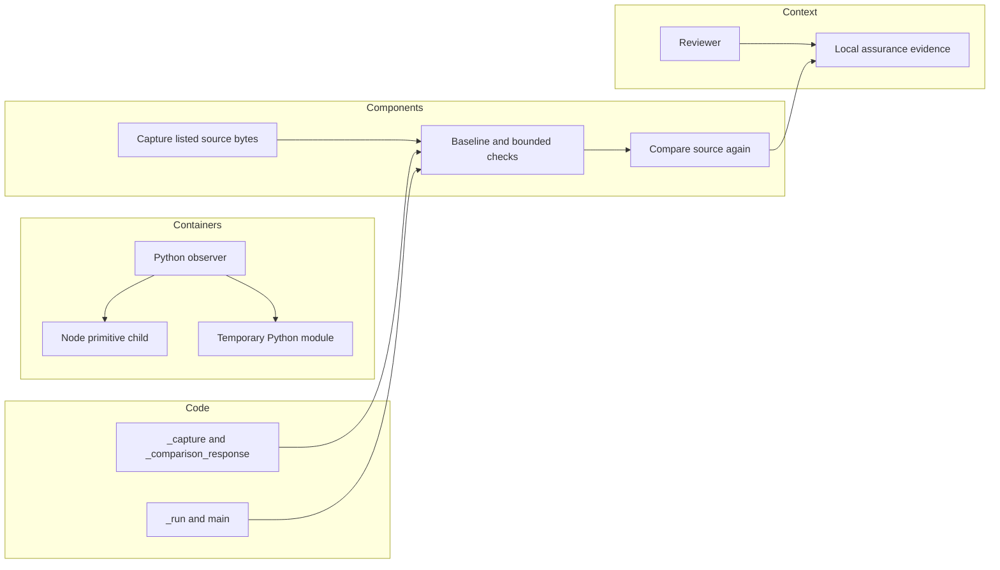

# P16 probe recheck

Reviewed 2026-10-10 at `e4e38c04ce15df942d46d795d450fbe85dfa08de`, following
parser-to-installed-result review in the [inventory](p16-p18-inventory-v3.md).
Both complete Python tools, the Node probe and their focused tests were inspected.
No new implementation mismatch was demonstrated; runtime, tools and tests are unchanged.
The preceding installed-result correction was verified against bridge parent, exact
paths, bytes and noreply identity, then pushed to PR #35 at this baseline.

## Technology decisions

[Comparison KEEP](../../decisions/p16-comparison-recheck-v3.json): the required
observables are actual Python API objects and interpreter-traced allocations, with
independent Node crypto primitives. [Python subprocess callbacks](https://docs.python.org/3/library/asyncio-protocol.html)
permit separate byte accounting; [Node crypto](https://nodejs.org/docs/latest-v22.x/api/crypto.html)
supplies the fixed primitive check. Retained bytes do not bound kernel buffers or RSS.
The Node input is generated and bounded by the parent; its post-read assertion is not
a hostile-stream input limiter.

[Julia BenchmarkTools](https://juliaci.github.io/BenchmarkTools.jl/stable/manual/)
provides configurable trials/samples/evaluations. [BenchmarkDotNet](https://benchmarkdotnet.org/articles/overview.html)
provides C#/F#/VB benchmark jobs and statistical summaries across .NET runtimes.
These are credible choices for a statistical experiment. The current probe expressly
reports single local batches and denies runtime ranking and target qualification.
Neither changes the need to observe the actual Python object and allocation boundary.
No alternative was executed or benchmarked; there is no measured language winner.

[Mutation KEEP](../../decisions/p16-mutation-recheck-v3.json): four exact trusted-source
edits require four successful baseline methods before crediting assertion failures.
[mutmut](https://mutmut.readthedocs.io/en/latest/) offers discovery and POSIX worker
isolation; [PIT](https://pitest.org/) targets Java mutation testing. Those are useful
different experiments. Separate interpreters would strengthen global-state isolation
if that became a requirement. Current code promises restoration of only two replaced
bindings and verifies their restoration on exceptions. It is neither a sandbox nor
an arbitrary-test timeout supervisor.

Choices follow observable boundaries and the finite local workload, not familiarity,
installed tooling or rewrite cost. They select developer tooling only, not a future
edge runtime or command platform.

## Fresh evidence

Nineteen methods in `test_passport_probe.py` pass without skips. They cover actual
child-process overflow, nonzero exit, timeout cleanup, optimized execution, malformed
responses, tracing lifecycle, integer timing, baseline integrity and source changes.
The live comparison reports six primitive cases and five lexical rejections. The live
mutation run passes four baseline methods and observes eight expected assertion
failures across four edits. These are deliberate mutant failures, not production RED.
All ten report source-hash entries match the current files.

Ruff checking/formatting and Node syntax checking pass. Unfiltered Bandit with
`--ignore-nosec` reports 13 low findings (10 B101 assertions, two B603 calls, one B404
import) and one medium B102 exec finding; zero high findings. The assertions are
intentional diagnostic checks guarded by optimized-mode rejection. Subprocess tests
use a fixed interpreter/script and no shell. The exec compiles inspected local source
for the declared experiments. Findings are retained with this boundary assessment;
this is not an unfiltered clean scan or broad repository security approval.

[The result record](p16-probe-recheck-v3-results.json) retains the fresh live reports,
source/log digests and commands. Before/after comparisons miss transient restoration,
loaded-code differences, omitted dependencies and changes after the final read.
The exchange timeout excludes process creation; cleanup is cooperative, direct-child
only. Traced Python allocation is not total native allocation. Timing samples on this
shared host establish no target latency, jitter, worst-case or performance ranking.

## C4 assurance boundary

These are computer-side assurance views. They implement no operational command,
control, communications, intelligence, surveillance or reconnaissance service.
MLS/CNSA, Link 16, DDS, five-nines availability and hardware real-time qualification
remain unestablished. Insufficient information for tactical deployment.

Next earliest remaining group: cross-phase consumer conformance and lifecycle/public
claim review. No whole-lane audit-completion marker or phase completion is issued.
