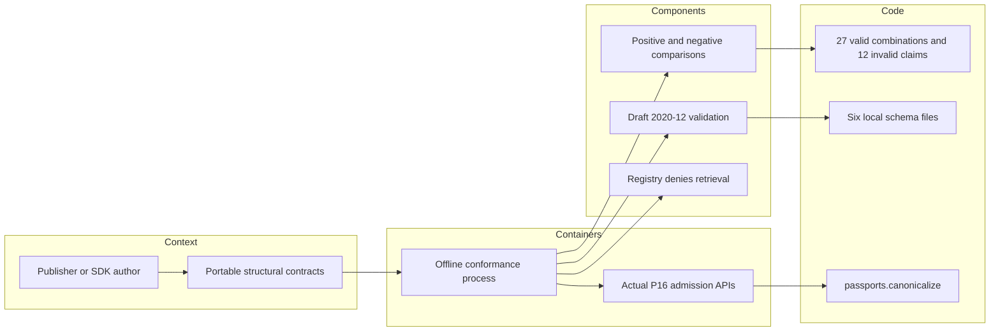

# Current P16 structural schema review

Reviewed from `7cc10877e431448d535dc45f62228c0245bda05e` on 2026-10-10.
Scope: three passport schemas, task/federation schemas, ADR schema and their direct
conformance checks. Earlier decisions are evidence inputs. No production mismatch
was demonstrated; the correction is a specific test-coverage gap.

## Constraints and technology decisions

These are offline authoring/consumer contracts, not the admission service or an edge
real-time loop. They must express closed objects, bounded collections and exact claim
vocabularies in a portable format. Tests must compare the published artifacts with
the actual runtime, reject schema retrieval and require a genuine positive signature
control. There is no identified target processor, memory budget or throughput SLA for
this tooling. No temporal threshold, signature profile or runtime dependency changes.

| Candidate | Decisive property and assessment |
|---|---|
| [JSON Schema 2020-12](https://json-schema.org/draft/2020-12/json-schema-validation) | Portable structural assertions; mathematical integer semantics and whole-value uniqueness do not provide lexical or relational admission checks. KEEP the six published artifacts. |
| [python-jsonschema](https://python-jsonschema.readthedocs.io/en/stable/referencing/) | Explicit registry retrieval control; current tests directly compare real Python admission APIs and can exercise dependency-failure behavior in process. KEEP this checker for that boundary. |
| [Ajv](https://ajv.js.org/json-schema.html) | Supports 2020-12 with its dedicated class; credible independent JavaScript/TypeScript consumer. It does not itself execute the Python admission API. No measured performance comparison performed. |
| [networknt](https://github.com/networknt/json-schema-validator) | Java validator supports the published dialect, offering a credible JVM consumer and Kotlin integration option. A different checker would still need the separate runtime comparison. |
| [CUE](https://cuelang.org/docs/concept/how-cue-works-with-json-schema/) | Constraint language with JSON Schema interchange, useful for authored/generated constraints. A generated artifact would still need independent validation and exact-wire admission checks. No generation requirement or material advantage established for these six small contracts. |
| [Pydantic strict models](https://docs.pydantic.dev/latest/concepts/strict_mode/) | Application validation option with stricter coercion behavior; does not by itself establish wire canonicality, complete references, trust or byte bounds. Replacing the independent structural checker with application models would weaken separation of the two checks. |

These are requirements-based choices, not installation/familiarity preferences or a
speed ranking. No alternative executable was run. Individual strict JSON decisions:
[passport](../../decisions/p16-passport-schema-claims-current-v3.json),
[task/federation](../../decisions/p16-interop-schema-recheck-v3.json),
[ADR tooling](../../decisions/p16-adr-schema-recheck-v3.json).

## Demonstrated mismatch and correction

The original eight passport-schema methods all passed when any one of five payload
constraints was removed from an in-memory schema copy: false motion authority,
self-declared assurance, capability names, evidence kinds or evidence outcomes.
This was a coverage gap, not evidence that deployed admission accepted those values.

Two new methods compare schema and real canonicalization behavior. One covers all
27 single-reference combinations of three permitted capabilities, three evidence
kinds and three outcomes. The other rejects 12 unsupported/type-confused claims,
including numeric zero masquerading as false authority. Each weakened schema now
causes assertion failures: four for authority and two for each other constraint.
Baseline controls pass, with zero errors or skips. No schema file or runtime changed.

Task/federation checks retain interval and domain-uniqueness examples where schema
success correctly differs from runtime rejection. ADR checks retain their explicit
removed-reference-pattern control. Workflow inspection confirms schema/ADR triggers
and explicit crypto/schema imports before comparisons; no hosted run is claimed.
Three existing edge UNKNOWN methods also pass in this module, but that execution
does not complete the separate cross-phase consumer review.

## C4 boundary

This C4 view describes structural tooling only. It implements no command execution,
communications transport, sensor acquisition or intelligence assessment. P17 command
workflows and P18 hardware integration remain separate unfinished scope. Self-declared
labels never supply observation truth or authority in any C4ISR pillar.

## Verification and limits

Run `PYTHONPATH=tests:. python -m unittest test_passport_schemas -v` with the optional
conformance requirements installed. Current run: 22 methods, zero failures/errors/skips.
Ruff check/format pass; Bandit with `--ignore-nosec` reports no findings for this test
file. [Source-bound results](p16-schema-claims-current-v3-results.json) retain before/after
counts and selected file hashes. Runtime mutation logs are diagnostic evidence, not
an exhaustive validator or language-portability proof.

No full repository, clean-clone, installed-distribution or hardware qualification was
run. Hashes identify selected disk bytes, not dependency closure, loaded-code identity,
atomic snapshots or authenticated provenance. No full review/completion marker is
issued. Insufficient information for tactical deployment.
