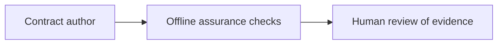
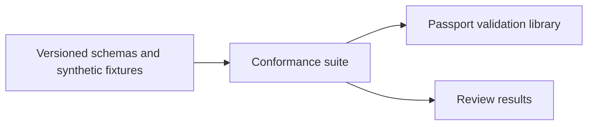
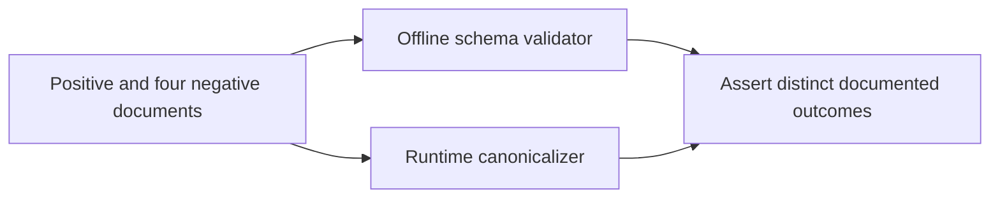
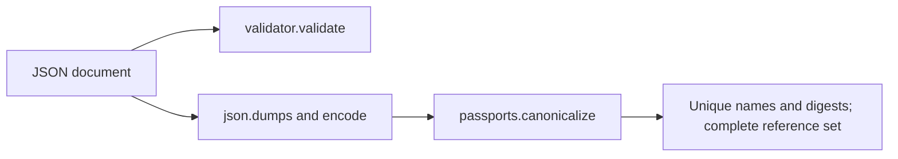

# P16 structural and reference-integrity review

Baseline `67ce70500d179c12b5c2b11e2634b3cd61b34c67`, reviewed 2026-10-10.
The earliest parser, payload and trust code was reread before reviewing the six
interop schemas, conformance tests, requirements and hosted discovery. Earlier
reviews remain evidence inputs. This slice does not complete the lane re-audit.

The schemas and runtime correctly enforce different boundaries. JSON Schema
[`uniqueItems`](https://json-schema.org/understanding-json-schema/reference/array)
compares array items. Distinct objects can repeat a selected field. The passport
schema comment already reserves unique capability names, unique evidence digests
and complete evidence references to runtime validation; no schema or runtime
acceptance change is required.

The conformance suite lacked a paired demonstration of these payload relationships.
One new method first validates and canonicalizes a positive two-reference payload,
then confirms structural acceptance and runtime rejection for four cases: distinct
capabilities sharing a name, distinct evidence entries sharing a digest, a missing
referenced digest and an unreferenced evidence entry. These are synthetic metadata
fixtures, not sensor observations or authenticated operational inputs.

Decision: **KEEP**, recorded in the [strict ADR](../../decisions/p16-schema-integrity-v3.json).
The constraints are trusted repository schemas, finite offline CI cases, standard
interchange and direct checks of actual runtime admission. There is no target device,
service workload or deadline. Current primary documentation supports these candidates:

| Candidate | Decisive property |
|---|---|
| Python jsonschema | [Explicit registry retrieval control](https://python-jsonschema.readthedocs.io/en/stable/referencing/) and direct runtime API comparisons fit this assurance boundary. |
| JavaScript/TypeScript Ajv | [Draft 2020-12 support](https://ajv.js.org/json-schema.html) requires the appropriate validator class; a different validator does not turn shape validity into authentication. |
| C#/F# JsonSchema.Net | [Dialect and registry configuration](https://docs.json-everything.net/schema/basics/) provides a credible managed-runtime consumer, explicitly selecting Draft 2020-12. |
| CUE | [Constraint unification and closed structs](https://cuelang.org/docs/concept/how-cue-enables-data-validation/) suit richer configuration constraints; equivalence to the public standard profile would require its own evidence. |

The current harness directly compares the published shape with real runtime results
and tests retrieval denial. No alternate implementation establishes a material
advantage for these constraints. This conclusion is not based on installed tools,
familiarity or rewrite cost. No alternate validator or throughput benchmark was run.

All 20 schema methods pass without skips. Three separate in-memory guard removals
produce respectively one, one and two expected assertion failures, zero errors or
skips; the production file remains unchanged. This is test sensitivity evidence,
not a production RED or proof that no other suite covers these guards. Ruff,
format and unfiltered scoped Bandit pass. The additional ADR validates offline.
Results and listed source/log digests are in the [result record](p16-schema-integrity-v3-results.json).

C4 context:

C4 containers:

C4 components:

C4 code:

These views concern software assurance. They add no command, communications,
intelligence, surveillance, reconnaissance or physical integration capability.
No MLS/CNSA, NAF/DoDAF accreditation, availability, real-time or tactical claim follows.
Insufficient information for tactical deployment.

Reproduce the scoped check with the pinned conformance environment:
`PYTHONPATH=tests python -m unittest test_passport_schemas -v`.
The local mutation driver and raw logs are retained in lane runtime, not published
artifacts. Listed file hashes are not dependency closure or loaded-code attestation.
Hosted discovery already selects this test file; no hosted run was observed here.
Next earliest component: task descriptions and bundle composition.
