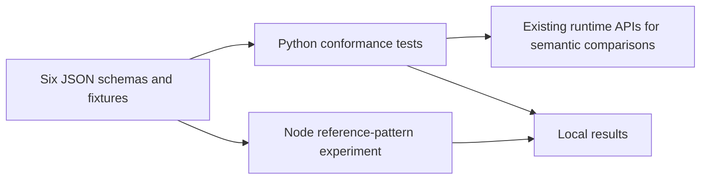
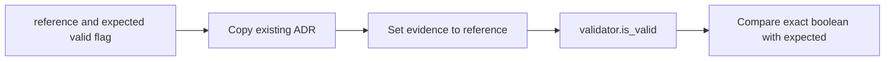

# P16 structural-schema reassessment v3

Baseline: `8df5c4826f943802437df95d91efc8d924608655`, reviewed 2026-10-10.
Fresh review of all six `contracts/interop/*.schema.json` contracts, the schema
conformance tests, pinned tooling requirements and schema CI discovery. Earlier
parser/trust/policy/evidence reviews are inputs, not completion markers. The next
runtime component is task descriptions and bundle composition.

## Decision and deployment constraints

[Strict JSON ADR](../../decisions/p16-schema-reassessment-v3.json): **KEEP** JSON
Schema 2020-12 and the offline Python checker; correct the reference character
constraint. These are developer/CI contracts and finite fixture checks. There is no
specified embedded target, throughput SLA or hard deadline for this component.
Schemas are trusted repository inputs. Consumers must separately enforce raw-byte
bounds, duplicate-key rejection, authentication, time and semantic relationships.

| Candidate | Decisive property and limit |
|---|---|
| Python jsonschema | Explicit [Registry retrieval policy](https://python-jsonschema.readthedocs.io/en/stable/referencing/) supports the required offline boundary. Direct API comparisons exercise the real runtime rather than a translated model. Regex portability still needs examination. |
| JavaScript/TypeScript Ajv | Compiled standard-schema validation is credible. Its [security guidance](https://ajv.js.org/security.html) treats schemas as trusted; [options](https://ajv.js.org/options.html) expose coercion and Unicode-regex choices. No complete Ajv execution or throughput comparison was performed. |
| Rust jsonschema | [Native validator](https://docs.rs/jsonschema/latest/jsonschema/) with configurable retrieval and regex behavior is credible for a native consumer or a demonstrated throughput requirement. Neither is established here. |
| CUE | [Closed definitions and constraint unification](https://cuelang.org/docs/concept/how-cue-enables-data-validation/) are credible configuration tooling. Replacing the public standard would require demonstrated equivalence of the imported/exported constraints and semantics. No CUE execution was performed. |

Standard interchange, explicit offline rejection and real API comparisons determine
the decision. The existing language, installed tools, familiarity and rewrite cost do
not. No alternative has a demonstrated material advantage under these constraints;
there is no winning migration being deferred. This is not a speed ranking.

## Demonstrated mismatch and correction

The ADR evidence-reference pattern used a negated whitespace class for its path.
Without an optional format checker, it accepted NUL, other raw controls, raw Unicode,
non-URI punctuation and malformed percent escapes. These are documentation references,
not URLs fetched by this checker; no exploitable network path is established here.

The new character profile permits explicit ASCII URI characters and complete percent
triplets, using the character categories in [RFC 3986](https://www.rfc-editor.org/rfc/rfc3986.html).
It retains the existing HTTPS/host restriction and absolute-end check. It does not
claim complete URI grammar, host validity, link reachability or source credibility.
Percent-encoded bytes are not decoded and can still represent control characters.
This is not an output-escaping or safe-fetch policy. Existing published ADRs validate.
No passport wire format, runtime admission, authority or frozen threshold changes.

The portable [22-case corpus](../../../examples/interop/adr-reference-vectors-v1.json)
contains six valid and sixteen invalid references. Before correction the new test
reported twelve assertion failures, zero errors; afterwards all nineteen schema
methods passed without skips. An initial corpus draft accidentally appended a hex
character after a deliberately short percent escape; this test-data error was corrected
before the schema edit, and both RED logs are retained. Ruff initially requested one
line-format change; final lint/format and scoped Bandit checks pass.

The [JSON Schema regex guidance](https://json-schema.org/understanding-json-schema/reference/regular_expressions)
uses ECMAScript syntax. Node 22.23.2, with both normal and Unicode regex modes,
agreed with all 22 expected pattern results. This is a finite pattern check, not an
Ajv run, complete alternate schema validation or universal regex-equivalence proof.
The Node probe is a reproducible review experiment, not a new CI prerequisite.
Existing schema/test/fixture workflow path filters cover the correction.

## C4 views of the tooling boundary

Context:


Containers:


Components:


Code:


These views describe offline assurance tooling only. Human review remains the
command/decision boundary; no communications transport, intelligence, surveillance,
reconnaissance or operational C2 capability is implemented by the schema checks.
No NAF/DoDAF conformance, MLS/CNSA, availability or physical qualification follows.
Insufficient information for tactical deployment.

## Reproduction and evidence limits

With the pinned conformance requirements installed:
```sh
PYTHONPATH=tests:. python -m unittest test_passport_schemas -v
ruff check tests/test_passport_schemas.py
ruff format --check tests/test_passport_schemas.py
bandit -q tests/test_passport_schemas.py
```

Run this bounded pattern experiment from the repository root:
```js
// node --input-type=module; no packages, network or subprocesses required.
import { readFileSync } from 'node:fs';
import assert from 'node:assert/strict';
const schema = JSON.parse(readFileSync('contracts/interop/architecture-decision-v1.schema.json'));
const corpus = JSON.parse(readFileSync('examples/interop/adr-reference-vectors-v1.json'));
assert.equal(corpus.cases.length, 22);
for (const c of corpus.cases) {
  for (const flags of ['', 'u']) {
    assert.equal(new RegExp(schema.properties.evidence.items.pattern, flags).test(c.reference),
      c.valid, c.name);
  }
}
```

[Results and hashes](p16-schema-reassessment-v3-results.json) identify the listed
working-copy inputs and local logs, not an atomic snapshot, loaded-code attestation
or dependency closure. The public corpus/test make the behavior reproducible;
local log hashes do not make those logs publicly available. No full repository,
installed-distribution or hosted CI qualification was performed in this slice.
