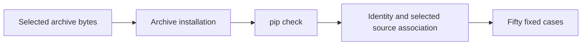

# P16 source-archive installation gate

Baseline `5d9c0bcfefacf2fd3c7388c0ed1c2a21938db345`, reviewed 2026-10-10.
The authoritative policy/review order and frozen v3 documents were reread. The
review restarted at the passport parser and reconciled the packaging inventory.
This is a scoped correction, not a completed earliest-to-HEAD review of all phases.

The prior workflow checked selected source-archive members but installed the package
from the checkout in a separate matrix. It did not show that the inspected archive
could produce an installation passing the passport checks. No prior record is
retroactively treated as such evidence.

The Ubuntu Python 3.13 sensor-conformance job now installs its inspected archive,
checks dependency consistency, and invokes the existing isolated identity/source/
RECORD checker and fifty pinned conformance cases. The job already installs pinned
build and verification dependencies and has a ten-minute timeout. The new step
is configured but has not been observed running remotely.

[The ADR](../../decisions/p16-sdist-install-v3.json) records KEEP for standard
package tooling, comparing pip, a separate PyPA build/installer sequence and Rust uv.
[pip supports source-archive installation](https://pip.pypa.io/en/stable/cli/pip_install/).
Its no-build-isolation option requires preinstalled build dependencies. The step
also disables index lookup and wheel-cache reuse and forces replacement of any
existing installation. These are package-tool options, not a network isolation
boundary for the build backend. The [PyPA frontend](https://build.pypa.io/en/stable/)
and [uv package manager](https://docs.astral.sh/uv/pip/packages/) remain credible
alternatives; no comparative speed or reproducibility result favors a migration
for this one-archive gate. This choice follows the required artifact-to-interpreter
path, not language familiarity.

Local validation: 22 existing packaging/checker methods and four ADR methods pass
without skips; actionlint passes. The existing Linux Python 3.13 installation also
passes fifty isolated cases. It was not rebuilt or replaced. This configuration-only
change adds no test that merely mirrors workflow text, and no failing runtime test
is claimed. The missing workflow stage was identified by inspection.

[The result record](p16-sdist-install-v3-results.json) binds these observations to
source and retained local logs. A single PR status observation before publication
showed the prior head `cee3e17906834e1bd6520da8b6b4fc1111654bf6` with queued passport
checks. That is not evidence for this change or a reason to claim hosted success.

## C4 assurance views

Context:

Containers:

Components:

Code:

These views concern software assurance. They introduce no command, communication,
intelligence, surveillance or reconnaissance functionality. No operational C4ISR,
MLS/CNSA, five-nines, zero-SPOF or hardware claim is made. Insufficient information
for tactical deployment.

Remaining gates include observed exact-revision hosted results, full release
reproducibility, signed distribution, independent customer installation, dependency
closure and platform coverage. Initial hosted setup and archive creation still use
network-enabled tooling. The source checks cover selected files, not all installed
bytes. The other OS/Python checkout-install matrix does not establish archive-install
coverage on those platforms. No release or phase completion follows from this patch.
