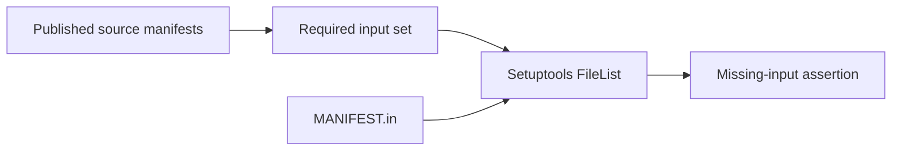
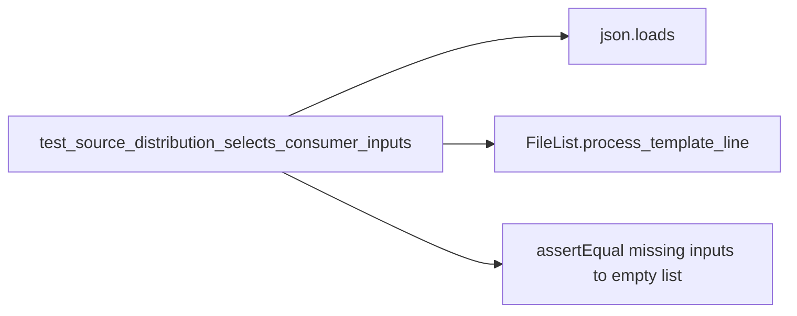

# P16 source-selection correction v3

Reviewed 2026-10-10 at `d8b7c02891b2541e27c3f7114a54cc45dd4ec227` after rereading
the current policy, earliest parser, remaining P16 public contracts and packaging inputs.
The library documents byte authentication without authority, persistence, network
transport or hardware qualification consistently with the inspected implementation.
A separate packaging mismatch was found and corrected.

## Finding and correction

The manifest selected consumer tests and portable fixtures but omitted eleven project
files named by those fixtures: two edge contract/UNKNOWN files and nine producer module
files. The example README linked from the root README was also omitted. The existing
package finder selects `aethron*`, not the separate `aethron_edge` source tree, and the
build configuration does not declare a version-control inclusion plugin.

`MANIFEST.in` now explicitly selects those twelve files. Peer files themselves, fixture
pins, package discovery and runtime dependencies are unchanged. This includes source
for existing synthetic tests; it does not install an edge service or enable a device.

The new `tests/packaging/test_passport_manifest.py` obtains required source names from
the four published fixture manifests and combines them with literal test, requirements
and example-guide inputs. It runs the actual Setuptools FileList selector over this
finite set and the actual manifest. The initial run failed with twelve missing inputs;
after the fix, all 22 inputs are selected. The existing consumer tests independently
check the pinned fixture/source inventory. The test does not model Setuptools's entire
default file-discovery process or build an archive.

CI explicitly discovers this packaging test in the sensor-conformance job and installs
Setuptools 84.0.0, the existing Python 3.13 build-backend version. Both event filters
include the test path. The manifest already triggers this workflow. The backend's
private FileList API is used only in this test and is pinned by the hosted step.

## Technology and evidence

The [ADR](../../decisions/p16-source-selection-v3.json) retains native manifest selection
with a correction after comparing [Setuptools](https://setuptools.pypa.io/en/latest/userguide/miscellaneous.html),
[Hatchling](https://hatch.pypa.io/latest/config/build/),
[Meson-python](https://mesonbuild.com/meson-python/) and
[Dhall](https://dhall-lang.org/). Alternative file-selection backends still need the
consumer inputs identified. Typed generation offers no demonstrated advantage for
this finite list. No native build, deadline or throughput requirement motivates a
backend change. This is a fit decision, not an installation/rewrite-cost preference
or measured speed comparison.

One new manifest method and 19 focused lexical, installed-source and cross-phase
methods pass with no skips. Ruff, formatting, Bandit and Actionlint pass. The limited
FileList candidate set produces expected warnings for unrelated manifest patterns;
RED and GREEN logs retain them. No archive build, installed distribution, clean clone,
full-repository matrix or hosted execution is claimed. This corrects selection evidence,
not all release gates or all source-distribution dependencies.

## C4 assurance views

Context:


Containers:


Components:


Code:


These views describe build assurance only. They implement no C2 authority, live
communications, operational intelligence, surveillance or reconnaissance service.
No tactical architecture or physical performance claim follows.

Reproduce after installing the pinned build tool:

```sh
python -m unittest discover -s tests/packaging -p test_passport_manifest.py -v
```

[Result record](p16-source-selection-v3-results.json) retains file/log hashes and the
RED/GREEN distinction. Next: continue the remaining release-claim reconciliation,
including the distinction between a selected input, a built artifact and an independently
installed product. No lane or technology-audit completion marker is created.
