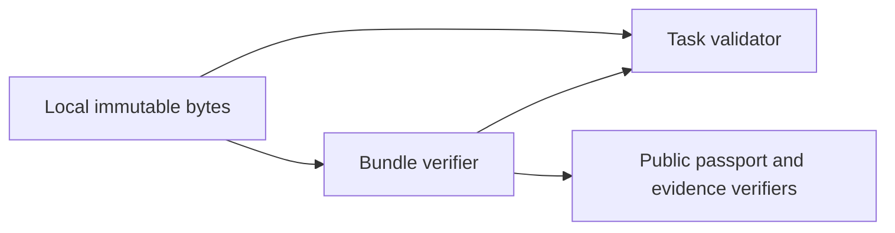
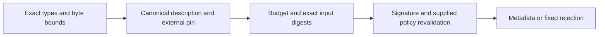
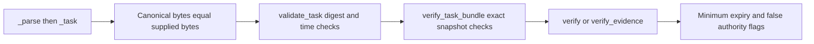

# P16 task and bundle reassessment v3

Baseline `ba0dbbc6af2cf7e87df0da0a8ace7fe1b4fa8e06`, reviewed 2026-10-10.
The earliest parser was reread, followed by the complete task and bundle modules,
their contracts and tests. No new implementation mismatch was demonstrated. The
current task JSON Schema exists; the older task review's absence statement explicitly
concerns its historical baseline. It is not a current publication gap.

## Component decisions

**KEEP task descriptions**, recorded in the [JSON ADR](../../decisions/p16-task-reassessment-v3.json).
The requirements are exact bounded UTF-8 bytes, duplicate-key and number-lexeme
rejection, canonical ASCII, external digest pins and caller-trusted time. The checker
supports two verification descriptions and has no execution or replay service. Python's
[JSON callbacks](https://docs.python.org/3.13/library/json.html) expose the distinctions
needed by the current parser without a custom tokenizer. The existing ten task methods
exercise positive admission, every rejection reason, bounds and snapshot limitations.

The candidate search also considered Erlang/Elixir's current
[OTP JSON callbacks](https://www.erlang.org/doc/apps/stdlib/json.html): integer/float
callbacks receive binaries and object callbacks permit custom accumulation. This is
broader than the historical Jason-only comparison. A credible OTP implementation must
reject leftover input, enforce duplicate keys and bounds, and generate the same
canonical bytes. It is not dismissed for lacking Python's hooks. C#/F#
[Utf8JsonReader](https://learn.microsoft.com/en-us/dotnet/api/system.text.json.utf8jsonreader?view=net-10.0)
provides token kinds and raw spans; Rust [Serde visitors](https://docs.rs/serde/latest/serde/de/trait.Visitor.html)
provide explicit traversal. Neither default typed decoding nor any language choice
alone establishes the whole lexical/pin contract. These are source-based comparisons;
no complete candidate implementation or runtime ranking is claimed.

**KEEP immutable bundle composition**, recorded in the [JSON ADR](../../decisions/p16-bundle-reassessment-v3.json).
The boundary admits exact bytes and an exact tuple, rejects excessive parts before
parsing/hashing, binds task/envelope/policy/evidence snapshots, then reuses the public
verification boundary. Python's [immutable byte values](https://docs.python.org/3.13/library/stdtypes.html#bytes-objects)
keep subsequent reads consistent. The 1,245,184-byte aggregate input ceiling is not
an allocation or RSS ceiling. The returned digest identifies the signed payload;
the task's passport pin identifies the envelope. These are intentionally distinct.

Rust [shared borrowing](https://doc.rust-lang.org/book/ch04-02-references-and-borrowing.html)
is a credible native alternative. Java/Kotlin [ByteString](https://protobuf.dev/reference/java/api-docs/com/google/protobuf/ByteString)
provides immutable content without requiring a Protobuf wire migration. C#/F#
[ReadOnlyMemory](https://learn.microsoft.com/en-us/dotnet/api/system.readonlymemory-1?view=net-10.0)
requires review of backing-storage ownership; a read-only view alone does not exclude
mutable aliases. No artificial IPC or copying requirement is imposed on these options.
Eleven bundle methods pass, including six revocation-list/task-kind combinations,
policy/passport expiry caps, evidence order independence and late-failure metadata removal.

These decisions follow lexical fidelity, immutable ownership and one explicit trust
boundary. There is no target hardware/OS restriction, throughput deadline or process
memory envelope that establishes a material migration advantage. Existing language,
installed tools, familiarity and rewrite cost are not retention criteria. No migration
winner is deferred. There is no measured performance or real-time conclusion.

## Executable evidence

Forty-one focused methods passed without skips: parser lexical cases, task tests,
bundle tests and schema tests. Two in-memory negative controls changed one guard each:

| Module and change | Existing test | Observed result |
|---|---|---|
| Task: canonical-byte equality replaced with an unconditional successful requirement | `TaskTests.test_exact_pin_subject_and_canonical_bytes` | One expected assertion failure |
| Bundle: envelope-pin comparison replaced with false | `TaskBundleTests.test_input_pins_and_evidence_set_fail_closed` | One expected assertion failure |

These are test-sensitivity controls, not production defects or a RED/fix cycle.
Production source files were unchanged before and after each control. The baseline
passed first. Each experiment compiled the single replacement into a temporary
`ModuleType` with package `aethron`, registered it in `sys.modules`, and temporarily
patched only the corresponding test's imported function/module alias. The temporary
module and patch were removed after the selected test. One method ran per mutation;
zero errors or skips occurred. Exact replacements are in the result record.

Neither API discovers revocations, persists trust floors, authenticates its pin provider,
expires saved objects, or guarantees exactly-once processing. Bundle freshness uses the
caller's time snapshot, not a clock sampled at completion. Those limitations are already
explicit in the contracts; this review does not relabel them as implemented features.

## C4 views

Context:


Containers:


Components:


Code:


These diagrams cover generic software assurance only. Human decisions remain outside
the checker; there is no communications transport or operational intelligence,
surveillance, reconnaissance or C2 service here. No NAF/DoDAF conformance, MLS/CNSA,
five-nines availability or physical qualification is established.
Insufficient information for tactical deployment.

## Reproduction

In the pinned local conformance environment:
```sh
PYTHONPATH=tests:. python -m unittest test_passport_lexical test_interop_tasks test_interop_bundles test_passport_schemas -v
ruff check aethron/interop_tasks.py aethron/interop_bundles.py
ruff format --check aethron/interop_tasks.py aethron/interop_bundles.py
bandit -q aethron/interop_tasks.py aethron/interop_bundles.py
```

[Results](p16-task-bundle-reassessment-v3-results.json) bind listed source files and
local logs. They do not attest loaded bytecode, dependency closure or an atomic
snapshot. Candidate comparisons are source-based, not executed parity tests.
The current review is incomplete; the next earliest runtime component is direct
federation, followed by inbox resource accounting. No completion marker is issued.


## Fresh source review at 6da83ae

Baseline `6da83aeeee775887a898e20e565028bca1be4ed2`, reviewed 2026-10-10 after
rereading current owner policy and restarting at the parser. Complete task and bundle
source, their tests and both normative contracts were inspected. No production,
contract or deployment-claim mismatch was found. No new runtime or test change is
justified by this review. The C4 views above still describe the implementation.

The fresh decisions are [KEEP tasks](../../decisions/p16-task-current-v3.json) and
[KEEP bundles](../../decisions/p16-bundle-current-v3.json). Current primary documentation
for Python JSON hooks, OTP JSON callbacks, .NET token reading, Rust borrowing and JVM
ByteString was consulted again. Lexical fidelity, stable ownership and reuse of the
actual verification boundary determine these decisions. No measured migration winner
is deferred; incumbent language, installed tooling and rewrite cost are not criteria.

Fresh checks: 22 methods (one lexical, ten task, eleven bundle) pass without skips.
Three separate in-memory changes weaken canonical equality, envelope pin and policy
pin. Existing tests detect each with one expected assertion failure, zero errors and
zero skips. The policy experiment uses changed whitespace: semantic policy equality
cannot replace the exact byte pin. These are sensitivity controls, not production
failures. Source files remain byte-identical. Scoped Ruff, formatting and unfiltered
Bandit pass; four ADR validation methods pass after adding both records.

[Current results](p16-task-bundle-current-v3-results.json) retain exact replacements,
listed input hashes and local log hashes. They do not make local logs public, attest
loaded code, establish complete dependency closure or prove hosted execution.
No target latency, MLS/CNSA, availability, operational capability or complete audit
claim follows. Next earliest component remains direct federation and inbox accounting.
