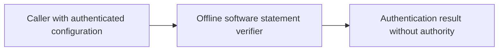
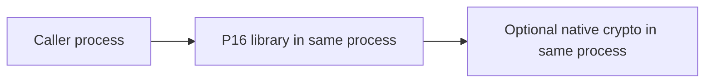
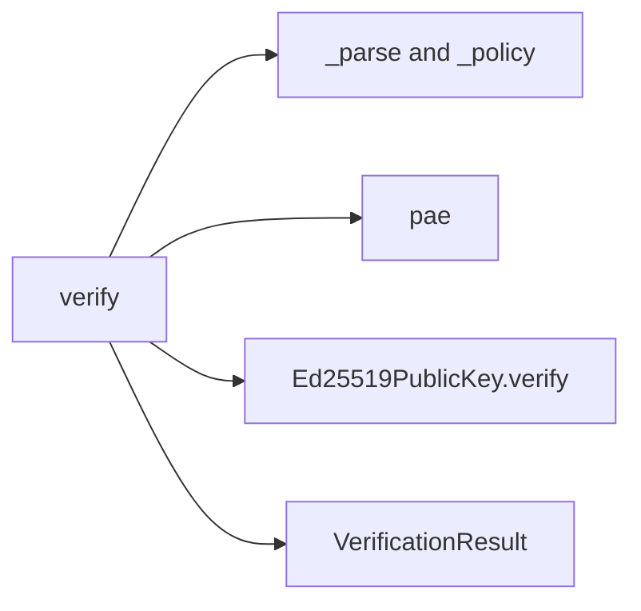

# P16 trust boundary reassessment v3

Reviewed 2026-10-10 against `bc196647ed8a5c7a0d1a970c2800eec53f5d0bd7`.
The earliest parser was re-read before this signature/trust/expiry/revocation slice.
Decision: **KEEP the bounded offline validation/native signature boundary**.
The [JSON ADR](../../decisions/p16-trust-reassessment-v3.json) is checked by the
existing decision-schema tests. This is a fresh component review, not whole-lane
completion or an endorsement of an operational deployment.

## Actual constraints and candidate comparison

The API processes immutable software statements, with 64 KiB input bounds, a single
Ed25519 signature, at most 16 provisioned keys and three revocation lists bounded at
256 entries each. It receives trusted time, revision floors and artifact expectations
from its caller. No private keys, transport, persistent state or authority grant is
implemented. No embedded OS, hardware class, throughput, hard deadline or process-memory
acceptance budget is specified. Insufficient information for tactical deployment.

| Candidate | Decisive properties for this contract |
|---|---|
| CPython plus native cryptography | The [50.0.2 API](https://cryptography.io/en/50.0.2/hazmat/primitives/asymmetric/ed25519/) accepts raw public keys and reports invalid signatures and unsupported algorithms. Lexical admission remains separate from native arithmetic; absence has an explicit rejection path. |
| Erlang/Elixir OTP crypto | [OTP crypto](https://www.erlang.org/doc/apps/crypto/crypto.html) exposes EdDSA verification but actual support depends on libcrypto/build configuration. Its error model still requires application mapping and bounded policy validation. No concurrent service workload here establishes a supervision/runtime advantage. |
| Java/Kotlin JCA | [Java 25 standard names](https://docs.oracle.com/en/java/javase/25/docs/specs/security/standard-names.html) include Ed25519. Provider-backed verification is credible, but naming support does not supply lexical admission, policy freshness or revocation. |
| Rust ed25519-dalek | The [verifying-key API](https://docs.rs/ed25519-dalek/latest/ed25519_dalek/struct.VerifyingKey.html) offers weak-key detection and strict verification. Those acceptance semantics must be specified and tested before a migration; six ordinary fixtures cannot establish equivalence for unusual encodings or weak keys. |
| C or safe bindings to libsodium | [Detached Ed25519 verification](https://doc.libsodium.org/public-key_cryptography/public-key_signatures) offers a narrow native boundary. The multipart API uses Ed25519ph, a different profile. This bounded input needs no streaming signature API. |
| Node JavaScript/TypeScript crypto | [Node verification](https://nodejs.org/api/crypto.html) supports Ed25519 with a null algorithm. The fresh primitive comparison agrees on six cases; a full replacement would also need lexical and policy validation. |

KEEP follows the raw-byte API, explicit failure mapping, bounded parser hooks and
executable contract behavior, without handwritten cryptography. No material winning
migration is established for these constraints. Existing language, installed tools,
familiarity and rewrite cost are not decision criteria. Only Python and Node were
executed; other candidates were evaluated from primary documentation. This is not a
universal language ranking, full alternative implementation comparison or a decision
for future physical processing. A native target requirement or revised cryptographic
acceptance profile reopens the choice.

## Findings and executable correction

The real verifier still checks every key's metadata, whole selected-key lifetime,
half-open passport/policy intervals, all revocation lists and caller floors. It
does not enroll keys or independently authenticate the policy source. These limits
are correctly stated in the current contract. No production defect was demonstrated.

The missing-package test used import-table mocks. The new
`tests/test_passport_optional_backend.py` adds a fresh interpreter with `-I -S`,
checks that crypto is not discoverable, imports only the trusted checkout explicitly,
and calls the real verifier with the existing valid signed fixture. Normal and `-O`
processes must reject with `crypto_unavailable`, null digest/revision/expiry and false
authority/evidence flags. The existing real-signature tests and primitive probe supply
the backend-present positive control. Existing workflow discovery includes this test.

The test passed on unchanged production code. A runtime-only in-memory mutation of
the missing-backend return reason produces two assertion failures, zero errors and
zero skips. It proves the test observes the actual verifier's error mapping; it is
not a production RED result. Production source was not rewritten.

The [results](p16-trust-reassessment-v3-results.json) retain source hashes, full probe
observations and negative-control details. Reproduce focused checks with:

```sh
PYTHONPATH=tests:. python -m unittest test_passport_optional_backend test_passports.PassportVerificationTests test_passport_schemas -v
python scripts/passport_technology_probe.py
```

Bandit initially reported B404/B603 on the test subprocess. Both were reviewed:
the interpreter is `sys.executable`, code/flags are fixed, the checkout is trusted,
the fixture is stdin data, no shell is used, and there is a ten-second timeout.
Two explicit source annotations document those narrow findings; the initial report
is retained. This is not a sandbox for hostile code. Output capture is not memory
bounded, process creation is not a real-time bound, `-S` is not an uninstall test,
and this source-tree test does not qualify an installed distribution.

## C4 views of the unchanged boundary

Context:



Containers:



Components:


Code:



These views describe software authentication only. There is no encryption-at-rest or
in-transit, MLS, CNSA, five-nines, hard-real-time or physical qualification claim.
Next earliest component: independent pinned-policy validation, followed by evidence
byte binding. Unimplemented later phases and excluded unsafe subcomponents remain
separate gaps; no audit-completion marker is warranted.
