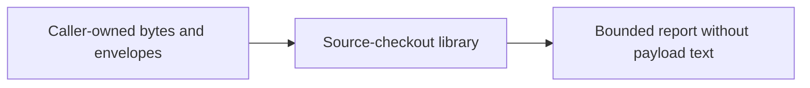
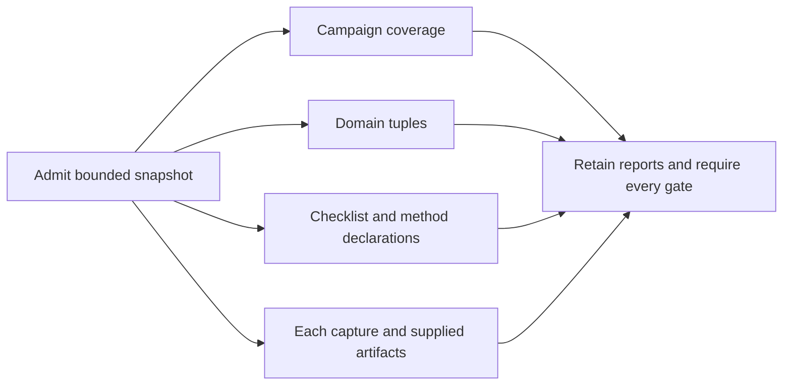
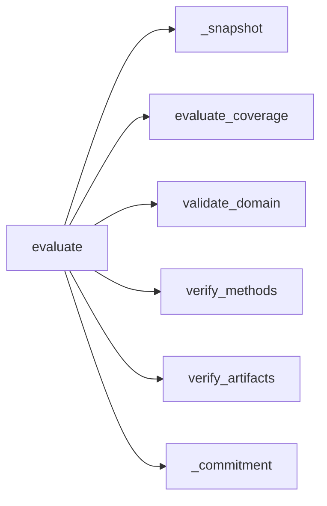

# Qualification software assessment v1

This source-checkout API composes existing declaration, domain, method and
artifact gates. It never approves a domain, acquisition method, instrument,
operator or physical device. Existing bundle v1 and its binary stream stay v1.

`qualification.assessment.evaluate(plan_bytes, captures, domain_bytes,
procedure_bytes, methods)` accepts raw inputs, never reports. Plan, domain and
procedure use their existing v1 contracts (each at most 65536 bytes). Methods
use the method-reference v1 envelope (48 documents of at most 65536 bytes).
Each of at most 64 captures has exactly `case_id`, `manifest`, `now_ms` and
`artifacts`. The first three fields retain campaign v1 semantics. Artifacts
are an exact dictionary of lowercase SHA-256 keys to immutable bytes: at most
15 entries per capture, at most 1 MiB per entry and **4 MiB summed across all
captures**, counting repeated payload references on every use. Manifest bytes
are at most 65536 per capture. Total admitted payload bytes are at most
11,730,944 (payload bound, not a Python heap or latency guarantee).

Snapshot exact lists/dictionaries and validate limits before invoking gates.
Callers must not mutate envelopes during their initial snapshot; this is not
an atomic transaction across caller-owned objects. Subsequent changes cannot
alter the admitted snapshot. Invalid envelopes or malformed plan/domain/checklist
raise only `invalid_qualification_assessment`. Malformed bounded method content
retains the existing method findings. A malformed bounded capture manifest
retains a capture-indexed `capture_invalid` result and does not suppress other
captures or gates. Its artifact content cannot be checked against missing
declarations; the submission commitment still covers all supplied bytes.

The report contains unchanged nested coverage, domain and method reports;
capture-indexed artifact reports; and `software_checks_passed` as their conjunction.
An empty capture set cannot pass or verify artifact bytes. All supplied attempts,
including reused or unplanned captures, are checked; an individually valid
artifact report cannot override failed campaign coverage. No payload, case label,
rig label or method body is echoed. Indexes refer to submission order.

`submission_sha256` is SHA-256 of the ASCII prefix
`aethron.qualification.assessment.v1` followed by a zero byte and compact ASCII
JSON encoding of a list: plan hash, domain hash, procedure hash, method commitment,
then the sorted capture bindings. Each binding is a list of case ID, exact manifest
hash, evaluation instant and sorted pairs of claimed artifact hash and actual
payload hash. Duplicates are retained. Reordering maps or capture submissions does
not change this commitment; rejected/unreferenced bytes and instants do. It is
not a signature, authentication, release binding or proof of complete submission.

## Technology decision and implementation sequence

Constraints are bounded offline evidence aggregation, exact byte identity,
independent negative findings and reuse of versioned semantic contracts. There is
no target ABI, hard deadline, persistent service or distributed policy requirement.

| Candidate | Decisive property for this boundary |
|---|---|
| Python with immutable bytes and direct bounded calls | Exact byte values plus explicit dictionary snapshots support a single admitted submission; JSON pair/numeric hooks preserve existing strict token semantics. |
| CUE | Constraint unification fits declaration shape; raw byte commitments and per-capture failure retention still require a host adapter. |
| Erlang/OTP | Immutable binaries/maps and process supervision are credible for a long-lived intake service; this synchronous function does not require supervision or message copying. |
| C# / Utf8JsonReader | A forward-only UTF-8 parser is credible for streamed intake with native deployment constraints; no such deployment requirement is present here. |

Select Python direct composition for this boundary: it retains every versioned
gate in-process without a second semantic implementation or serialized report
trust boundary. This is a mechanism comparison, not a measured speed ranking;
reopen for an actual target ABI, resource failure or supervised service boundary.
Sources: [Python JSON](https://docs.python.org/3.13/library/json.html),
[CUE validation](https://cuelang.org/docs/concept/how-cue-enables-data-validation/),
[Erlang expressions](https://www.erlang.org/doc/system/expressions.html),
[Utf8JsonReader](https://learn.microsoft.com/en-us/dotnet/standard/serialization/system-text-json/use-utf8jsonreader).

Implementation sequence: failing composed-gate test; bounded snapshots and direct
composition; simultaneous-negative, commitment, input-limit and snapshot tests;
targeted existing-gate tests, lint and static security checks; retained evidence.

## C4 views

Context:

Containers:

Components:

Code:

This is qualification tooling only. It implements no C2 authority, communications
transport, operational intelligence, surveillance or reconnaissance. Its computing
function is bounded evidence assessment; external C4ISR integrations cannot inherit
MLS, CNSA, Link 16, real-time, availability or certification claims from this report.
Insufficient information for tactical deployment.
