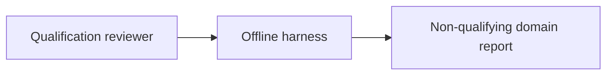
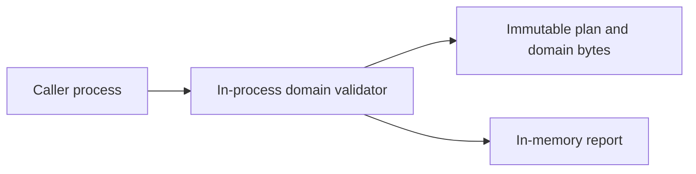
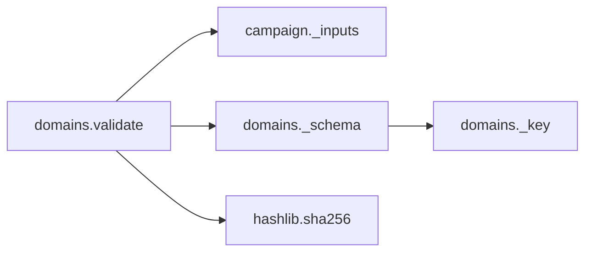

# Qualification domain declarations v1

`qualification.domains.validate(plan_bytes, domain_bytes)` checks the declared
coverage of a campaign against a finite domain matrix. It does not inspect
captures, operate devices, approve a domain or prove preregistration. The
existing opaque reference, campaign and checklist contracts remain unchanged.

Both inputs are exact immutable bytes, UTF-8 JSON, at most 65536 bytes and depth
eight each. Admission rejects duplicate/unknown keys, invalid UTF-8, nonfinite
values, boolean numbers and non-integer version tokens. The campaign plan uses
v1. Malformed input raises fixed `ValueError("invalid_qualification_domain")`.

The domain object has exactly `version` (integer 1), `kind`
(`qualification_domain`), `rig_sha256` (64 lowercase hex characters) and
`profiles` (zero through sixteen entries). Each profile has exactly `lighting`,
`required_sensors`, and `evidence`:

- Lighting is null or daylight/low_light/near_dark/zero_visible.
- Required sensors is null or one through five unique rgb/lwir/radar/depth/nir
  values. Ordering has no semantic significance; an empty sensor set is invalid.
- Evidence is null or synthetic/recorded/external_unverified.

Duplicate profile tuples are invalid, including reordered sensor sets and
identical unknown profiles. Null is an explicit unknown, never a wildcard.
Every fully specified domain profile must have at least one matching plan case,
and every plan case must match a fully specified profile. Matching uses the
**whole tuple**, with exact sensor-set equality; matching individual columns or
subsets would invent undeclared combinations. Multiple plan cases may match the
same profile; this is not a check of sample count or sample independence.

The report has version 1, exact-byte `plan_sha256` and `domain_sha256`, sorted
unique `findings`, `domain_declaration_checks_passed` and `content_status`
(`incomplete` or `consistent_unverified`). `cases` follows plan order and contains
`case_index` and nullable `profile_index`. `profiles` follows domain order with
`profile_index`, `status` (`unknown` or `unverified`) and `matched_case_count`.
Unknown profiles always have zero matches. IDs and input profile values are not
echoed. Digests and ordinal associations are linkable, not anonymized.

All independent findings are retained: `domain_digest_mismatch`,
`domain_rig_mismatch`, `domain_profiles_missing`, `domain_profile_unknown`,
`domain_profile_uncovered` (fully specified profile has no plan case),
`domain_case_unmatched`. Empty profiles produce profiles-missing and case-unmatched.
Successful local declaration matching still sets `domain_verified`,
`artifact_authenticity_verified` and `physical_qualification_passed` to false,
and `human_review_status` to `unverified`. No input approval flags are accepted.

This matrix only describes the dimensions currently modeled by campaign v1.
Weather, power, temperature, vibration, EMC, calibrated range/accuracy and actual
method content remain separate unfinished software or physical evidence gates.
Matching declarations cannot establish any of those dimensions. Mutable returned
reports are not authorization tokens, and hashes do not authenticate sources.

## Technology decision and execution

Constraints: offline source-checkout use, two bounded messages, sixteen profiles
and sixteen plan cases, exact byte commitments, null-preserving tuple relations
and fixed errors. No target ABI, hard deadline, persistent store or policy service
is required. Select Python JSON hooks and direct tuple indexing: token-level
checks preserve duplicate rejection and exact version types; explicit tuples
avoid accidental Cartesian products and retain unknown values before matching.
This is a qualitative contract-fit decision, not a speed ranking.

[CUE](https://cuelang.org/docs/concept/how-cue-enables-data-validation/) supplies
constraints and closed structs; it would still require raw-token admission and
the report relation boundary. [Dhall](https://dhall-lang.org/) offers typed
configuration and semantic hashing; this API accepts no configuration expressions
or imports and requires raw-byte, not normalized-expression, commitments.
[Rego](https://www.openpolicyagent.org/docs/policy-language) is credible for the
set relations but does not eliminate token admission; there is no independent
policy distribution requirement here. Native streaming C# and typed Rust remain
credible if a target ABI or measured resource deficit emerges, as reviewed for
the [checklist component](procedures-v1.md). The decisive current mechanism is
[Python's pair and numeric hooks](https://docs.python.org/3.13/library/json.html)
plus immutable bytes; incumbent language or installed tooling alone is no reason
to retain it. The [JSON ADR](technology/domain-decision-v1.json) records the choice.

Bounded execution: freeze this contract; demonstrate a failing new API test;
implement admission and matching; retain Cartesian-product, subset, unknown,
duplicate, mismatch and maximum-bound negatives; publish synthetic vectors;
run focused campaign/checklist/domain tests, Ruff and Bandit; commit. The owned
workflow already discovers new qualification tests. No local full matrix or soak.

## C4 views

These show context, container, component and code boundaries. Human C2 approval
is external; communications are caller-owned; computers validate declarations;
intelligence, surveillance and reconnaissance feeds are outside this API. No
sensor fusion, actuation, DDS, MLS/ZTA enforcement, certified crypto or uptime
claim follows. Insufficient information for tactical deployment.
