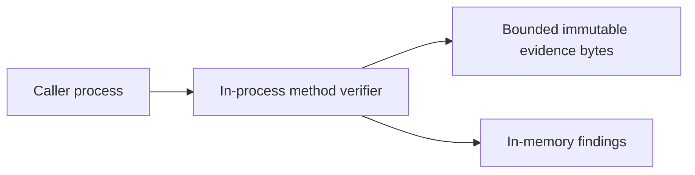
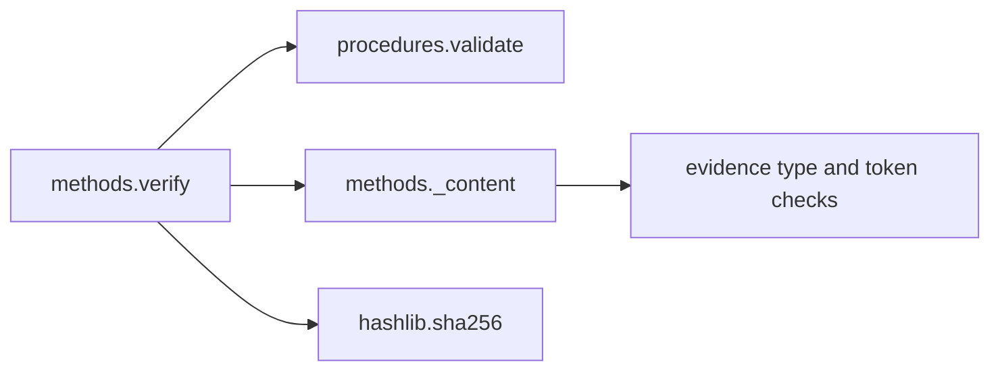

# Non-executing declaration-method references v1

`qualification.methods.verify(plan_bytes, procedure_bytes, methods)` composes
checklist validation with bounded method-byte binding and rule-declaration
checks. It executes no method and does not accept physical calibration recipes,
commands, paths or approval flags. Existing v1 APIs and thresholds are unchanged.

Plan and procedure use the checklist API's strict byte contracts. `methods` is
an exact dictionary of zero through 48 lowercase SHA-256 keys to exact immutable
bytes, each at most 65536 bytes. A shallow snapshot stabilizes the mapping; the
payloads are immutable. The count and per-payload bounds cap supplied bytes at
3145728. Invalid envelopes raise fixed `ValueError("invalid_qualification_methods")`.

Each method payload is UTF-8 JSON, depth at most eight, with no duplicate/unknown
keys, nonfinite numbers or coercion. It has exactly `version` (integer 1), `kind`
(`qualification_declaration_method`), `check` (calibration/clock/environment),
and `rules`. Rules have exactly the keys for that check:

| Check | Rule declarations consistent with current software |
|---|---|
| calibration | `rig_binding: exact`, `clock_domain: capture`, `interval: entire_capture` |
| clock | `rig_binding: exact`, `clock_domain: capture`, `within_capture: required`, `max_age_ms: 100`, `reference_skew_ms: 50`, `pair_skew_ms: 50` |
| environment | `rig_binding: exact`, `clock_domain: capture`, `within_capture: required`, `max_age_ms: 100`, `lighting: campaign_case` |

Every rule may instead be null, explicitly unknown. Non-null numeric rules must
be exact integers in 0..2^53-1000. Non-null text rules must be ASCII tokens of
1–64 letters/digits/underscore/hyphen. Known but different values produce
`method_rule_mismatch`; null produces `method_rule_unknown`. Neither silently
changes execution thresholds, including a stricter alternative threshold.
Malformed method content produces `method_invalid` while other inputs continue
to be checked. Every supplied method is inspected, even if unreferenced.

The checklist supplies the required digest/check associations, including extra
cases. One digest may serve repeated uses of the same check; use for another
check yields `method_check_mismatch`. Unknown checklist references remain unknown.
No reference yields `method_references_empty`. Missing payloads, mismatched byte
hashes and unused payloads yield `method_missing`, `method_digest_mismatch` and
`method_unreferenced`. All independent findings are retained as sorted unique
codes; byte mismatch does not suppress a separate content failure.

Output: version 1, nested unchanged `procedure` report, `methods_sha256`,
`method_counts` (referenced distinct digests, supplied, supplied_bytes),
`method_findings`, `method_bytes_verified`, `software_checks_passed`,
`method_verified: false`, `artifact_authenticity_verified: false`,
`physical_qualification_passed: false`, `human_review_status: unverified`.
Byte verification requires nonempty references, exact keys and matching bytes;
it says nothing about content. Software success additionally requires no method
finding and passing checklist declarations. Missing/unknown checklist entries
therefore cannot be rescued by valid method files.

The supplied-set commitment is SHA-256 over
`b"aethron.qualification.methods.v1\0"` followed by compact ASCII JSON of the
lexicographically sorted `[claimed_digest, actual_payload_digest]` pairs. It
includes unreferenced and mismatched inputs, preserves exact payload bytes and
is independent of dictionary insertion order. The nested report commits the
plan and checklist. Reports expose counts/digests/fixed findings, not rule values
or method text; commitments remain linkable and are not authentication.

These declarations cover the listed consistency rules in [schema v1](schema-v1.md)
and campaign lighting matching. They are not acquisition instructions, full
evidence validation, truthful instrument measurements or comprehensive physical
method specifications. The caller still runs the separate capture/artifact/
domain checks. Independent review, source authorization and actual execution
evidence remain unverified. Insufficient information for tactical deployment.

## Decision and bounded plan

Select Python immutable bytes, native hashing and bounded JSON hooks for this
offline in-process adapter: at most 48 small documents, exact raw-token rejection,
preserved independent findings, no target ABI or hard deadline. Compare
[CUE constraints](https://cuelang.org/docs/concept/how-cue-enables-data-validation/)
and [Rego relations](https://www.openpolicyagent.org/docs/policy-language): useful
for authored policies, but both still need the byte envelope, hashing and fixed
report boundary. [Erlang binaries and maps](https://www.erlang.org/doc/system/expressions.html)
offer immutable values and matching; process supervision is not a requirement of
this synchronous adapter. Native C#/Rust candidates from the earlier checklist
review remain appropriate if a target ABI or measured resource deficit appears.
[Python decoding hooks](https://docs.python.org/3.13/library/json.html) directly
expose token/pair admission; no language receives preference merely for already
being installed. This is a qualitative contract-fit choice, not a speed claim.

Freeze the contract, observe failing API tests, implement bounded composition,
then verify binding/content negatives independently, rule boundaries, aggregate
resource caps and unchanged checklist behavior. Run focused tests, Ruff and
Bandit; retain source-bound results and commit. No device access or local soak.

## C4 views

Views are context/container/component/code. Human command and control remain
external; communications are caller-owned; computers validate declarations;
intelligence, surveillance and reconnaissance streams are outside this API.
No operational C2, sensor fusion, DDS, MLS/ZTA enforcement, certified encryption
or uptime claim follows from this software boundary.
