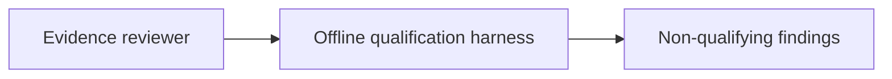
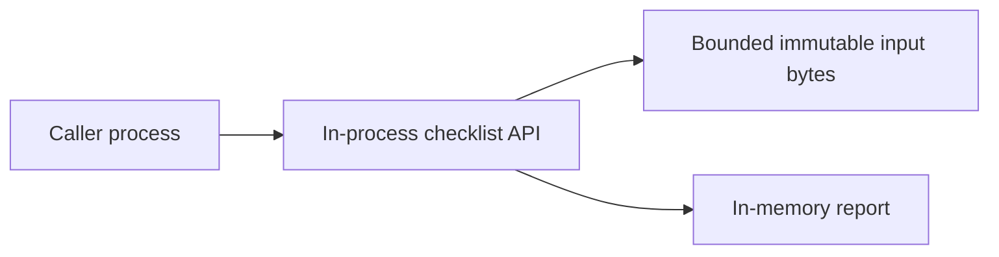
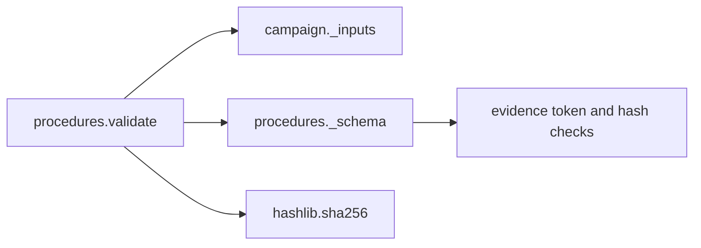

# Non-executing procedure checklist declarations v1

`qualification.procedures.validate(plan_bytes, procedure_bytes)` checks a bounded
checklist against an existing campaign plan. It opens no files, resolves no
references, runs no instructions and grants no authority. This is a separate
API; the existing opaque reference and bundle v1 contracts remain unchanged.

Both arguments must be exact immutable `bytes`, UTF-8 JSON, at most 65536 bytes
each and depth eight. Duplicate keys, unknown fields, nonfinite values, boolean
numbers and non-integer version tokens are rejected. Invalid structure raises
only `ValueError("invalid_qualification_procedure")`. The plan obeys campaign v1.

The procedure has exactly `version` (integer 1), `kind`
(`qualification_checklist`), `rig_sha256`, `domain_sha256` (64 lowercase hex
characters), and `cases`. Cases is a list of zero through sixteen distinct
`case_id` values (ASCII letters, digits, underscore or hyphen, 1–64 characters).
Each case has exactly `case_id` and `checks`. Checks is a list of zero through
three distinct kinds; each has exactly `kind` and `specification_sha256`.
Kinds are `calibration`, `clock`, `environment`; the specification digest is
either 64 lowercase hex characters or null (explicitly unknown).

Every planned case requires all three checklist entries with non-null method
references. This is declaration coverage, not approval of the referenced method
or a substitute for sensor-specific acceptance criteria. Reusing one method
digest across cases or kinds is permitted; bytes and suitability remain unchecked.
An empty checklist is valid input with negative findings, never success.

The report has version 1, exact-byte `plan_sha256` and `procedure_sha256`, sorted
unique `findings`, `procedure_declaration_checks_passed`, and `content_status`
(`incomplete` or `consistent_unverified`). `cases` follows plan order, with
`case_index` and `checks` mapping each fixed kind to `missing`, `unknown` (null)
or `unverified` (digest supplied). IDs and method digests are not echoed.

Independent findings are all retained: `procedure_digest_mismatch` (the plan
does not pin these exact bytes), `procedure_rig_mismatch`,
`procedure_domain_mismatch`, `procedure_case_missing`, `procedure_case_unplanned`,
`procedure_check_missing`, `procedure_specification_unknown`. Extra cases also
undergo completeness checks. A missing planned case has three missing check
states and both case-missing and check-missing findings.

Every report always sets `procedure_verified`, `specification_bytes_verified`,
`artifact_authenticity_verified`, and `physical_qualification_passed` to false,
and `human_review_status` to `unverified`. No supplied flag can override these.
Hashes are linkable commitments, not authentication or anonymization. There is
no clock, signature, preregistration proof, performance guarantee or durable
report storage. Callers must retain the actual inputs; mutable reports are not
authorization tokens. Domain contents and referenced method contents remain
unfinished software work, separately from independent review and physical tests.

## Architecture boundary

These are Context, Container, Component and Code views respectively. C2 decisions
and human approval are external; communications/transport are caller-owned;
computers perform offline validation; intelligence, surveillance and reconnaissance
feeds are outside this checklist API. It implements no operational C2, sensor
fusion, DDS, MLS, ZTA, cryptographic certification or availability guarantee.
Insufficient information for tactical deployment.

## Technology decision and bounded execution plan

Constraints: offline Linux development/CI and Python 3.9+ source consumers;
two bounded JSON documents, at most sixteen cases, exact raw-byte commitments,
fixed errors and preserved independent negatives. No native ABI, hard deadline,
measured memory deficit, database or independently distributed policy requirement.

Select direct Python admission plus semantic checks. Its
[JSON hooks](https://docs.python.org/3.13/library/json.html) expose duplicate pairs
and number tokens before normalization; exact bytes compose with hashing without
conversion. This directly meets the decisive contract rather than relying on
incumbency. [CUE](https://cuelang.org/docs/concept/how-cue-enables-data-validation/)
offers declarative constraints, but does not remove this contract's raw-byte host
boundary and report composition. [Rego](https://www.openpolicyagent.org/docs/policy-language)
supports policy queries; these sixteen fixed case relations need no policy service
or policy distribution. [C# Utf8JsonReader](https://learn.microsoft.com/en-us/dotnet/standard/serialization/system-text-json/use-utf8jsonreader)
and [Rust Serde](https://docs.rs/serde_json/latest/serde_json/) offer streaming or
typed native paths; bounded input eliminates a current need for streaming and no
target ABI or performance requirement selects a native path. They remain credible
if deployment constraints change. [Pydantic strict mode](https://docs.pydantic.dev/latest/concepts/strict_mode/)
reduces coercion but still needs token-level admission, relations and fixed-error
wrapping; no generated-model integration is required for this narrow API.
These are qualitative mechanism comparisons, not comparative speed measurements.

Implementation sequence: freeze this contract; add failing positive/negative,
strict-admission and maximum-size tests; implement `procedures.py`; add reusable
synthetic input/report vectors; run the new tests and existing campaign/reference/
bundle tests, Ruff and Bandit; record source-bound results and commit. Hosted
discovery already includes new `test_*.py` files. No full local suite or soak.
Review focus: missing versus unknown, all mismatch retention, extra-case negatives,
exact-byte pinning, and no promotion of a checklist into approval.
